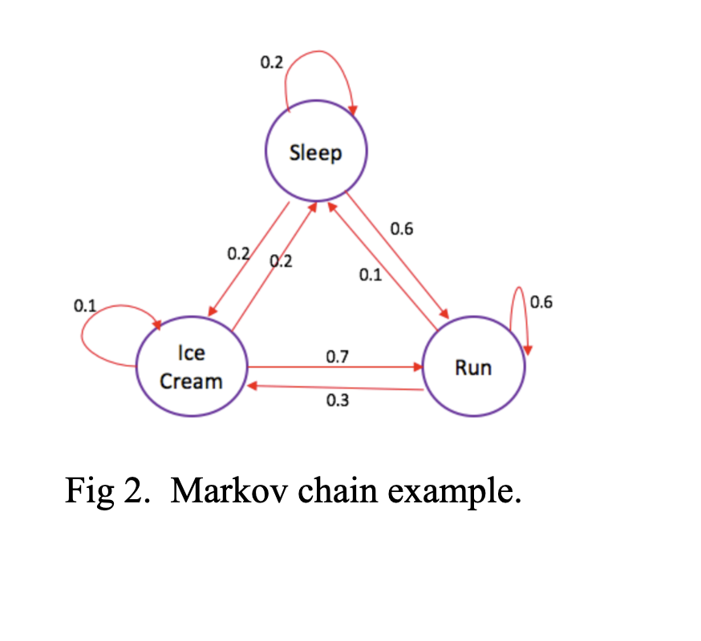
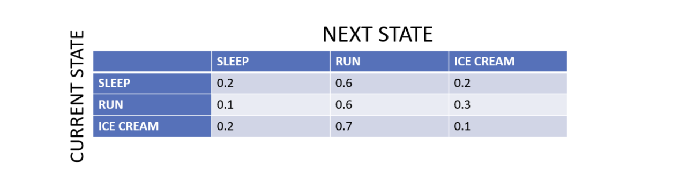
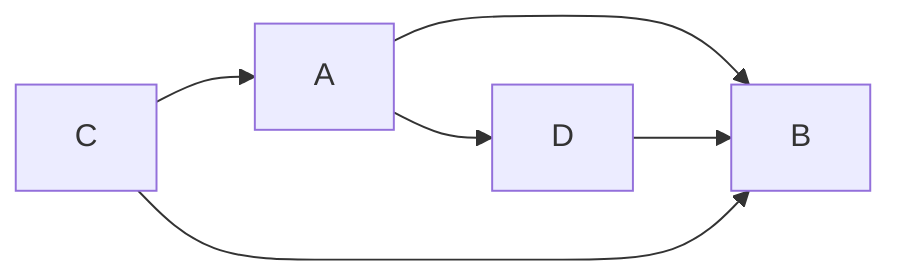
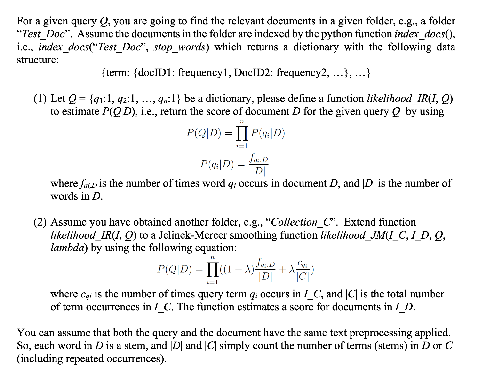

# Review Questions
Review questions for the exam
## Week 2 Review Questions
### Question 1. 
Please open a text or an XML file (e.g., 6146.xml) and represent it as a list of paragraphs or sentences, text. You may remove any non-relevant information (e.g ‘<p>’, ‘</p>’, \‘n'). After that, you need to find all terms and their frequencies (the number of occurrences in the file) if their length > 2, represent them using a dictionary, doc; and print the number of total terms (e.g., 137). Then print the top-10 terms in doc in a descending order, e.g., [('the', 8), ('technical', 2), ('bounce', 2), ('said', 2), ('and', 2), ('not', 2), ('due', 2), ('rose', 2), ("argentina's", 2), ('argentine', 1)]

```python
import re

def get_terms(text): # text is a list of paragraphs or sentences
    terms = {}
    for term in text:
        if len(term) > 2: # if the length of the term > 2
            if term in terms: # if the term is in the dictionary
                terms[term] += 1 # increase the frequency by 1
            else:
                terms[term] = 1 # add the term to the dictionary
    return terms

def get_text(filename): # filename is a string
    with open(filename, 'r') as f:# open the file
        text = f.read() # read the file
        text = re.sub(r'<[^>]+>', '', text) # remove any non-relevant information
        text = re.sub(r'\n', '', text) # remove any non-relevant information
        text = re.sub(r'\s+', ' ', text) # remove any non-relevant information (e.g., ‘<p>’, ‘</p>’, ‘\n’)
        text = text.split(' ') # split the text into a list of paragraphs or sentences
        return text # return the list of paragraphs or sentences

text = get_text('6146.xml') # get the text
terms = get_terms(text) # get the terms and their frequencies
print(len(terms)) # print the number of total terms
print(sorted(terms.items(), key=lambda x: x[1], reverse=True)[:10]) # print the top-10 terms in a descending order
```
### Question 2. 
Which of the following is FALSE? and explain why it is FALSE.
1. Stemming is a component of text processing that captures the relationships between different variations of a word.
2.Stemming reduces the different forms of a word that occur because of inflection (e.g., plurals, tenses) or derivation (e.g., making a verb into a noun by adding the suffixation) to a common stem.
3.In general, using a stemmer for search applications with English text produces a small but noticeable improvement in the quality of results.
4. A dictionary-based stemmer uses a small program to decide whether two words are related, usually based on knowledge of word suffixes for a particular language.

Answer: 4, a dictionary contains no program, it is a a data structure that maps keys to values. it relies on some pre made dictionary to decide whether two words are related. a more appropriate answer would be an algorithm based stemmer which uses a small program to decide whether two words are related, usually based on knowledge of word suffixes for a particular language.


### Question 3 N-grams
Typically, n-grams are formed from overlapping sequences of words., i.e. move n-word “window” one word at a time in a document. For example, bigrams are 2 words sequences, and trigrams are 3 words sequences.

The definition of Tropical fish is described in the following document:
```
Tropical fish are generally those fish found in aquatic tropical environments around the
world, including both freshwater and saltwater species. Fishkeepers often keep tropical
fish in freshwater and saltwater aquariums.
```

Please design a python program to print all bigrams and trigrams of the above document that contain at least one of the highlighted key words (‘fish’, ‘tropical’, ‘freshwater’, ‘saltwater’, ‘aquariums’).

```python
import re
import string

myText - '''
Tropical fish are generally those fish found in aquatic tropical environments around the
world, including both freshwater and saltwater species. Fishkeepers often keep tropical
fish in freshwater and saltwater aquariums.
'''
keywords = ['fish', 'tropical', 'freshwater', 'saltwater', 'aquariums']

def get_ngrams(text, n):
    text = re.sub(r'[^a-zA-Z0-9\s]', '', text) # remove any non-relevant information
    text = re.sub(r'\n', '', text) # remove any non-relevant information
    text = text.split(' ') # split the text into a list of paragraphs or sentences
    ngrams = []
    for i in range(len(text) - n + 1): # for each ngram
        ngram = text[i:i+n] # get the ngram
        ngrams.append(ngram) # add the ngram to the list of ngrams
    return ngrams

for keyword in keywords: # for each keyword
    print('keyword: ', keyword) # print the keyword
    bigrams = get_ngrams(myText, 2) # get the bigrams
    trigrams = get_ngrams(myText, 3) # get the trigrams
    for bigram in bigrams: # for each bigram
        if keyword in bigram: # if the keyword is in the bigram
            print(bigram) # print the bigram
    for trigram in trigrams: # for each trigram
        if keyword in trigram: # if the keyword is in the trigram
            print(trigram) # print the trigram

```

### Question 4. (Markov chain)
Assume when John is sad today, which isn't very usual: he either goes for a run, gobbles down ice cream or takes a nap next day. The Markov Chain depicted in the following state diagram has 3 possible states: “Sleep”, “Run”, and “Ice Cream”.


Here is also the transition matrix for the Markov Chain:


1. According to the above diagram, if John spent sleeping a sad day away, what is the probability of the will likely go for a run next day?
- 0.6 or 60%

2. The transition matrix will be 3 ´ 3 matrix. To simple represent the matrix, we can use the following variables, for example:

```
SS - sleep -> sleep
SR - sleep -> run
SI - sleep -> ice cream
```

as a matrix representation in python aka (list of lists) as follows:

```
transition_matrix = [
    [SS, SR, SI],
    [RS, RR, RI],
    [IS, IR, II]
]
```

Please write the corresponding transition matrix for probabilities in a list of lists.
- Take the values above and replace the letters with the probabilities (e.g. SS = 0.2, SR = 0.6, SI = 0.2) and put them in a list of lists.
```
transition_matrix = [
    [0.2, 0.6, 0.2],
    [0.1, 0.6, 0.3],
    [0.2, 0.7, 0.1]
]
```


### Question 6.
Design a python program to extract all hyperlinks (or destination links) in a html file. You can use HTMLParser python package.
  
  ```python
  from html.parser import HTMLParser

  def get_links(html):
      class MyHTMLParser(HTMLParser): # create a class that inherits from HTMLParser
          def __init__(self): # define the constructor
              HTMLParser.__init__(self) # call the constructor of the parent class
              self.links = []
          def handle_starttag(self, tag, attrs): # define the handle_starttag method
              if tag == 'a': # if the tag is an anchor tag
                  for attr in attrs: # for each attribute
                      if attr[0] == 'href': # if the attribute is a hyperlink
                          self.links.append(attr[1]) # add the hyperlink to the list of links
      parser = MyHTMLParser()
      parser.feed(html)
      return parser.links

  html = '''
  <html>
  <head>
  <title>Page title</title>
  </head>
  <body>
  <a href="http://example.com/">Link text</a>
  </body>
  </html>
  '''
```

## Week 3 Review Questions
### Question 1. 
(Indexing Process) Which of the following statements is false? and justify your answer.
(1) The text transformation component transforms documents into index terms or features.
(2) Index terms (e.g., words, sometimes simply referred to as “terms”) are the parts of a document that are stored in the index and used in searching
(3) A “feature” is more often used in the field of machine learning to refer to a part of a text document that is used to represent its content, which also describes an index term.
(4) Examples of other types of index terms or features are phrases, names of people, dates, and links in a web page.
(5) The set of all the terms that are indexed for a document collection is called the index distribution.

Answer: 5 - sets are unique and cannot have duplicates therefore its an index vocabulary not a distribution, a distribution, distributes the indexes across computers in a cluster.


### Question 2. (Page Rank)
A Web graph G = (P, L) consists of Web pages (vertices) and links (edges). The PageRank (PR) procedure takes a Web graph G as input and then outputs the better PageRank estimate PR using the following equation:

$$
PR(u) = \frac{\lambda}{N} + (1 - \lambda) \sum_{v \in B_u} \frac{PR(v)}{L(v)}
$$

where $B_u$ is the set of pages that point to $u$ (i.e., the backlinks of $u$), $L_v$ which is number out outgoing links from page ($v$).

The following table shows the Web graph G = (P, L), where P = {A,B,C,D} and L = {(A,B),(A,D),(C,A),(D,B),(C,B)}.




Assume the initial estimate of each Web page is equally, i.e., PR(A) = PR(B) = PR(C) = PR(D) = 0.25; and λ = 0.15. Calculate the PageRank estimate (PR value) of each Web page after running the first iteration of procedure PageRank(G).

So we have the following equation:
$$
PR(A) = \frac{0.15}{4} + (1 - 0.15) \sum_{v \in B_A} \frac{PR(v)}{L(v)}
$$

Lets look at the first iteration of the graph:
$L_c$ has 2 outgoing links being A and B, therefore $L_c = 2$
$L_A$ has 2 outgoing links being B and D, therefore $L_A = 2$
$L_D$ has 1 outgoing link being B, therefore $L_D = 1$
$L_B$ has 0 outgoing links, therefore $L_B = 0$

For page A: $B_A$ = {C} -  this means that the only page that links to A is C
$$
PR(A) = 0.15 / 4 + (1 - 0.15) * \frac{PR(C)}{L_C} = 0.0375 + 0.85 * \frac{0.25}{2} = 0.0375 + 0.10625 = 0.14375
$$

so 0.15 is the damping factor, 4 is the number of pages, 1 - 0.15 is the probability of a random surfer clicking on a link, 0.25 is the initial estimate of each page, 2 is the number of outgoing links from C.


For page B: $B_B$ = {A, D, C} -  this means that the only page that links to B is A, D and C
$$
PR(B) = 0.15 / 4 + (1 - 0.15) * \frac{PR(A)}{L_A} + (1 - 0.15) * \frac{PR(D)}{L_D} + (1 - 0.15) * \frac{PR(C)}{L_C} = 0.0375 + 0.85 * \frac{0.25}{2} + 0.85 * \frac{0.25}{1} + 0.85 * \frac{0.25}{2} = 0.0375 + 0.10625 + 0.2125 + 0.10625 = 0.4625
$$

so 0.15 is the damping factor, 4 is the number of pages, 1 - 0.15 is the probability of a random surfer clicking on a link, 0.25 is the initial estimate of each page, 2 is the number of outgoing links from C, 1 is the number of outgoing links from D.


For page C: $B_C$ = {} -  this means that the only page that links to C is none and is a dangling node or a special case
$$
PR(C) = 0.15 / 4 + (1 - 0.15) *  0 = 0.0375 + 0 = 0.0375
$$

So 0.15 is the damping factor, 4 is the number of pages, 1 - 0.15 is the probability of a random surfer clicking on a link, 0.25 is the initial estimate of each page, 0 is the number of outgoing links from C.

For page D: $B_D$ = {A} -  this means that the only page that links to D is A
$$
PR(D) = 0.15 / 4 + (1 - 0.15) * \frac{PR(A)}{L_A} = 0.0375 + 0.85 * \frac{0.25}{2} = 0.0375 + 0.10625 = 0.14375
$$

So 0.15 is the damping factor, 4 is the number of pages, 1 - 0.15 is the probability of a random surfer clicking on a link, 0.25 is the initial estimate of each page, 2 is the number of outgoing links from C.

### Question 3. There are some unique challenges to crawling web pages. Identify which of the following is FALSE. You also need to justify your answer.
(1) The biggest problem is the sheer scale of the Web. There are at least tens of billions of pages on the Internet.
(2) Web pages are usually under the control of the people building the search engine database.
(3) The web crawler spends a lot of its time waiting for responses. It waits for the DNS
server response, the connection to the web server to be acknowledged, and then the web page data to be sent from the server.
(4) Web pages are constantly being added, deleted, and modified. To keep an accurate view of the Web, a web crawler must continually revisit pages it has already crawled to see if they have changed in order to maintain the freshness of the document collection.

Answer: 2 - Web pages are usually under the control of the people building the search engine database. - this is false because web pages are not under the control of the people building the search engine database, they are under the control of the people who own the web pages. The search engine database is just a collection of web pages that have been crawled and indexed by the search engine. the search engine does not control the web pages. and the developers of the sites do not control the search engine database or vice versa.

### Question 4 - Removing Noise
Many web pages contain text, links, and pictures that are not directly related to the main content of the page. Please identify which of the following statements is False and correct the false statement

(1) A major component of the representation of a page used in a search engine is based on word counts; so, the presence of a large number of words unrelated to the main topic can be a problem.
(2) The simple technique based on the observation is that there are less HTML tags in the text of the main content of typical web pages than there is in the additional material.
(3) A document slope curve shows the cumulative distribution of tags in a web page as a function of the total number of tokens (words or other non-tag strings) in the page.
(4) The main text content of the page corresponds to the “plateau” in the middle of the distribution. This flat area is relatively small because of the large amount of formatting and presentation information in the HTML source for the page.
(5) The detection of the main content can then be viewed as an optimization problem where we find values of i and j to maximize both the number of non-tag tokens below i and above j and the number of tags between i and j.

Answer: 5 - The detection of the main content can be viewed as an optimization problem, where we find values of i and j to maximize the number of non-tag tokens between i and j, as well as the number of tags below i and above j.


## Week 4 Review Questions
### Question 1.
Which of the following descriptions is wrong? and justify your answer.

(1) The Boolean retrieval model is also known as exact-match retrieval since documents are retrieved if they exactly match the query specification, and otherwise are not retrieved.
(2) The process of developing queries with a focus on the size of the retrieved set has been called searching by numbers and is a consequence of the limitations of the Boolean retrieval model.
(3) In a vector space model, documents and queries are assumed to be part of a t-dimensional vector space, where t is the number of index terms (words, stems, phrases, etc.).
(4) There is an explicit definition of relevance in the vector space model.

Answer: 4 - There is an explicit definition of relevance in the vector space model. - this is wrong because there is no explicit definition of relevance in the vector space model. The vector space model is a model that is based on the idea that documents and queries are assumed to be part of a t-dimensional vector space, where t is the number of index terms (words, stems, phrases, etc) this means that there  is an implicit assumption that relevance is related to the similarity of query and document vectors.

### Question 2. (Probabilistic Models)
Let N=|D| be the total number of documents in a training set D and R be the number of relevant documents in D. The following is a term weighting formula of probabilistic methods:
$$
w_1(t) = \log[(r(t) /R) / (n(t) / N)]
$$
Explain the meaning of $r(t)$ and $n(t)$ in the formula.
$r(t)$ is the number of relevant documents that contain term t 

$n(t)$ is the number of documents that contain term t


### Question 3. 
Which of the following descriptions is wrong? and justify your answer.
1) In the query likelihood retrieval model, documents are ranked by the probability that the query text could be generated by the document language model.
(2) To use the unigram language model to estimate P(Q|D) - the document D’s score for the given query Q ={q1, q2, …, qn}, the language model probabilities P(qi|D) (i =1, 2, …, n) are needed to be estimated.
(3) The major problem with the estimate of P(qi|D) is that if any of the query words are missing from the document, the score given by the query likelihood model for P(Q|D) will be zero.
(4) Kullback-Leibler (KL) divergence is a technique for avoiding this estimation problem and overcoming data sparsity, which means that we typically do not have large amounts of text to use for the language model probability estimates

Answer: 4: Kullback-leibler (KL) is not used as a technique for avoiding this estimation problem and overcoming data sparsity. its used to measure the difference between two probability distributions. The technique used to overcome data sparsity is called smoothing.

### Question 4. (Language Models
Let Q = {US, ECONOM, ESPIONAG} be a query, and C = {D1, D2, D3, D4, D5, D6} be a
collection of documents, where:

$D_1$ = {GERMAN, VW}
$D_2$ = {US, US, ECONOM, SPY}
$D_3$ = {US, BILL, ECONOM, ESPIONAG}
$D_4$ = {US, ECONOM, ESPIONAG, BILL}
$D_5$ = {GERMAN, MAN, VW, ESPIONAG}
$D_6$ = {GERMAN, GERMAN, MAN, VW, SPY}

Jelinek-Mercer smoothing method uses the following equation to calculate a score for a document D
$$
P(Q|D) = \prod_{i=1}^n P(q_i|D) 
$$ 
Where n is the number of terms in the query Q. The probability of a term $q_i$ in a document D is calculated as follows:
$$
P(q_i|D) = (1 - \lambda) \frac{tf(q_i, D)}{|D|} + \lambda P(q_i|C)
$$

for all query term qi in Q, where fqi,D is the number of times query word qi occurs in document D, |D| is the number of word occurrences in D, cqi is the number of times query word qi occurs in collection C, and |C| is the total number of word occurrences in collection C. Assume parameter λ = 0.4, calculate P(Q|D2). You are required to write the finding process.

Answer:
$$
D_2 = {US, US, ECONOM, SPY}, Q = {US, ECONOM, ESPIONAG}
$$

$$
P(Q|D_2) = P(US|D_2) * P(ECONOM|D_2) * P(ESPIONAG|D_2) = 0.003865 
$$ What this means is that the probability of the query Q given the document $D_2$ is 0.003865

$$
P(US|D_2) = (1 - 0.4) * \frac{2}{4} + 0.4 * \frac{4}{23} 0. * 0.5 + 0.4 * 0.17 = 0.368
$$ 
What this means is that the probability of the term US given the document $D_2$ is 0.368


$$
P(ECONOM | D2) =0.6 *(1/4)+0.4*(3/23) = 0.6*0.25 + 0.4*0.13 = 0.202
$$ 
What this means is that the probability of the term ECONOM given the document $D_2$ is 0.202

$$
P(ESPIONAG | D2) = 0.6 * (0/4) + 0.4 * (3/23) = 0.4 * 0.13 = 0.052
$$ 
What this means is that the probability of the term ESPIONAG given the document $D_2$ is 0.052

### Question 5. (Language Models

Answer: 1

## Week 5 Review Questions
### Question 1.
Which of the following is wrong? and justify your answer.
(1) A document feature is some attribute of the document we can express numerically.
(2) A ranking function takes data from document features combined with the query and produces a score.
(3) Topical features are the only features we can find in documents.
(4) If a document gets a high score, this means that the system thinks that document is a good match for the query, whereas lower numbers mean that the system thinks the document is a poor match for the query.

Answer: 3 - other things that can be used as features are:
- document length
- metadata
- document structure
- document quality
- document freshness
- last update time
- document popularity


### Question 2. 
Which of the following is wrong? and justify your answer.
(1) The index is inverted because usually we think of words being a part of documents, but if we invert this idea, documents are associated with words.
(2) In an inverted index that contains only document information, i.e., the features are binary, meaning they are 1 if the document contains a term, 0 otherwise. This inverted index contains enough information to tell if the document contains the exact phrase “tropical fish”.
(3) Each index term has its own inverted list that holds the relevant data for that term. Each list entry is called a posting, and the part of the posting that refers to a specific document or location is often called a pointer.
(4) An extent is a contiguous region of a document. We can represent these extents using word positions.


Answer: 2 - With binary features, we can only tell if the document contains the term, but not how many times it occurs. If a document contains the term 10 times, or 100 times, or 1000 times, we cannot tell the difference. We can only tell that it contains the term or the exact phrase. e.g. "tropical" and  fish" could be in the document, but not "tropical fish" together.


## Question 3.
Assume the model of ranking contains a ranking function R(Q, D), which compares each document with the query and computes a score. Those scores are then used to determine the final ranked list.
An alternate ranking model might contain a different kind of ranking function, f(A, B, Q), where A and B are two different documents in the collection and Q is the query. When A should be ranked higher than B, f(A, B, Q) evaluates to 1. When A should be ranked below B, f(A, B, Q) evaluates to –1. If you have a ranking function R(Q, D), show how you can use it in a system that requires one of the form f(A, B, Q).

Answer:
$$
f(A, B, Q) = R(Q, A) - R(Q, B)
$$

If $R(Q, A) > R(Q, B)$, then $f(A, B, Q) = 1$ and A should be ranked higher than B. If $R(Q, A) < R(Q, B)$, then $f(A, B, Q) = -1$ and A should be ranked lower than B. If $R(Q, A) = R(Q, B)$, then $f(A, B, Q) = 0$ and A and B should be ranked the same.

## Question 4.
Inverted indexing is an efficient data structure to represent documents for information retrieval, where each index term is associated with an inverted list that contains a list of pairs of document number and count of the term occurrences in that document. The following table is an inverted index for 4 documents and their index terms.


Assume the abstract model of ranking is 
$$
R(Q, D) = \sum_{i} g_i(Q)f_i(D)
$$


where fi is the document topical feature function (the value of fi(D) is term ti’s counts in documentD) and gi is a query topical feature function (gi(Q) = 1 if term ti is in query Q; otherwise, gi(Q) =0). Let query Q = {freshwater, fish, aquarium, tropical}. Calculate each document’s ranking score by using Term-at-a-time Algorithm. You are required to write the calculating process (or steps)

Answer:
What are the query terms? freshwater, fish, aquarium, tropical
so lets look for those in the table

L1 – freshwater 1:1 4:1
L2 – aquarium 3:1
L3 - fish 1:2 2:3 3:2 4:2
L4 – tropical 1:2 2:2 3:1

This means that freshwater occurs in document 1 and 4, aquarium occurs in document 3, fish occurs in document 1, 2, 3, 4, and tropical occurs in document 1, 2, 3.

L1 - 1:1 4:1
Partial scores 1:1 4:1
The partial scores are the number of times the query term occurs in the document. So freshwater occurs once in document 1, and once in document 4. So the partial scores are 1:1 4:1
---------------------------------------------
Old Partial scores 1:1 4:1
L2 - 3:1
new partial scores 1:1 3:1 4:1
The partial scores are the number of times the query term occurs in the document. So freshwater occurs once in document 1, and once in document 4. So the partial scores are 1:1 4:1
---------------------------------------------

Old Partial scores 1:1 3:1 4:1
L3 - 1:2 2:3 3:2 4:2
new partial scores 1:3 2:3 3:3 4:3
The partial scores are the number of times the query term occurs in the document. So freshwater occurs once in document 1, and once in document 4. So the partial scores are 1:1 4:1
---------------------------------------------
Old Partial scores 1:3 2:3 3:3 4:3
L4 - 1:2 2:2 3:1
new partial scores 1:5 2:5 3:4 4:3
The partial scores are the number of times the query term occurs in the document. So freshwater occurs once in document 1, and once in document 4. So the partial scores are 1:1 4:1


## Week 6 Review Questions
## Week 7 Review Questions
## Week 8 Review Questions
## Week 9 Review Questions
## Week 10 Review Questions
## Week 11 Review Questions