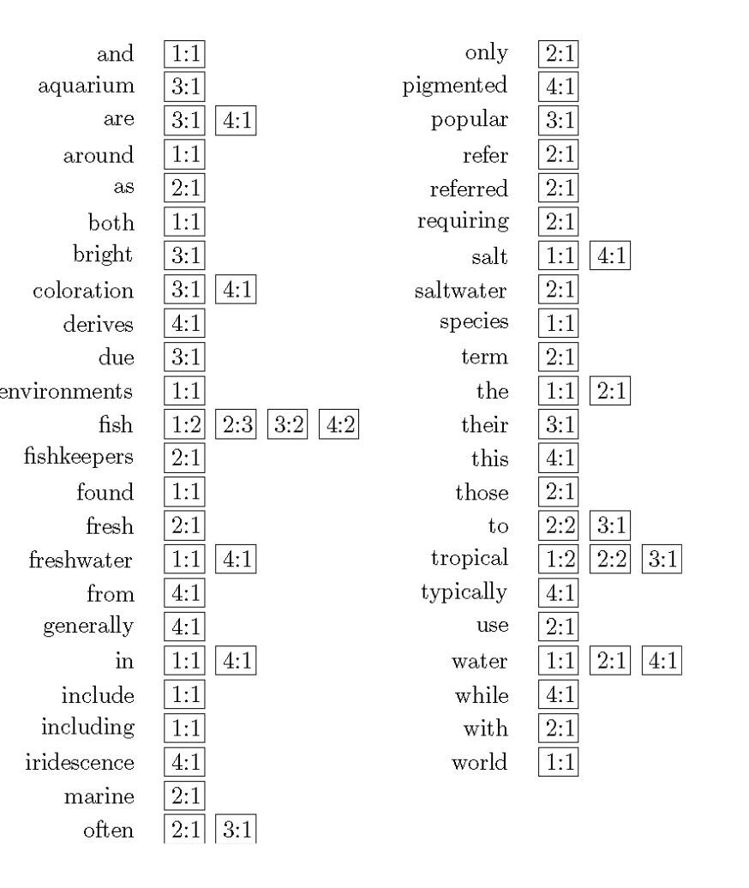

# Review Questions
Review questions for the exam
## Week 2 Review Questions
### Question 1. 
Please open a text or an XML file (e.g., 6146.xml) and represent it as a list of paragraphs or sentences, text. You may remove any non-relevant information (e.g ‘<p>’, ‘</p>’, \‘n'). After that, you need to find all terms and their frequencies (the number of occurrences in the file) if their length > 2, represent them using a dictionary, doc; and print the number of total terms (e.g., 137). Then print the top-10 terms in doc in a descending order, e.g., [('the', 8), ('technical', 2), ('bounce', 2), ('said', 2), ('and', 2), ('not', 2), ('due', 2), ('rose', 2), ("argentina's", 2), ('argentine', 1)]

```python
import re

def get_terms(text): # text is a list of paragraphs or sentences
    terms = {}
    for term in text:
        if len(term) > 2: # if the length of the term > 2
            if term in terms: # if the term is in the dictionary
                terms[term] += 1 # increase the frequency by 1
            else:
                terms[term] = 1 # add the term to the dictionary
    return terms

def get_text(filename): # filename is a string
    with open(filename, 'r') as f:# open the file
        text = f.read() # read the file
        text = re.sub(r'<[^>]+>', '', text) # remove any non-relevant information
        text = re.sub(r'\n', '', text) # remove any non-relevant information
        text = re.sub(r'\s+', ' ', text) # remove any non-relevant information (e.g., ‘<p>’, ‘</p>’, ‘\n’)
        text = text.split(' ') # split the text into a list of paragraphs or sentences
        return text # return the list of paragraphs or sentences

text = get_text('6146.xml') # get the text
terms = get_terms(text) # get the terms and their frequencies
print(len(terms)) # print the number of total terms
print(sorted(terms.items(), key=lambda x: x[1], reverse=True)[:10]) # print the top-10 terms in a descending order
```
### Question 2. 
Which of the following is FALSE? and explain why it is FALSE.
1. Stemming is a component of text processing that captures the relationships between different variations of a word.
2.Stemming reduces the different forms of a word that occur because of inflection (e.g., plurals, tenses) or derivation (e.g., making a verb into a noun by adding the suffixation) to a common stem.
3.In general, using a stemmer for search applications with English text produces a small but noticeable improvement in the quality of results.
4. A dictionary-based stemmer uses a small program to decide whether two words are related, usually based on knowledge of word suffixes for a particular language.

Answer: 4, a dictionary contains no program, it is a a data structure that maps keys to values. it relies on some pre made dictionary to decide whether two words are related. a more appropriate answer would be an algorithm based stemmer which uses a small program to decide whether two words are related, usually based on knowledge of word suffixes for a particular language.


### Question 3 N-grams
Typically, n-grams are formed from overlapping sequences of words., i.e. move n-word “window” one word at a time in a document. For example, bigrams are 2 words sequences, and trigrams are 3 words sequences.

The definition of Tropical fish is described in the following document:
```
Tropical fish are generally those fish found in aquatic tropical environments around the
world, including both freshwater and saltwater species. Fishkeepers often keep tropical
fish in freshwater and saltwater aquariums.
```

Please design a python program to print all bigrams and trigrams of the above document that contain at least one of the highlighted key words (‘fish’, ‘tropical’, ‘freshwater’, ‘saltwater’, ‘aquariums’).

```python
import re
import string

myText - '''
Tropical fish are generally those fish found in aquatic tropical environments around the
world, including both freshwater and saltwater species. Fishkeepers often keep tropical
fish in freshwater and saltwater aquariums.
'''
keywords = ['fish', 'tropical', 'freshwater', 'saltwater', 'aquariums']

def get_ngrams(text, n):
    text = re.sub(r'[^a-zA-Z0-9\s]', '', text) # remove any non-relevant information
    text = re.sub(r'\n', '', text) # remove any non-relevant information
    text = text.split(' ') # split the text into a list of paragraphs or sentences
    ngrams = []
    for i in range(len(text) - n + 1): # for each ngram
        ngram = text[i:i+n] # get the ngram
        ngrams.append(ngram) # add the ngram to the list of ngrams
    return ngrams

for keyword in keywords: # for each keyword
    print('keyword: ', keyword) # print the keyword
    bigrams = get_ngrams(myText, 2) # get the bigrams
    trigrams = get_ngrams(myText, 3) # get the trigrams
    for bigram in bigrams: # for each bigram
        if keyword in bigram: # if the keyword is in the bigram
            print(bigram) # print the bigram
    for trigram in trigrams: # for each trigram
        if keyword in trigram: # if the keyword is in the trigram
            print(trigram) # print the trigram

```

### Question 4. (Markov chain)
Assume when John is sad today, which isn't very usual: he either goes for a run, gobbles down ice cream or takes a nap next day. The Markov Chain depicted in the following state diagram has 3 possible states: “Sleep”, “Run”, and “Ice Cream”.


Here is also the transition matrix for the Markov Chain:


1. According to the above diagram, if John spent sleeping a sad day away, what is the probability of the will likely go for a run next day?
- 0.6 or 60%

2. The transition matrix will be 3 ´ 3 matrix. To simple represent the matrix, we can use the following variables, for example:

```
SS - sleep -> sleep
SR - sleep -> run
SI - sleep -> ice cream
```

as a matrix representation in python aka (list of lists) as follows:

```
transition_matrix = [
    [SS, SR, SI],
    [RS, RR, RI],
    [IS, IR, II]
]
```

Please write the corresponding transition matrix for probabilities in a list of lists.
- Take the values above and replace the letters with the probabilities (e.g. SS = 0.2, SR = 0.6, SI = 0.2) and put them in a list of lists.
```
transition_matrix = [
    [0.2, 0.6, 0.2],
    [0.1, 0.6, 0.3],
    [0.2, 0.7, 0.1]
]
```


### Question 6.
Design a python program to extract all hyperlinks (or destination links) in a html file. You can use HTMLParser python package.
  
  ```python
  from html.parser import HTMLParser

  def get_links(html):
      class MyHTMLParser(HTMLParser): # create a class that inherits from HTMLParser
          def __init__(self): # define the constructor
              HTMLParser.__init__(self) # call the constructor of the parent class
              self.links = []
          def handle_starttag(self, tag, attrs): # define the handle_starttag method
              if tag == 'a': # if the tag is an anchor tag
                  for attr in attrs: # for each attribute
                      if attr[0] == 'href': # if the attribute is a hyperlink
                          self.links.append(attr[1]) # add the hyperlink to the list of links
      parser = MyHTMLParser()
      parser.feed(html)
      return parser.links

  html = '''
  <html>
  <head>
  <title>Page title</title>
  </head>
  <body>
  <a href="http://example.com/">Link text</a>
  </body>
  </html>
  '''
```

## Week 3 Review Questions
### Question 1. 
(Indexing Process) Which of the following statements is false? and justify your answer.
(1) The text transformation component transforms documents into index terms or features.
(2) Index terms (e.g., words, sometimes simply referred to as “terms”) are the parts of a document that are stored in the index and used in searching
(3) A “feature” is more often used in the field of machine learning to refer to a part of a text document that is used to represent its content, which also describes an index term.
(4) Examples of other types of index terms or features are phrases, names of people, dates, and links in a web page.
(5) The set of all the terms that are indexed for a document collection is called the index distribution.

Answer: 5 - sets are unique and cannot have duplicates therefore its an index vocabulary not a distribution, a distribution, distributes the indexes across computers in a cluster.


### Question 2. (Page Rank)
A Web graph G = (P, L) consists of Web pages (vertices) and links (edges). The PageRank (PR) procedure takes a Web graph G as input and then outputs the better PageRank estimate PR using the following equation:

$$
PR(u) = \frac{\lambda}{N} + (1 - \lambda) \sum_{v \in B_u} \frac{PR(v)}{L(v)}
$$

where $B_u$ is the set of pages that point to $u$ (i.e., the backlinks of $u$), $L_v$ which is number out outgoing links from page ($v$).

The following table shows the Web graph G = (P, L), where P = {A,B,C,D} and L = {(A,B),(A,D),(C,A),(D,B),(C,B)}.


Assume the initial estimate of each Web page is equally, i.e., PR(A) = PR(B) = PR(C) = PR(D) = 0.25; and λ = 0.15. Calculate the PageRank estimate (PR value) of each Web page after running the first iteration of procedure PageRank(G).

So we have the following equation:
$$
PR(A) = \frac{0.15}{4} + (1 - 0.15) \sum_{v \in B_A} \frac{PR(v)}{L(v)}
$$

Lets look at the first iteration of the graph:
$L_c$ has 2 outgoing links being A and B, therefore $L_c = 2$
$L_A$ has 2 outgoing links being B and D, therefore $L_A = 2$
$L_D$ has 1 outgoing link being B, therefore $L_D = 1$
$L_B$ has 0 outgoing links, therefore $L_B = 0$

For page A: $B_A$ = {C} -  this means that the only page that links to A is C
$$
PR(A) = 0.15 / 4 + (1 - 0.15) * \frac{PR(C)}{L_C} = 0.0375 + 0.85 * \frac{0.25}{2} = 0.0375 + 0.10625 = 0.14375
$$

so 0.15 is the damping factor, 4 is the number of pages, 1 - 0.15 is the probability of a random surfer clicking on a link, 0.25 is the initial estimate of each page, 2 is the number of outgoing links from C.


For page B: $B_B$ = {A, D, C} -  this means that the only page that links to B is A, D and C
$$
PR(B) = 0.15 / 4 + (1 - 0.15) * \frac{PR(A)}{L_A} + (1 - 0.15) * \frac{PR(D)}{L_D} + (1 - 0.15) * \frac{PR(C)}{L_C} = 0.0375 + 0.85 * \frac{0.25}{2} + 0.85 * \frac{0.25}{1} + 0.85 * \frac{0.25}{2} = 0.0375 + 0.10625 + 0.2125 + 0.10625 = 0.4625
$$

so 0.15 is the damping factor, 4 is the number of pages, 1 - 0.15 is the probability of a random surfer clicking on a link, 0.25 is the initial estimate of each page, 2 is the number of outgoing links from C, 1 is the number of outgoing links from D.


For page C: $B_C$ = {} -  this means that the only page that links to C is none and is a dangling node or a special case
$$
PR(C) = 0.15 / 4 + (1 - 0.15) *  0 = 0.0375 + 0 = 0.0375
$$

So 0.15 is the damping factor, 4 is the number of pages, 1 - 0.15 is the probability of a random surfer clicking on a link, 0.25 is the initial estimate of each page, 0 is the number of outgoing links from C.

For page D: $B_D$ = {A} -  this means that the only page that links to D is A
$$
PR(D) = 0.15 / 4 + (1 - 0.15) * \frac{PR(A)}{L_A} = 0.0375 + 0.85 * \frac{0.25}{2} = 0.0375 + 0.10625 = 0.14375
$$

So 0.15 is the damping factor, 4 is the number of pages, 1 - 0.15 is the probability of a random surfer clicking on a link, 0.25 is the initial estimate of each page, 2 is the number of outgoing links from C.

### Question 3. There are some unique challenges to crawling web pages. Identify which of the following is FALSE. You also need to justify your answer.
(1) The biggest problem is the sheer scale of the Web. There are at least tens of billions of pages on the Internet.
(2) Web pages are usually under the control of the people building the search engine database.
(3) The web crawler spends a lot of its time waiting for responses. It waits for the DNS
server response, the connection to the web server to be acknowledged, and then the web page data to be sent from the server.
(4) Web pages are constantly being added, deleted, and modified. To keep an accurate view of the Web, a web crawler must continually revisit pages it has already crawled to see if they have changed in order to maintain the freshness of the document collection.

Answer: 2 - Web pages are usually under the control of the people building the search engine database. - this is false because web pages are not under the control of the people building the search engine database, they are under the control of the people who own the web pages. The search engine database is just a collection of web pages that have been crawled and indexed by the search engine. the search engine does not control the web pages. and the developers of the sites do not control the search engine database or vice versa.

### Question 4 - Removing Noise
Many web pages contain text, links, and pictures that are not directly related to the main content of the page. Please identify which of the following statements is False and correct the false statement

(1) A major component of the representation of a page used in a search engine is based on word counts; so, the presence of a large number of words unrelated to the main topic can be a problem.
(2) The simple technique based on the observation is that there are less HTML tags in the text of the main content of typical web pages than there is in the additional material.
(3) A document slope curve shows the cumulative distribution of tags in a web page as a function of the total number of tokens (words or other non-tag strings) in the page.
(4) The main text content of the page corresponds to the “plateau” in the middle of the distribution. This flat area is relatively small because of the large amount of formatting and presentation information in the HTML source for the page.
(5) The detection of the main content can then be viewed as an optimization problem where we find values of i and j to maximize both the number of non-tag tokens below i and above j and the number of tags between i and j.

Answer: 5 - The detection of the main content can be viewed as an optimization problem, where we find values of i and j to maximize the number of non-tag tokens between i and j, as well as the number of tags below i and above j.


## Week 4 Review Questions
### Question 1.
Which of the following descriptions is wrong? and justify your answer.

(1) The Boolean retrieval model is also known as exact-match retrieval since documents are retrieved if they exactly match the query specification, and otherwise are not retrieved.
(2) The process of developing queries with a focus on the size of the retrieved set has been called searching by numbers and is a consequence of the limitations of the Boolean retrieval model.
(3) In a vector space model, documents and queries are assumed to be part of a t-dimensional vector space, where t is the number of index terms (words, stems, phrases, etc.).
(4) There is an explicit definition of relevance in the vector space model.

Answer: 4 - There is an explicit definition of relevance in the vector space model. - this is wrong because there is no explicit definition of relevance in the vector space model. The vector space model is a model that is based on the idea that documents and queries are assumed to be part of a t-dimensional vector space, where t is the number of index terms (words, stems, phrases, etc) this means that there  is an implicit assumption that relevance is related to the similarity of query and document vectors.

### Question 2. (Probabilistic Models)
Let N=|D| be the total number of documents in a training set D and R be the number of relevant documents in D. The following is a term weighting formula of probabilistic methods:
$$
w_1(t) = \log[(r(t) /R) / (n(t) / N)]
$$
Explain the meaning of $r(t)$ and $n(t)$ in the formula.
$r(t)$ is the number of relevant documents that contain term t 

$n(t)$ is the number of documents that contain term t


### Question 3. 
Which of the following descriptions is wrong? and justify your answer.
1) In the query likelihood retrieval model, documents are ranked by the probability that the query text could be generated by the document language model.
(2) To use the unigram language model to estimate P(Q|D) - the document D’s score for the given query Q ={q1, q2, …, qn}, the language model probabilities P(qi|D) (i =1, 2, …, n) are needed to be estimated.
(3) The major problem with the estimate of P(qi|D) is that if any of the query words are missing from the document, the score given by the query likelihood model for P(Q|D) will be zero.
(4) Kullback-Leibler (KL) divergence is a technique for avoiding this estimation problem and overcoming data sparsity, which means that we typically do not have large amounts of text to use for the language model probability estimates

Answer: 4: Kullback-leibler (KL) is not used as a technique for avoiding this estimation problem and overcoming data sparsity. its used to measure the difference between two probability distributions. The technique used to overcome data sparsity is called smoothing.

### Question 4. (Language Models
Let Q = {US, ECONOM, ESPIONAG} be a query, and C = {D1, D2, D3, D4, D5, D6} be a
collection of documents, where:

$D_1$ = {GERMAN, VW}
$D_2$ = {US, US, ECONOM, SPY}
$D_3$ = {US, BILL, ECONOM, ESPIONAG}
$D_4$ = {US, ECONOM, ESPIONAG, BILL}
$D_5$ = {GERMAN, MAN, VW, ESPIONAG}
$D_6$ = {GERMAN, GERMAN, MAN, VW, SPY}

Jelinek-Mercer smoothing method uses the following equation to calculate a score for a document D
$$
P(Q|D) = \prod_{i=1}^n P(q_i|D) 
$$ 
Where n is the number of terms in the query Q. The probability of a term $q_i$ in a document D is calculated as follows:
$$
P(q_i|D) = (1 - \lambda) \frac{tf(q_i, D)}{|D|} + \lambda P(q_i|C)
$$

for all query term qi in Q, where fqi,D is the number of times query word qi occurs in document D, |D| is the number of word occurrences in D, cqi is the number of times query word qi occurs in collection C, and |C| is the total number of word occurrences in collection C. Assume parameter λ = 0.4, calculate P(Q|D2). You are required to write the finding process.

Answer:
$$
D_2 = {US, US, ECONOM, SPY}, Q = {US, ECONOM, ESPIONAG}
$$

$$
P(Q|D_2) = P(US|D_2) * P(ECONOM|D_2) * P(ESPIONAG|D_2) = 0.003865 
$$ What this means is that the probability of the query Q given the document $D_2$ is 0.003865

$$
P(US|D_2) = (1 - 0.4) * \frac{2}{4} + 0.4 * \frac{4}{23} 0. * 0.5 + 0.4 * 0.17 = 0.368
$$ 
What this means is that the probability of the term US given the document $D_2$ is 0.368


$$
P(ECONOM | D2) =0.6 *(1/4)+0.4*(3/23) = 0.6*0.25 + 0.4*0.13 = 0.202
$$ 
What this means is that the probability of the term ECONOM given the document $D_2$ is 0.202

$$
P(ESPIONAG | D2) = 0.6 * (0/4) + 0.4 * (3/23) = 0.4 * 0.13 = 0.052
$$ 
What this means is that the probability of the term ESPIONAG given the document $D_2$ is 0.052

### Question 5. (Language Models

Answer: 1

## Week 5 Review Questions
### Question 1.
Which of the following is wrong? and justify your answer.
(1) A document feature is some attribute of the document we can express numerically.
(2) A ranking function takes data from document features combined with the query and produces a score.
(3) Topical features are the only features we can find in documents.
(4) If a document gets a high score, this means that the system thinks that document is a good match for the query, whereas lower numbers mean that the system thinks the document is a poor match for the query.

Answer: 3 - other things that can be used as features are:
- document length
- metadata
- document structure
- document quality
- document freshness
- last update time
- document popularity


### Question 2. 
Which of the following is wrong? and justify your answer.
(1) The index is inverted because usually we think of words being a part of documents, but if we invert this idea, documents are associated with words.
(2) In an inverted index that contains only document information, i.e., the features are binary, meaning they are 1 if the document contains a term, 0 otherwise. This inverted index contains enough information to tell if the document contains the exact phrase “tropical fish”.
(3) Each index term has its own inverted list that holds the relevant data for that term. Each list entry is called a posting, and the part of the posting that refers to a specific document or location is often called a pointer.
(4) An extent is a contiguous region of a document. We can represent these extents using word positions.


Answer: 2 - With binary features, we can only tell if the document contains the term, but not how many times it occurs. If a document contains the term 10 times, or 100 times, or 1000 times, we cannot tell the difference. We can only tell that it contains the term or the exact phrase. e.g. "tropical" and  fish" could be in the document, but not "tropical fish" together.


## Question 3.
Assume the model of ranking contains a ranking function R(Q, D), which compares each document with the query and computes a score. Those scores are then used to determine the final ranked list.
An alternate ranking model might contain a different kind of ranking function, f(A, B, Q), where A and B are two different documents in the collection and Q is the query. When A should be ranked higher than B, f(A, B, Q) evaluates to 1. When A should be ranked below B, f(A, B, Q) evaluates to –1. If you have a ranking function R(Q, D), show how you can use it in a system that requires one of the form f(A, B, Q).

Answer:
$$
f(A, B, Q) = R(Q, A) - R(Q, B)
$$

If $R(Q, A) > R(Q, B)$, then $f(A, B, Q) = 1$ and A should be ranked higher than B. If $R(Q, A) < R(Q, B)$, then $f(A, B, Q) = -1$ and A should be ranked lower than B. If $R(Q, A) = R(Q, B)$, then $f(A, B, Q) = 0$ and A and B should be ranked the same.

## Question 4.
Inverted indexing is an efficient data structure to represent documents for information retrieval, where each index term is associated with an inverted list that contains a list of pairs of document number and count of the term occurrences in that document. The following table is an inverted index for 4 documents and their index terms.


Assume the abstract model of ranking is 
$$
R(Q, D) = \sum_{i} g_i(Q)f_i(D)
$$


where fi is the document topical feature function (the value of fi(D) is term ti’s counts in documentD) and gi is a query topical feature function (gi(Q) = 1 if term ti is in query Q; otherwise, gi(Q) =0). Let query Q = {freshwater, fish, aquarium, tropical}. Calculate each document’s ranking score by using Term-at-a-time Algorithm. You are required to write the calculating process (or steps)

Answer:
What are the query terms? freshwater, fish, aquarium, tropical
so lets look for those in the table
```
L1 – freshwater 1:1 4:1
L2 – aquarium 3:1
L3 - fish 1:2 2:3 3:2 4:2
L4 – tropical 1:2 2:2 3:1

This means that freshwater occurs in document 1 and 4, aquarium occurs in document 3, fish occurs in document 1, 2, 3, 4, and tropical occurs in document 1, 2, 3.

L1 - 1:1 4:1
Partial scores 1:1 4:1
The partial scores are the number of times the query term occurs in the document. So freshwater occurs once in document 1, and once in document 4. So the partial scores are 1:1 4:1
---------------------------------------------
Old Partial scores 1:1 4:1
L2 - 3:1
new partial scores 1:1 3:1 4:1
The partial scores are the number of times the query term occurs in the document. So freshwater occurs once in document 1, and once in document 4. So the partial scores are 1:1 4:1
---------------------------------------------

Old Partial scores 1:1 3:1 4:1
L3 - 1:2 2:3 3:2 4:2
new partial scores 1:3 2:3 3:3 4:3
The partial scores are the number of times the query term occurs in the document. So freshwater occurs once in document 1, and once in document 4. So the partial scores are 1:1 4:1
---------------------------------------------
Old Partial scores 1:3 2:3 3:3 4:3
L4 - 1:2 2:2 3:1
new partial scores 1:5 2:5 3:4 4:3
The partial scores are the number of times the query term occurs in the document. So freshwater occurs once in document 1, and once in document 4. So the partial scores are 1:1 4:1
```


## Week 6 Review Questions
### Question 1. 
Which of the following are False? and justify your answer?
(1) For a very large data collection, pooling technique is used to select top-k results from the rankings obtained by different retrieval algorithms. The results are merged into a pool, duplicates are removed, and the documents are presented in some random order to the people doing the relevance judgments.
(2) Pooling produces a large number of relevance judgments for each query. However, this list is incomplete, and for a new retrieval algorithm that had not contributed documents to the original pool, this could potentially be a problem.
(3) Many user actions (e.g., Query log data) can be considered implicit relevance judgments. The main drawback with this data is that it is not as precise as explicit relevance judgments.
(4) A typical query log does not contain user identifier or user session identifier because of the privacy issue.

Answer: 4 - is false because a typical query can contain a user identifier or user session identifier. This is because the user identifier or user session identifier is not considered private information. Privacy is only an issue when this sort of data is used to identify a user or is distributed for research (or other) purposes.

### Question 2. (Effectiveness Metrics)

Assume Table 1 illustrates the relevant judgments for documents 110 to 124 about topic 101, where 1 means the corresponding document is relevant and 0 means non-relevant; and Table 2 shows IR model1’s output, where documents are sorted according to their weights.


Table 1. Relevant Judgements 
| TOPIC | DocNo | Rel |
|-------|-------|-----|
| 101   | 110   | 1   |
| 101   | 111   | 1   |
| 101   | 112   | 0   |
| 101   | 113   | 1   |
| 101   | 114   | 1   |
| 101   | 115   | 0   |
| 101   | 116   | 1   |
| 101   | 117   | 1   |
| 101   | 118   | 0   |
| 101   | 119   | 1   |
| 101   | 120   | 0   |
| 101   | 121   | 0   |
| 101   | 122   | 0   |
| 101   | 123   | 1   |
| 101   | 124   | 0   |

Table 2. IR Model1’s Output (ranked by weight)
| TOPIC | DocNo | Weight |
|-------|-------|--------|
| 101   | 111   | 0.812  |
| 101   | 112   | 0.790  |
| 101   | 113   | 0.689  |
| 101   | 110   | 0.542  |
| 101   | 114   | 0.496  |
| 101   | 119   | 0.455  |
| 101   | 115   | 0.321  |
| 101   | 122   | 0.300  |
| 101   | 118   | 0.278  |
| 101   | 116   | 0.234  |
| 101   | 123   | 0.211  |
| 101   | 121   | 0.201  |
| 101   | 120   | 0.189  |
| 101   | 117   | 0.176  |
| 101   | 124   | 0.123  |


Assume A is the relevant set of documents for topic 101, A’ is the non-relevant set. We also assume IR model1 selects top-6 as the relevant documents B (i.e., the set of retrieved documents), and B’ is the set of documents that are not retrieved

(1) List all sets’ elements and enclose them in braces.
(2) Calculate recall and precision of IR model1.
(3) Calculate false positive and false negative of IR model1.
(4) Calculate IR model1’s F1 measure.


Asnwer:

1. A = {110, 111,113, 114, 116, 117, 119, 123}, this is the set of relevant documents for topic 101
2. B = {111, 112, 113, 110, 114, 119}, this is the set of retrieved documents for topic 101 in table 2
3. A' = {112, 115, 118, 120, 121, 122, 124}, this is the set of non-relevant documents for topic 101
4. B' = {115, 116, 117, 118, 120, 121, 122, 124}, this is the set of the other non-retrieved documents for topic 101 in table 2

2.
$$
Recall = \frac{|A \cap B|}{|A|} = |{110, 111, 113, 114, 119}| / |A| = 5/8 = 0.625 or 62.5\%
$$
What this means is that $A \cap B$  means the intersection of A and B, which is the set of relevant documents that were retrieved.
so 110, 111, 113, 114, 119 appear in both A and B, so the intersection is 5. The size of A is 8, so the recall is 5/8.

$$
Precision = \frac{|A \cap B|}{|B|} = |{110, 111, 113, 114, 119}| / |B| = 5/6 = 0.833 or 83.3\%
$$

What this means is that $A \cap B$  means the intersection of A and B, which is the set of relevant documents that were retrieved.
so 110, 111, 113, 114, 119 appear in both A and B, so the intersection is 5. The size of B is 6, so the precision is 5/6.

3. 
$$
FP = Fallout = \frac{|A' \cap B |}{|A'|} = |{112}| / |A'| = 1/7 = 0.143 or 14.3\%
$$
What this means is that $A' \cap B$  means the intersection of A' and B, which is the set of non-relevant documents that were retrieved.
so 112 appears in both A' and B, so the intersection is 1. The size of A' is 7, so the fallout is 1/7.

$$
FN = \frac{|A \cap B'|}{|A|} = |{116, 117, 123}| / |A| = 3/8 = 0.375 or 37.5\%
$$

What this means is that $A \cap B'$  means the intersection of A and B', which is the set of relevant documents that were not retrieved.

so 116, 117, 123 appear in both A and B', so the intersection is 3. The size of A is 8, so the fallout is 3/8.

4. 
$$
F1 = 2 * Recall * Precision / (Recall + Precision) = 2*(5/8) (5/6) / (5/8 + 5/6) = 10/14 = 71.43%
$$

### Question 3.
For the give relevance judgment (Table 1) and the ranked output of IR model1 (Table 2)

(1) Calculate IR model1’s precision at rank 6 (position 6) and precision at rank 10 (position 10).
(2) Calculate IR model1’s average precision.

Answer:
1.
precision at rank 6 = 83.33% (see question 2 solution)
We can see that the first 6 documents are all relevant, so the precision at rank 6 is 5/6 = 83.33%

2.
IR model1’s ranked output:

111 112 113 110 114 119 115 122 118 116 123 121 120 117 124
1 0.5 2/3 ¾ 4/5 5/6 5/7 5/8 5/9 0.6 7/11 7/12 7/13 8/14 8/15

How do we get the fractions: 1 0.5 2/3 ¾ 4/5 5/6 5/7 5/8 5/9 0.6 7/11 7/12 7/13 8/14 8/15

we get those fractions by looking at the first 6 documents, and seeing how many of them are relevant. We can see that the first 6 documents are all relevant, so the precision at rank 6 is 5/6 = 83.33%

We can see that the first 10 documents are all relevant, so the precision at rank 10 is 10/10 = 100%

Average Precision = (1 + 2/3 + ¾ + 4/5 + 5/6 + 0.6 + 7/11 + 8/14) / 8 = (1+ 0.667 + 0.75 + 0.8 + 0.833 + 0.6 + 0.636 + 0 571) / 8 = 73.21%

### Question 4

MAP is the average of the average precision for each query. So we need to calculate the average precision for each query, and then take the average of those.

1. Average Precision query and 2 and get the average of both
So what we do is we sum up the precision of each document and average by how many found docs there are.
So:
$$
(1.0 + 0.67 + 0.5 + 0.44 + 0.5) / 5 = 0.622
$$

So what we do is we sum up the precision of each document and average by how many found docs there are.
So:
$$
(0.5 + 0.4 + 0.43) / 3 = 0.443
$$

now to find the average we take:
$$
(0.622 + 0.443) / 2 = 0.5325
$$ 

2. For query 1, list the elements of S in curly braces 
S= {(0.2, 1.0), (0.2, 0.5), (0.4, 0.67), (0.4, 0.5), (0.4, 0.4), (0.6, 0.5), (0.6, 0.43), (0.6, 0.38), (0.8, 0.44), (1.0, 0.5)}


3. Calculate query 1’s precision P at any standard recall level R

```
For recall level 0, we have {P’: R’ ³ 0 Ù (R’, P’) ÎS} = {1.0, 0.5, 0.67, 0.4, 0.43, 0.38, 0.44}
For recall level 0.1, we have {P’: R’ ³ 0.1 Ù (R’, P’) ÎS} = {1.0, 0.5, 0.67, 0.4, 0.43, 0.38, 0.44}
For recall level 0.2, we have {P’: R’ ³ 0.2 Ù (R’, P’) ÎS} = {1.0, 0.5, 0.67, 0.4, 0.43, 0.38, 0.44}
max{1.0, 0.5, 0.67, 0.4, 0.43, 0.38, 0.44} = 1.0.
So, P(0) = P(0.1) = P(0.2) = 1.0
For recall level 0.3, we have {P’: R’ ³ 0.3 Ù (R’, P’) ÎS} = {0.67, 0.5, 0.4, 0.43, 0.38, 0.44}
For recall level 0.4, we have {P’: R’ ³ 0.4 Ù (R’, P’) ÎS} = {0.67, 0.5, 0.4, 0.43, 0.38, 0.44}
max{0.67, 0.5, 0.4, 0.43, 0.38, 0.44}=0.67
So, P(0.3) = P(0.4) = 0.67
For recall level 0.5, we have {P’: R’ ³ 0.5 Ù (R’, P’) ÎS} = {0.5, 0.43, 0.38, 0.44}
For recall level 0.6, we have {P’: R’ ³ 0.6 Ù (R’, P’) ÎS} = {0.5, 0.43, 0.38, 0.44}
max{0.5, 0.43, 0.38, 0.44} = 0.5
So, P(0.5) = P(0.6) = 0.5
For recall level 0.7, we have {P’: R’ ³ 0.7 Ù (R’, P’) ÎS} = {0.44, 0.5}
For recall level 0.8, we have {P’: R’ ³ 0.8 Ù (R’, P’) ÎS} = {0.44, 0.5}
max{0.44, 0.5}=0.5
So, P(0.7) = P(0.8) = 0.5
For recall level 0.9, we have {P’: R’ ³ 0.7 Ù (R’, P’) ÎS} = {0.5}
For recall level 1.0, we have {P’: R’ ³ 0.8 Ù (R’, P’) ÎS} = {0.5}
max{0.5} = 0.5
So, P(0.9) = P(1.0) = 0.5
```

4. ssume S is represented as a list of recall-precision pairs, e.g., S = [(0.2, 1.0), (0.2, 0.5), (0.4, 0.67), (0.4, 0.5), (0.4, 0.4), (0.6, 0.5), (0.6, 0.43), (0.6, 0.38), (0.8, 0.44), (1.0, 0.5)]. Define a list comprehension to calculate precisions at all standard recall levels.

```python
[max([p for (r, p) in S if r >= R/10]) for R in [0.0, 0.1, 0.2, 0.3, 0.4, 0.5, 0.6, 0.7, 0.8, 0.9, 1.0]]
# we find the max of the precision for each recall level by filtering out the ones that are less than the recall level
```


## Week 7 Review Questions
### Question 1. 
Which of the following is False? And justify your answer: 
(1) A stem class is the group of words that will be transformed into the same stem by the stemming algorithm. <br />
(2) The most common measure for comparing words (or more generally, strings) is the edit distance, which is the number of operations required to transform one of the words into the other. <br />
(3) The Damerau-Levenshtein distance metric counts the maximum number of insertions, deletions, substitutions, or transpositions of single characters required to do the transformation.<br />
(4) A variety of techniques and data structures have been used to speed up the calculation of edit distances between the misspelled word and the words in the dictionary. These include restricting the comparison to words that start with the same letter (since spelling errors rarely change the first letter), words that are of the same or similar length (since spelling errors rarely change the length of the word), and words that sound the same. <br />

Answer: 3 is false. because the Damerau-Levenshtein distance metric counts the minimum not maximum number of insertions, deletions, substitutions, or transpositions of single characters required to do the transformation.


### Question 2
Consider the spelling error “fish tink” given by a user. We want to select the best correction of “tink” from {“tank”, “think”} words with edit distance 1. Assume all words with same edit distance have same probability and the words “tank” and “think” are quite common and have very similar priori probabilities, i.e., P(tank) = P(think).

Based on the noisy channel model and these assumptions, we are likely select tank (rather than think) as the correction of tink. Please justify this statement.

Answer: 
We have the misspelled word "tink" and two possible corrections: "tank" and "think." We want to determine which correction is more likely based on the noisy channel model and certain assumptions.

According to the noisy channel model and Bayes' rule, the probability of the correct word being "w" given the observed misspelling "e" can be calculated as:

P(w|e) ∝ P(e|w)P(w)

To calculate this, we consider the likelihood of observing the misspelling "e" given the correct word "w" (P(e|w)) and the prior probability of the word "w" being the correct choice (P(w)).

In our case, we assume that both "tank" and "think" have the same probability of being misspelled as "tink." So P(tink|tank) = P(tink|think).

We also assume that the prior probabilities of "tank" and "think" are similar, i.e., P(tank) = P(think).

Now, we need to consider the context of the word before the misspelling, which is "fish." We can express the prior probability as a mixture of the probability of the word occurring independently and the probability of it occurring following the previous word:

P(w) = λP(w) + (1 - λ)P(w|w_p)

Here, λ is a weighting factor between 0 and 1, and w_p represents the previous word.

Using these equations, we can calculate:

P(tank|tink) = P(tink|tank) * P(tank) = P(tink|tank) * (λP(tank) + (1 − λ)P(tank|fish))
P(think|tink) = P(tink|think) * P(think) = P(tink|think) * (λP(think) + (1 − λ)P(think|fish))

Since P(tink|tank) = P(tink|think) and P(tank) = P(think) based on our assumptions, the only difference lies in the probabilities P(tank|fish) and P(think|fish).

If we have prior knowledge that P(tank|fish) > P(think|fish) in a collection of documents, then P(tank|tink) > P(think|tink) is very likely.

Therefore, based on the assumptions and the probability distribution, we can conclude that "tank" is the more probable correction for the misspelling "tink" in this scenario.

### Question 3
For two words (or terms) a and b, their mutual information measure (MIM) is defined as
$$
\log \frac{P(a, b)}{P(a) P(b)}
$$

where P(a) is the probability that word a occurs in a text window of a given size, P(b) is the probability that word b occurs in a text window, and P(a, b) is the probability that a and b occur in the same text window. 

Assume a function df(docs, a) is defined to calculate the number of documents containing word a, and function df2(docs, a, b) returns the number of documents containing both words a and b, where docs is a set of documents.
(1) Let D be a set of documents. For any two words a and b, use the MIM equation and the provided two functions to calculate their MIM.
(2) Assume the collection of documents is represented as a dictionary {docID: {term: counts, …},…}, for example, docs = {'D1':{'term1':3, 'term4':5, 'term5':7},'D2':{'term1':5, 'term2':3, 'term3':4, 'term4':6}, 'D3':{'term3':5, 'term4':4, 'term5':6}, 'D4' {'term1':9, 'term4':1, 'term5':2}, 'D5':{'term2':1, 'term4':3, 'term5':2},'D6':{'term1':3, 'term3':2, 'term4':4, 'term5':4}}. 

Define a python function df2(docs, a, b) to calculate nab - the number of documents that include both terms a and b.

(3) Assume python function c_df(docs) calculates df value for all terms in docs and returns a {term:df, …} dictionary. Use both functions df2() and c_df() to define a Python function MIM(docs, a, b) to calculate the MIM value for terms a and b.

Asnwer: 
(1) 
Let N= |D|, then we have
P(a)= df(D, a)/ N, P(b)= df(D, b)/N,
P(a, b) = df2(D, a, b)/N
So, MIM = log(df2(D, a, b)/N)/(( df(D, a)/ N)*( df(D, b)/N))
= log[N*df2(D, a, b)/(df(D, a)*df(D, b))]

(2) 
```python

def df2(docs, a, b):
    count = 0 # number of documents containing both a and b
    for doc in docs: # for each document
        if a in docs[doc] and b in docs[doc]: # if the document contains both a and b
            count += 1 # increase the count by 1
    return count # return the count
```

(3) 
```python 
def MIM(docs, a, b): # define a function MIM - which means mutual information measure
    return np.log(df2(docs, a, b) / (df(docs, a) * df(docs, b))) # return the MIM value where df2 is the function defined in (2) and df is the function defined in (1)
```

## Week 8 Review Questions
### Question 1
Term frequency Measure

Assume Table 1 is a training set provided by user feedback. A term’s frequency measure is defined as follows:

$$
tf(t_k) = \frac{\sum_{d_i \in D^+} f_{i_k}}{\sum_{d_i \in D^+} \sum_{t_j \in T} f_{i_j}}
$$
Doc_ID | Terms                 | Label (Relevant)
-------|-----------------------|----------------
D1     | GERMAN, VW            | 0 no
D2     | US, US, ECONOM, SPY   | 1 yes
D3     | US, BILL, ECONOM, ESPIONAG | 1 yes
D4     | US, ECONOM, ESPIONAG, BILL | 1 yes
D5     | GERMAN, MAN, VW, ESPIONAG | 0 no
D6     | GERMAN, GERMAN, MAN, VW, SPY | 0 no
D7     | US, MAN, VW           | 0 no


Calculate term ESPIONAG’s frequency measure, and show your calculation steps:

Answer:
First thing is get all the terms in a set
Terms = {US, BILL, ECONOM, ESPIONAG, GERMAN, MA, VW, SPY}

Then, we need to calculate the frequency of each term in each document
D+ = {D2, D3, D4} # the set of relevant documents where the label is 1 so that term or series of terms are relevant (show up in the relevant documents)
D- = {D1, D5, D6, D7} # the set of irrelevant documents where the label is 0 so that term or series of terms are irrelevant (show up in the irrelevant documents)

Make a table to calculate the frequency of each term in each document

$f_{ij}$ | US | BILL| ECONOM | ESPIONAG | GERMAN | MAN | VW | SPY|
---------|----|-----|--------|----------|--------|-----|----|----|
D1       | 0  | 0   | 0      | 0        | 1      | 0   | 1  | 0  |
D2       | 2  | 0   | 1      | 0        | 0      | 0   | 0  | 1  |
D3       | 1  | 1   | 1      | 1        | 0      | 0   | 0  | 0  |
D4       | 1  | 1   | 1      | 1        | 0      | 0   | 0  | 0  |
D5       | 0  | 0   | 0      | 1        | 1      | 1   | 1  | 0  |
D6       | 0  | 0   | 0      | 0        | 2      | 1   | 1  | 1  |
D7       | 1  | 0   | 0      | 0        | 0      | 1   | 1  | 0  |

Then, we can calculate the frequency measure for each term

to solve the equation we need to look at where ESPIONAG shows up in the relevant documents 
since we know it shows up in D2, D3, D4, we can calculate the frequency measure for ESPIONAG as follows:
$$
tf('ESPIONAG') = (0+1+1)/(4+4+4) = 2/12 = 0.1667
$$

What this means is that ESPIONAG shows up in 2 out of 12 documents in the training set
How do we get to that though?
So the (0+1+1) is the sum of the frequency of ESPIONAG in the relevant documents 0 is the frequency of ESPIONAG in D2, 1 is the frequency of ESPIONAG in D3, 1 is the frequency of ESPIONAG in D4
The (4+4+4) is the sum of the frequency of all the terms in the relevant documents 4 is the sum of the frequency of all the terms in D2, 4 is the sum of the frequency of all the terms in D3, 4 is the sum of the frequency of all the terms in D4

### Question 2
Probabilistic Information filtering model
For a given training set D (or labelled dataset, e.g., a list of lists of terms, where each list of terms denotes a document), which consists of a set of relevant documents Rel and a set of non-relevant documents Nonrel; BM25 based IF model uses the following equation to calculate a term’s weight:


Provide equations to calculate N, R, r(t) and n(t), where an equation is a math formula or a python definition.

Answer:
immediately we can see that N is the total number of documents in the training set D
so N = |D|  = `len(D)`
R is the total number of relevant documents in the training set D
so R = |Rel| = `len(Rel)`

r(t) is the number of relevant documents that contain term t
so r(t) = |{d in Rel: t in d}| = `len([d for d in Rel if t in d])`

n(t) is the number of non-relevant documents that contain term t
so n(t) = |{d in Nonrel: t in d}| = `len([d for d in Nonrel if t in d])`

### Question 3. 
(Pseudo relevance feedback)
Assume your user provides a query Q = {q1, q2, …, qm} and a data collection C = {d1, d2, …, dN} (unlabelled dataset) and asks you to define a probabilistic IF model by using pseudo relevance
feedback techniques. After your data exploration of C, and you find that basically the distribution of terms in relevant documents is independent and their distribution in non-relevant documents is independent. And you want to define the probable relevance based only on the presence of search terms in documents. Describe your thoughts on how to design this IF model.
???

### Question 4. 
(Distance Function)
Table 1 shows an example of a binary information table.
Document | t1 | t2 | t3 | t4 | t5 | t6 | t7
---------|----|----|----|----|----|----|----
d1       | 1  | 1  | 0  | 0  | 0  | 0  | 0
d2       | 0  | 0  | 1  | 1  | 0  | 1  | 0
d3       | 0  | 0  | 1  | 1  | 1  | 1  | 0
d4       | 0  | 0  | 1  | 1  | 1  | 1  | 0
d5       | 1  | 1  | 0  | 0  | 0  | 1  | 1
d6       | 1  | 1  | 0  | 0  | 0  | 1  | 1

- (1) Draw the binary contingency table of Table 1 for comparing documents d1 and d2.
- (2) Evaluate the Jaccard distance between d1 and d2.
- (3) Evaluate the Simple matching coefficient distance between d1 and d2.


Answer:

- (1) Draw the binary contingency table of Table 1 for comparing documents d1 and d2.


2. Evaluate the Jaccard distance between d1 and d2.
$$
Jaccard(d1, d2) =(r+s) / (q+r+s)
$$

$$
Jaccard(d1, d2) = (2+3) / (0+2+3) = 5/5 = 1
$$

3. Evaluate the Simple matching coefficient distance between d1 and d2.
$$
SMC(d1, d2) = (r+s) / (q+r+s+t)
$$

$$
SMC(d1, d2) = (2+3) / (0+2+3+2) = 5/7 = 0.7143
$$

### Question 5.
(Cluster Precision)


Assume your clustering algorithm produces two (K=2) clusters C1 = {d2, d5, d10} and C2 = {d1, d3, d4, d6, d7, d8, d9}.

- Calculate MaxClass(Ci) for i = 1 and 2.
- Calculate Cluster Precision for the two clusters.

Answer:

$$
Label(C1) = `spam`
$$

$$
Label(C2) = `not_spam`
$$

$$
MaxClass(C1) = {\{d_2, d_5\}}
$$

$$
MaxClass(C2) = {\{d_1, d_3, d_6, d_7, d_8, d_9\}}
$$

2. Calculate Cluster Precision for the two clusters.

$$
ClusterPrecision = (2 + 6) / (3 + 7) = 8/10 = 0.8
$$


## Week 9 Review Questions
### Question 1. 
Let T = {t1, t2, …, tk} be a set of terms, D be a training set of documents, which consists of a set of positive documents D+; and a set of negative documents D-. Assume X is a termset. Which of the following is false?

- (1) X is a set of terms, that is $ X \subseteq T $.
- (2)  The covering set of $X$ includes all docuements d such that $X \subseteq d$, denothing as [X] = {d | d ∈ D, X ⊆ d}.
- (3) X is called a frequent pattern if its support (|[X]|/|D+|) => min_sup, a minimum support.
- (4) X is called an interesting pattern if it is a frequent pattern and its confidence (|[X]|/N(X)) => min_conf, a minimum confidence where N(X) is the number of documents where Nx = |{d| d ∈ D, X ⊆ d}|.

Answer: 2
The covering set of X includes all relevant documents d such that X ⊆ d denoting as [X] = {d | d ∈ D+, X ⊆ d}.

### Question 2.
pattern mining
Given the following complete transaction database for a training set of documents, where “yes” means relevant and “no” means non-relevant:

Transaction | Terms         | Label
------------|---------------|------
1           | t1 t2 t3 t7   | yes
2           | t3 t4 t6      | yes
3           | t3 t4 t5 t6   | yes
4           | t3 t4 t5 t6   | yes
5           | t1 t2 t6 t7   | yes
6           | t1 t2 t7      | yes
7           | t1 t2         | no
8           | t3 t4         | no
9           | t1 t2 t5      | no
10          | t1 t3         | no

- (1) Write all interesting patterns if min_sup = 50% and min_conf = 90%.

- (2) Write the covering sets of patterns `<t1 t2 t7>, <t4 t6> and <t6>`, and explain why `<t4 t6> `is a non-closed pattern.

Answer:

- (1) Write all interesting patterns if min_sup = 50% and min_conf = 90%.


- (2) Write the covering sets of patterns `<t1 t2 t7>`, `<t4 t6>` and `<t6`>, and explain why `<t4 t6>` is a non-closed pattern.
[`<t1 t2 t7>`] = {1, 5, 6}
[`<t4 t6>`] = {2, 3, 4}
[`<t6>`] = {2, 3, 4, 5,6 }
t4 t6> is a non-closed pattern because
C(`<t4 t6>`)= termset([2,3,4])= `<t3 t4 t6> != <t4 t6>`


## Week 10 Review Questions
- Too much shit to copy over :)
- just look at the review q's

### Week 11 Review Questions
Question 1. Assume C is a collection of tweets. We can use the following query likelihood method to calculate the probability of a tweet d occurring for a given query Q.


Let |d| and |Q| are the respective lengths (size) of the tweet d and query Q, and μ is the smoothing parameter. Interpret the meaning of c(w, d), c(w, Q), and P(w|C).

Answer:
So based on the equation we know that Q is a query, word w count

so 
c(w,d) is the count of word w in document d

c(w, Q) is the count of word in a query Q

P(w|C) is the probability of a word in the collection

### Question 2.
Which of the following is false for sentiment analysis? and justify your answer
- (1) Sentiment analysis (opinion mining) discovers users’ opinions about products or services in on-line reviews or feedback or observes trends in public mood to analysis of clinical records.

- (2) The orientation is the opinion provided about the entity and/or the aspect that was provided by the opinion holder at a specific time.

- (3) The goal of emotion classification is to separate subjective from objective information, a binary classification task.

- (4) Aspects are features, components or functions of the entity. They can be nouns and/or noun phrases

- (5) Polarity classification is to group the expressed opinion in a document, a sentence or an entity feature/aspect in positive, negative or neutral regions.

Answer:
(3) The goal of emotion classification is to separate subjective from objective information, a binary classification task.


### Question 3.
- did not understand the question go back to later


Answer:


### Question 4.
Collaborative filtering leverages relationships between users to improve how items (documents) are matched to users (profiles). The figure below shows a group of users and their ratings for an item. The user with the question mark above its head has not rated this item yet. The goal of the recommendation algorithm is to fill in these question marks.


Suppose your team wants to design functions to implement a collaborative filtering-based recommender system, and your task is to determine the function name and its input and output data structures. For privacy reasons, you can use only numbers or IDs to represent users, such as 1 or u1, 2 or u2, etc.; for items, you can use numbers or their names; and ratings are expressed as integers (e.g., 0 to 5).

Answer:
```python
# function name: collaborative_filtering
# input: user, item
# output: rating

# The common similarity measures used for clustering users is the correlation measure.
# Typically, users are represented by their rating vectors of items.
# We use a list of lists Rvs to represent rating vectors for all users


# for example
# I = [0,1,2,3] # 4 items in I numbered from 0 to 3 – a list
# U = [0,1,2,3,4] # 5 users in U numbered from 0 to 4 – a list
# Rvs = [[1,2,1,0], [0,1,1,1], [2,1,3,5], [1,0,2,0], [0,2,3,4]] – a list of lists
# 5 users' rating vectors for 4 items, where 0 means the user has not yet rated the item.

def collaborative_filtering(user, item) -> rating:
    # find the users who have rated the item
    U = [0,1,2,3,4]
    Rvs = [[1,2,1,0], [0,1,1,1], [2,1,3,5], [1,0,2,0], [0,2,3,4]]
    Uc = [0,1,2,3,4]
    # find the most similar user to the given user
    # return the rating of the item by the most similar user
    return rating


```
