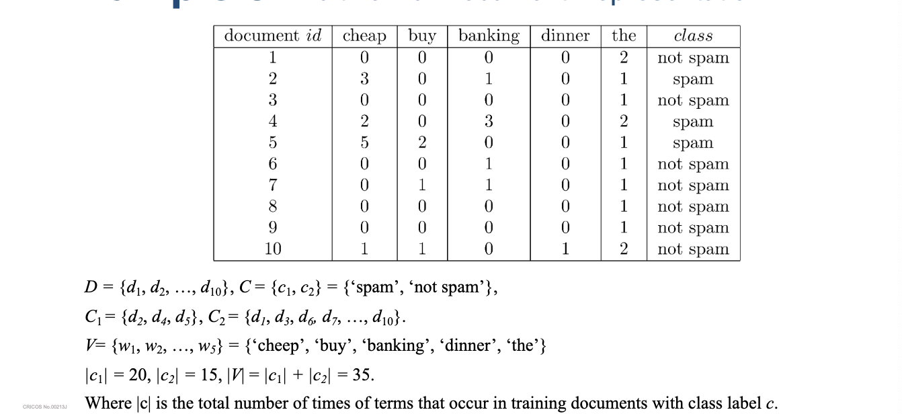
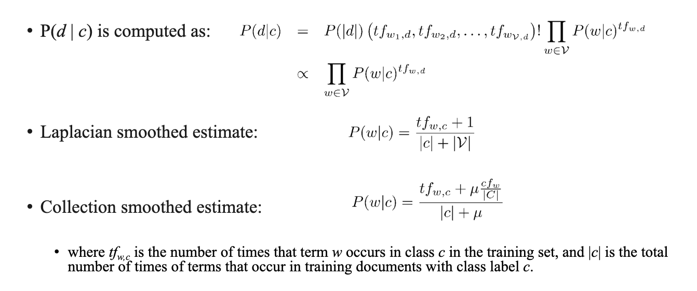
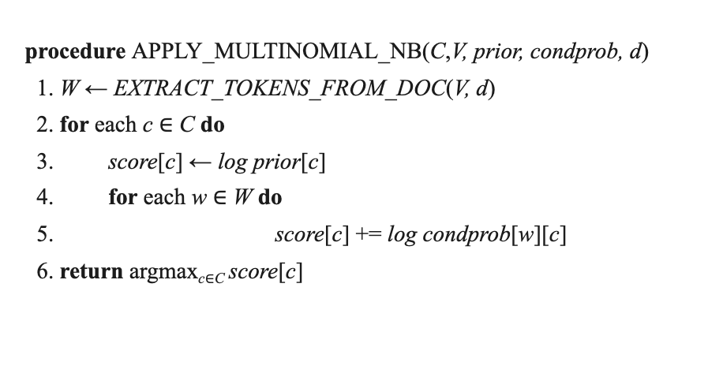
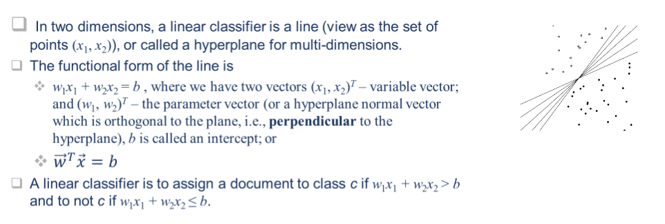
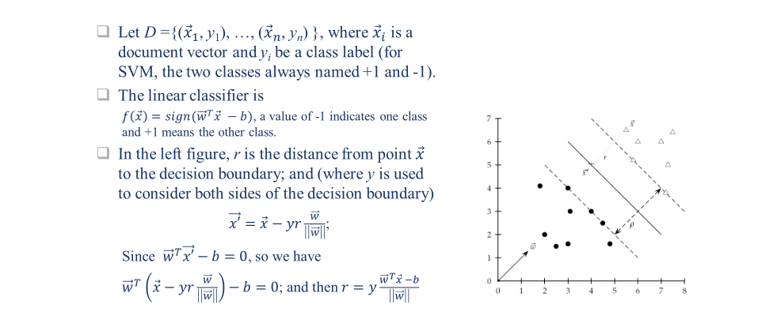
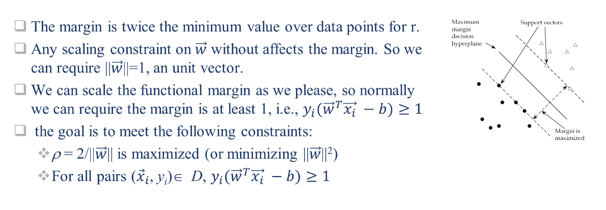
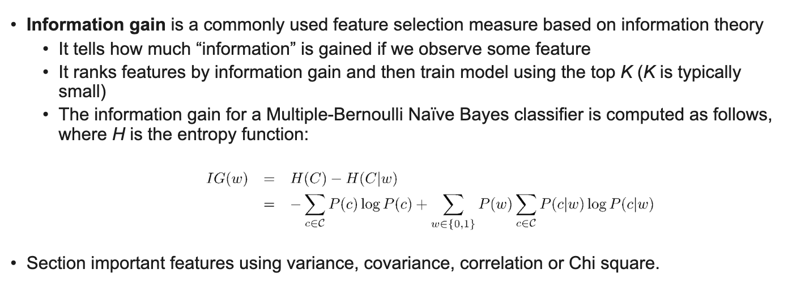

# Week 10 - cab431 - Text Classification

# 1. Classification introduction

• Classification (a.k.a categorization) is the process of classifying big data into categories by
using classifiers learned from training samples.
• Classification problem can be
• A “binary" classification problem If there are exactly two classes;
• A “multi-class" problem if there are more than two classes and each data object (e.g., a
document) falls into exactly one class or
• A “multi-label categorization" problem if a data object (e.g., document) may have more
than one associated category in a classification scheme.
• The process of classification generally consists of the feature selection, classification model
(classifier) development and classification evaluation tasks.

# Classification vs Clustering

- Machine learning methods

  - Supervised learning - infers a classifer of function from labeled training data
  - Unsupervised learning - learns patterns from unlabeled data (clustering))

- Classification and clustering are classical pattern recognition / machine learning problems

- Classification:

  - Asks "what class does this observation belong to?"
  - Supervised learning

- Clustering:
  - Asks "how can i group this set of observations?"
  - Unsupervised learning
- items can be documents, queries, emails entities, etc.

# Document Classification

• Document classification is to assign a document to one or more classes or categories.
• The documents to be classified may be texts, images, music, etc.
• When not otherwise specified, text classification is implied.
• Documents may be classified according to their subjects (contents) or other attributes (or
meta-data, such as document type, author, printing year etc.)
• The content-based approach
• The class assigned to a document is based on subjects (topics) in the document.
• The request-based approach
• The class assigned to a document is based on “relevance”, i.e., the anticipated request from users is
influencing how documents are being classified. It is targeted towards a particular audience or user
group.
• The statistical approaches for categorization
• It uses machine learning methods to learn automatic classification rules based on human-labelled
training documents.

# Text Classification Application

- Classification is widely used for dealing with big data
- Example applications
  - spam detection
  - sentiment analysis
  - Semantic classification of documents/advertisements

# Spam detection

- Classification is widely used to detect spam

- types of spam

  - Link Spam
    - adding links to boards, blogs, guestbooks, etc.
    - link exchange networks
    - Link farms
  - Term Spam
    - URL term spam
    - Dumping
    - Phrase stitching
    - Weaving

- Useful features

  - unigrams
  - formatting (invisble text, flashing etc)
  - Misspellings
  - IP addresses

- Different features are useful for different types of spam detection tasks
- email and web page spam are by fair the most widely studied, well understood and easiest to detect for spam.

- Assassin is an intelligent email filter to identify spam.

# Sentiment Analysis

- blogs, online reviews and forum posts are often opinionated
- Sentiment analysis is the task of identifying the polarity of a given text
- Polarity can be positive, negative or neutral

- Sometimes the strength of the opinion is also important

  - e.g. "I love this movie" vs "I like this movie"
  - Weakly positive vs strongly positive, weakly negative vs strongly negative

  - useful features
    - Entities and aspects
      - unigrams
      - bigrams
    - apart of speech tags
    - adjectives

# Classifying Online Ads

• Unlike traditional search, online advertising goes beyond “topical relevance”.
• A user searching for ‘tropical fish’ may also be interested in pet stores, local aquariums, or even
scuba diving lessons.
• These are semantically related, but not topically relevant!
• As we mentioned before, it is possible to use standard information retrieval techniques to find
these semantic matches for advertising,
• It is also possible to use a classifier that maps queries (and web pages) into semantic classes.
• We can bridge the semantic gap by classifying ads and queries according to a semantic hierarch

# Example 1 (Semantic Class)

• Semantic hierarchy ontology
• Example: Pets / Aquariums / Supplies
• Training data
• Large number of queries and ads are manually
classified into the hierarchy
• Nearest neighbor classification has been shown to be
effective for this task.
• Hierarchical structure of classes can be used to
improve classification accuracy
Rainbow

- For example, we have a web page about rainbow fish (a type of tropical fish) and an advertisement for
  tropical fish food.
- The web page is classified as “Fish”
- The ad is classified as “Supplies”.
- Here, “Aquariums” is the least common ancestor.
- Although the web page and ad do not share any terms in common (except fish), they can be matched because of their semantic similarity

```mermaid
graph LR
A[Aquariums] --> B[Supplies]
A --> C[Fish]
c --> D[Rainbow fish resources (web page)]
B --> E[Tropical fish food (ad)]
```

# How to Classify?

• How do humans classify items?
• For example, suppose you had to classify the
“healthiness” of a food
• Identify set of features indicative of health
• Energy, fat, protein, etc.
• Extract features from foods
• Read nutritional facts, chemical analysis, etc.
• E.g., nutrition information panel (see right table)
• Combine evidence from the features into a hypothesis
• Add health features together to get “healthiness
factor”
• Finally, classify the item based on the evidence
• If “healthiness factor” is above a certain value,
then deem it healthy
• How does a machine classify items?

# 2. Naive Bayes Classifier

Naïve Bayes is one of the most straightforward yet effective classification techniques.
• Classification task
• Let C = {c1 , c2 , . . . , cJ } be a fixed set of classes, and U be the document space (or the set of
incoming documents).
• Let D be a training set that consists of labelled documents <d, c>,where <d, c> ∈ U × C.
• E.g., <d 1 , c1 > = <“Beijing joins the World Trade Organization”, China>
• A classifier (or classification function) maps documents to classes:
• cf: U -> C
• This type of learning is called supervised learning because a supervisor (the human who defines the
classes and labels training documents) serves as a teacher directing the learning process.

# Bayes Decision

- it uses Bayes' rule to classify documents into two classes, relevant and irrelevant.

- Probabilistic classifier based on Bayes Rule:
  $$
  P(c|d) = \frac{P(d|c)P(c)}{\sum_{c' \in C}P(d|c')P(c')}
  $$

where c is a random variable corresponding to the class d is a random variable corresponding to the document

# Probability: Random Variables

- Random variable are non-deterministic variables

  - Can be discrete or continuous
  - model uncertainty in a variable

- $P(X = x)$ means the probability that the random variable X takes on the value x

Example:
• Let X be the outcome of a coin toss
• P(X = heads) = P(X = tails) = 0.5
• Example: Y = 5 - 2X
• If X is random, then Y is random
• If X is deterministic then Y is also deterministic
• Note: “Deterministic” just means P(X = x) = 1.0!

Documents are classified according to ( argmax means return the class c, out of classes C, that maximizes P(c | d) )

Must estimate P(d | c) and P(c)
• P(c) is the probability of observing class c
• P(d | c) is the probability that document d is observed given the class is known to be c

- P(c) is the probability of observing class c
- Estimated as the proportion of training documents in class c:

$$
P(c) = \frac{N_c}{N}
$$

where $N_c$ is the number of training documents in class c, and N is the total number of training documents.

# Estimating P(d | c)

- $P(d|c)$ is the probability that document d is obeerved given the class is known to be c

- estimate depends of the event space used to represent documents

- what is the event space?
  - the set of all possible outcomes for a random variable
  - for a coin toss the event space is S = {heads, tails}

# multiple Bernoulli event space

- Documents are represented as binary vectors
- One entry for each term in the vocabulary
- Entry i = 1 if term i occurs in the document and 0 otherwise

• Multiple Bernoulli distribution is a natural way to model distributions over binary
vectors
• Same event space as used in the classical probabilistic information retrieval model.

# Example 3 (multinomial Document representation)



# multinomial Estimating $P(d|c)$



# Actually NB implementation

- let document d be represented as a vector of term frequencies d= (w1, w2, ..., wn) we have:

$$
P(c|d) = P ∝ P(c) \prod_{w_i \in d}P(w_i|c)
$$

- where each conditional probability 𝑃(𝑤$ |𝑐) indicates how likely term w i is relevant to class c, and ∝ (\propto symbol) denotes proportionality

- The formula above can be converted to a summation by applying the logarithm to both sides.

$$
P(c|d) \propto \log P(c) + \sum_{w_i \in d} \log P(w_i|c)
$$

# Naive Bayes Algorithm (multinomial model): Training


# Naive Bayes Algorithm (multinomial model): testing



# Vector Space clasification

- Documents are represented as vectors of term weights


# Vector Space Classifiers

• Rocchio classification
• It divides the vector space into regions centered on centroids (or
prototypes), one for each class, computed as the center of mass of all
documents in the class.
• SVM
• Support Vector Machines
• kNN (or k nearest neighbors)
• For 1NN we assign each document to the class of its closest neighbor.
• For kNN we assign each document to the majority class of its k closest neighbors where k is a parameter.
• The rationale of kNN classification is that, based on the contiguity hypothesis, we expect a test document d to have the same label as the training documents located in the local region surrounding

# Rocchio Classification

• For an input training set D and a set of class labels C, the training procedure of Rocchio classification uses centroids to represent
classes. The centroid of a class is computed as the mean vector of class members.
• Training - given a list of vectors in each class
”cj ” of C. We can sum all the vectors they are
from class c j to form a mean vector (or the centroid of c j ).
• Test - for any new document d, in the test phase, we can determine whether document d belongs to which class by checking which class (i.e. its centroid) is closed to d.

# Support Vector Machines (SVM)

- it is based on geometric principles
- given a set of inputs labelled `+` and `-`, it tries to find the best hyperplane that separates the two classes

**Common questions**

- How is "best" defined?
- what if no hyperplane can separate the two classes?

# why SVM?

• For two-class, separable training data sets, there are lots of possible linear
separators.
• Intuitively, a decision boundary drawn in the middle seems better than others in
a training set; but it may not be the middle of a testing set.
• SVM defines is looking for a decision surface that is maximally far away from
any data point.
• This distance from the decision surface to the closest data point determines the
margin of the classifier.
• The decision function for an SVM is full specified by a (usually small) subset of
the data which defines the position of the separator. These points are referred
to as the support vectors.
• The goal of SVM is to Maximize the margin.

# Formalize an SVM





# Functional Margin



# Separable vs. Non-Separable Data


# Linear Separable Case

# SVM Tools

• Solving SVM optimization problem is not straightforward
• Many good software packages exist
• SVM-Light
• LIBSVM
• R library
• Matlab SVM Toolbox
• scikit-learn (Machine Learning in Python

# Example 4. scikit-learn: SVM

```python
rom sklearn import svm
X = [[0, 0], [1, 1], [2, 2], [-1, 1], [1.5, 2.5]]
y = [0, 1, 1, 0, 1]
clf = svm.SVC(gamma='scale')
clf.fit(X, y)
result1 = clf.predict([[2., 2.], [3., 3.], [-2., 0]])
print("SVC Predication Results: %s" % result1)
supp_v = clf.support_vectors_
print("Support Vectors: %s" % supp_v)
lin_clf = svm.LinearSVC()
lin_clf.fit(X, y)
result2 = clf.predict([[2., 2.], [3., 3.], [-2., 0]])
print("Linear Predication Results: %s" % result2)
dec = lin_clf.decision_function([[2., 2.], [3., 3.], [-2., 0]])
print("Linear decision function values: %s" % dec)
```

# kNN training and testing

• The k-nearest neighbors algorithm (k-NN) is a non-parametric supervised learning
method.
• Given an incoming document, the nearest neighbour classifier finds the training
example that is nearest (according to some distance metric) to it.
procedure TRAIN-KNN(C, D)

1. D′ ← PRE_PROCESS(D)
2. k ← SELECT-K(C, D′)
3. return D′, k
   procedure APPLY-KNN(C, D′, k, d)
4. S k ← COMPUTE_NEAREST_NEIGHBORS(D′, k, d)
5. for each cj ∈ C do
6. p j ← |S k ∩ cj |/k
7. return argmaxj p j # where j is a class label. The return value is the class label that maximizes p j.

# Example 5. Nearest Neighbor Classification

- The pluses + and minuses -
  indicate positive and negative training examples, respectively.
  • The solid grey line shows the actual decision boundary, which is highly non-linear.
  • SVMs with a non-linear kernel,
  would have a difficult time fitting a model to this data.
  • For this reason, the nearest neighbour classifier is optimal.


# Classes of Classifiers

• Types of classifiers
• Generative (Naïve-Bayes)
• Discriminative (Rocchio, SVMs)
• Non-parametric (nearest neighbor)
• Types of learning
• Supervised (Naïve-Bayes, kNN, SVMs)
• Semi-supervised (Rocchio + relevance models)

# 4. Feature Selection & Evaluating Classifiers

• Document classifiers can have a very large number of features, but NOT all features are useful.
Also, excessive features can increase computational cost of training and testing.
• Feature Selection Methods reduce the number of features by choosing the most useful features
• Filters that select terms or patterns by ranking them with correlation coefficients.
• They do not incorporate learning (e.g., tf\*idf, BM25 weights).
• Wrapper methods that assess subsets of features according to their usefulness to a given
predictor.
• They use a learning method to measure the quality of subsets of features (eg., cross-
validation) without incorporating knowledge about the specific structure of the
classification or regression function.
• Embedded methods implement feature selection during the model training.
• They do not separate the learning from the feature selection part

# Other Measures


# Evaluating Classifiers

- Common classification metrics
  - precision
  - recall
  - F-measure
  - Accuracy
  - ROC curves analysis
    - the curve is created by plotting the true positive rate (TP rate) against the false positive rate (FP rate) at various threshold settings
- Differences from IR metrics
  - "Relevant" replaced with "classified correctly"
  - Micr-averaging more commonly used
    - Micro-averaging is useful if you want to know how the system as a whole performs
    - Macro-averaging is useful if you want to know how the average user performs
  
