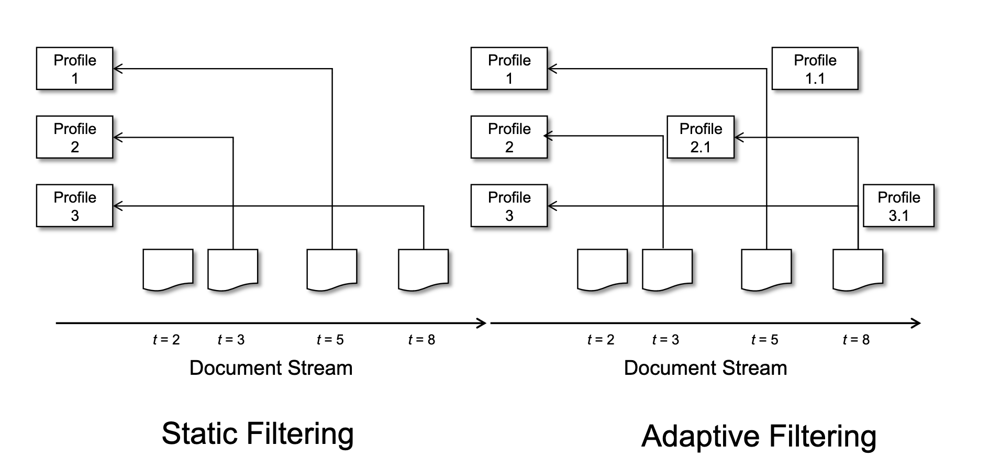
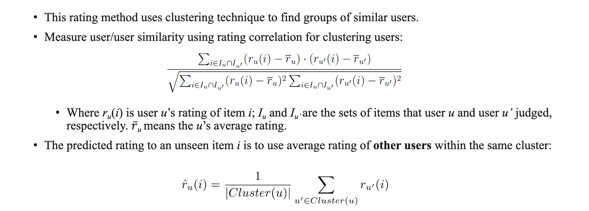

# week 11 cab431 - Social media analytics

## 1. Social media analytics
- It is defined as, "the art and science of extracting valuable hidden insights from vast amounts of semi-structured and unstructured social media data (e.g., Twitter, Facebook) and users (e.g., user reviews and ratings) to enable informed and insightful decision making."
- It is also commonly used by marketers to track online conversations about products and companies.
- There are three main steps in analyzing social media:
  - Data identification, identifying the subsets of available data to focus on for analysis;
  - Data analysis, and
  - Information interpretation.


## Social media
Web-based services that allow individuals, communities, and organizations to produce, share, and engage with user-generated content.

Media platforms and technologies
- e-commerce gateways;
- microblogs (e.g., Tumblr, Instagram, Twitter);
- social networking (e.g., LinkedIn, Facebook, MySpace);
- multimedia portals (e.g., Vimeo, Twitter, Facebook, Periscope, TikTok, YouTube);
- virtual worlds (e.g., Second Life);
- review platforms (e.g., Tripadvisor, Foursquare); and
- social gaming (e.g., World of Warcraft).


## Microblog Retrieval
- Different types of microblogging technologies are available within social media to help achieve goals.
- Twitter is a microblogging service introduced in March 2006. With over 125 million daily active users, Twitter is ranked among the most popular social media platforms.
- The platform allows everyone to create and share information and ideas in real-time.
- "Tweet" is a term that refers to a short text message that a Twitter user can produce.
- This short plain text (tweet) can also include videos, photographs, and website URLs.
- In the beginning, Twitter allowed 140 characters for a plain text message. The length has expanded to 280 characters since Nov 2017.
- The "@username" feature can be used to mention a specific person for interaction, e.g., user network.
- Hashtag feature can also be used to annotate user messages where the prefix "#" character is used as a non-spacing word, e.g., Hashtag based search.


## example 1 Tweets with json:
```json
{
  "text" : " i hate this weather",
  "created_at" : "Wed Oct 10 20:19:24 +0000 2018",
  "id" : 1050118621198921728,
  "retweet_count" : 0,
  "favorite_count" : 0,
  "lang" : "en",
  "screen_name" : "user1"
}
```

## Query Likelihood
- uses Bayesian (Dirichlet) smoothing.
- Considers both the query and the document.
$$
P(Q,d) = \sum_{w \in Q,d} c(w, Q) \log (1+\frac{c(w,d)}{\mu \cdot P(w|C)}) + |Q| \log \frac{\mu}{\mu + |d|}
$$

where:
- $c(w,d)$ is the word count in the document
- $c(w,Q)$ is the word count in the query
$|d|$ and $|Q|$ are the lengths of the document and query respectively
- $\mu$ is the probability of the word in the collection that is used to normalise the model.
- $P(w|C)$ is the collection language model


## Sentiment Analysis
- Sentiment analysis (opinion mining) discovers users' opinions about products or services in on-line reviews or feedback, or observes trends in public mood (e.g. analysis of clinical records, political debates, etc.).

- It is widely used to voice of customers (users) materials such as reviews and survey response, online, social media and healthcare materials for applications that range
from marketing to customer service to clinical medicine

- Opinion can be represented as a tuple of Entity, Aspect, Orientation, Opinion Holder and
Time.
- An entity is the name of an entity, which could refer to a product for example.
- An aspect can be a feature, component or function of the entity.
- The orientation is the opinion provided about the entity and/or the aspect that was provided by the opinion holder at a specific time.

## Tasks in Sentiment Analysis
- Polarity Classification
  - Group the expressed opinion in a document, a sentence or an entity feature/aspect in positive, negative or neutral regions.
- Subjectivity Classification
  - Determine whether a document, a sentence or an entity feature/aspect is subjective or objective.
- Emotion Classification
  - Determine the emotion expressed in a document, a sentence or an entity feature/aspect.

- Source detection
- identify the person, organisation, or more generally, the entity that is thesource of subjective information, including named entity recognition and relationship extraction.

- Target detection
  - The goal of sentiment target detection is to determine the subject of a sentiment expression


## Extraction of Opinion Sentences
• Aspects are nouns and/or noun phrases, for example, “face recognition”, “zoom”, and “touch screen” are
aspects of the product “camera”.
• Opinion words are mostly adjectives. They are the closest adjective to the aspects in the sentence. An
opinion lexicon can be used to identify and extract opinion words along with their orientation.
• Extraction of opinions:
• Build a list of aspects from two sources: product specifications and word synonyms. Product
specifications is a list provided by the manufacturer for each product, while synonyms are the
matching words taking from the WordNet dictionary.
• Identify the aspects and opinions in sentences. You may need to group aspects based on frequency
and synonyms.
• Pattern mining is applied to find frequent sets of tags that are sets of POS tags that occur together.
A set of tags is defined as frequent if it appears in more than 1% (minimum support) of the review
sentences.
• For example, the tag of aspect appears first, the sequence of tags [NN][VBZ][RB][JJ] corresponds to the sentence
“software is absolutely terrible”.
• Weighting sentences by adding tags’ weights and then select sentences with high scores.


## Adjective, adverb and verb weights
| Tags | Description              | Weight |
|------|--------------------------|--------|
| JJ   | Adjective                | 1      |
| JJR  | Comparative Adjective    | 2      |
| JJS  | Superlative Adjective    | 3      |
| RB   | Adverb                   | 1      |
| RBR  | Comparative Adverb       | 2      |
| RBS  | Superlative Adverb       | 3      |


- note that categories are used for verbs.
- if the sentence contains a verb from positive category, then the sentence is positive. (+1 is added to the weight) and vice versa for negative category.

| Verb category | Orientation | Verbs                | Comments                                        |
|---------------|-------------|----------------------|-------------------------------------------------|
| Tell verbs    | Positive    | tell                 | Positively reinforce an opinion                  |
| Chitchat verbs| Positive    | argue, chatter, gab  | Positively reinforce opinion is being expressed |
| Advise verbs  | Positive    | advise, instruct     | Positively reinforce an opinion                  |
|               | Negative    | admonish, caution, warn | Negatively reinforce the degree of certainty about a given opinion |


## 2. Social Search
- Social Search - Communities of users actively participate in the search. Goes beyond classical search.
- Key Differences - Users interact with the system, Users interact with other users either implicitly or explicitly


## Web 2.0
- Social search includes but is not limited to the so-called social media sites
- Web 2.0 is a term that refers to the second generation of the World Wide Web, where content is user-generated and dynamic, and where users interact with each other.
- Social media sites
  - Users generated content
  - Users can tag their own and others content
  - users can share favourite content with others

- Examples
  - Social networking sites (Facebook, LinkedIn)
  - Blogs (Blogger, Wordpress)
  - Microblogging (Twitter)
  - Wikis (Wikipedia)
  - Social bookmarking (Delicious)
  - Social news (Digg)

# Social Search Topics
- User tags
- Searching within communities
- Document filtering
- Recommender systems

## User Tags
- Then: library card catalogs
  - Indexing terms chosen with search in mind
  - Experts generate indexing terms
  - terms are very high quality 
  - Terms chosen from controlled vocabulary
- Now: user tags
  - Tags not always chosen with search in mind
  - Users generate tags
  - Tags can be noisy or even wrong
  - tags chosen from folksonomy
    - A folksonomy is a system of classification derived from the practice and method of collaboratively creating and managing tags to annotate and categorize content; this practice is also known as collaborative tagging, social classification, social indexing, and social tagging.

## Types of User Tags
• Content-based
• car, woman, sky
• Context-based
• new york city, empire state building
• Attribute
• nikon (type of camera), black and white (type of movie), homepage (type of web page)
• Subjective
• pretty, amazing, awesome
• Organizational
• to do, my pictures, readme

#### Taxonomy vs Folksonomy
- Taxonomy
  - A taxonomy is a hierarchical structure of categories used to classify content.
  - Taxonomies are created by experts.
  - Taxonomies are used to classify content.
  - Taxonomies are used to find content.

- Folksonomy
  - A folksonomy is a flat structure of tags used to classify content.
  - Folksonomies are created by users.
  - Folksonomies are used to classify content.
  - Folksonomies are used to find content.

## Searching Tags 
Tags can be used to describe textual or non-textual items (e.g., images or videos) to provide a textual dimension to items.
• These textual representations of items can be very useful for searching; however, tags are very sparse representations of very complex items.
• Searching user tags is challenging
• Most items have only a few tags
• Tags are very short
• Boolean, probabilistic, vector space, and language modeling will fail if use naïvely
• Must overcome the vocabulary mismatch problem between the query and tags. Possible ways to overcome this problem
• Stemming (e.g., stem classes in week 7)
• Pseudo-relevance feedback for tag expansion

## Tag Expansions
- it uses search results (pseudo-relevance feedback) to enrich a tag representation.
- it overcomes vocabulary mismatch problems by expanding tag representation with external knowledge sources.

- Possible external sources:
  - Thesaurus
  - Query logs
  - Web search results

- After tags have been expanded, we can use standard IR techniques to search for items.

## Example 2 Tag Expansion process
1. Use the tag "tropical fish" as a query Q to find top-k relevant documents D1, D2, ..., Dk.
2. Select terms with the highest probability, e.g. terms "fish", "tropical", "aquariums", "goldfish" and "bowls".
3. Q is expanded with these terms to form a new query Q' = "tropical fish fish tropical aquariums goldfish bowls".
4. Srach by the new query Q' to find top-k relevant documents D1', D2', ..., Dk'.

# Issues
- Even with tag expansions, searching tags is still challenging
- tags are inherently noisy (e.g., misspellings, abbreviations, etc.) and wrong
- Many items may not have any tags
- Typically easier to find popular items with many tags than less popular items with few tags.

## Inferring Missing tags
- items that have no tags pose a challenge to a search system.
- How can we automatically tag items with missing tags?
  - Use cases of inferred tags:
    - Improve search results
    - Automatic tag recommendations

## Methods for inferring Tags

- TF-IDF if items are textual, such as books or news articles.
$$
wt(w) = \log(f_w,D + 1 ) \log(\frac{N}{df_w})
$$

where $f_w,D is the number of times term w occurs in item D, N is the total number of items, and df_w is the number of items that contain term w.
- Classification
  - Train binary classifiers to predict whether a term is relevant to an item or not. (Represent items as vectors of terms and use the vector as input to the classifier.)
  - this performs well for popular tags but not good for rare tags.
- Maximal marginal relevance
  - Finds tags that are relevant to the item and novel with respect to existing tags (or not very similar to
any of the other tags), where t is tag, i is an item and Ti is the current set of tags for item i.

## Browsing and Tag Clouds
• Search is useful for finding items of interest 
• Browsing is more useful for exploring collections of tagged items
• Various ways to visualize collections of tags
• Tag lists
• Tag clouds
• Alphabetical order
• Grouped by category
• Formatted/sorted according to popularity


## Collaborative Search
- Traditional search assumes a single searcher
- Collaborative search assumes a group of searchers with a common goal
  - e.g. an online community - groups of entities that interact with each other
- Example scenarios
  - students doing research for a history project
  - Family members searching for information on how to care for an aging relative.
  - Team member working to gather information and requirements for an industrial project.

## Types of Collaborative Search
- Two types of collaborative search setting depending on where participants are physically located.
- Co-located collaborative search
  - Participants are physically located in the same place
  - Participants can communicate face-to-face
  - Participants can share a single computer

- Remote collaborative search
  - Participants are physically located in different places
  - Participants can communicate via email, chat, or video conferencing
  - Participants can share a single computer or use their own computers

- challenges
  - How to coordinate search activities?
  - How to share search results?
  - How to share search strategies?
  - How to share search history?
  - How to share search sessions?

- very few commercial collaborative search systems.
- likely to see more of this type in the future.


# 3. Document Filtering


## profiles
- Represents ling term information needs
- can be represented in different ways:
  - boolean or keyword query
  - sets of relevant and non-relevant documents
  - Relational constraints
    - "published before 1990"
    - "price within the $100-$200 range"
    - "author is Stephen King"
- Actual representation usually depends on underlying filtering model.
- can be static (static filtering) or updated over time (adaptive filtering)

## Static Filtering
- given a fixed profile, how can we determine if an incoming document should be delivered?
- Treat as information retrieval problem
  - Boolean 
  - Vector space
  - Language modeling
- Treat as supervised learning problem
  - Naïve Bayes
  - Support vector machines (SVM)

## Static Filtering with Language Models
- Assume profile consists of K relevant documents $T_i$, each with weight αi

- Probability of a word given the profile is (variable P means a profile language model, $\lambda$ is used for smoothing)
<!-- add equation -->

KL divergence is used to measure the difference between two probability distributions.


## Adaptive Filtering
- In adaptive filtering profiles are dynamic
- How can profiles change 
  - user can explicitly update the profile.
  - User can provide (relevance) feedback about the documents delivered to the profile.
  - Implicit user behavior can be captured and used to update the profile.

## Adaptive Filtering Models
- Rocchio
  - Profiles treated as vectors ($P'$ is the adapted profile)
- relevance based language models
  - Profiles treated as language models

## Fast Filtering with Millions of Profiles
- Real filtering systems
  - may have thousands or millions of profiles
  - many new documents will be published every day
- How can we efficiently filter millions of profiles against millions of documents?
- Use inverted index to index profiles
  - Each profile is a document
  - Each profile is represented as a vector of terms
  - Each term is a posting list of profiles that contain the term

## evaluation of filtering systems
- Definition of “good” depends on the purpose of the underlying filtering system
||Relevant| non-relevant|
|---|---|---|
|Retrieved|True positive (TP)|False positive (FP)|
|Not retrieved|False negative (FN)|True negative (TN)|

- Generic filtering evaluation measure:
  - $U = \alpha TP + \beta FP + \gamma FN + \delta TN$  
  - α = 2, β = 0, δ = -1, and γ = 0 is widely used

# Summary of Filtering Models
|Model|Profile representation|Profile updating|
|---|---|---|
|Boolean|Boolean Expression|N/A|
|Vector space|Vector| Rocchio|
|Language model| Poisson distribution| Relevance-based language model|
|classification|Model parameters| Online learning|

# Recommender Systems
- recommender systems are used to recommend items to users

e.g. Netflix or Amazon

- Recommender systems use collaborative filtering to recommend items

## Collaborative Filtering
- In static and adaptive filtering, users and their profiles are assumed to be independent of each other.

- However, in real world, similar users are likely to have similar preferences.

- Collaborative filtering exploits relationships between users to improve how items (documents) are matched to users (profiles)

## Algorithm’s input and output
- Inputs
  - (user, item, rating) tuples for items that the user has explicitly rated
    - Typically represented as a user-item matrix.
- Output
  - (user, item, rating) tuples for items that the user has not rated
    - Can be thought of as filling in the missing entries of the user-item matrix.
  - Most algorithms infer missing ratings based on the ratings of similar users.

## Rating Method - Using User Clusters


## Rating Method - using nearest neighbors


## Evaluating Collaborative Filtering
- Standard metrics, such as precision are too strict for evaluating recommender systems
- Want to quantify how different predicted rating are from actual ratings

- The biggest difference between absolute error and mean squared error is that mean squared error penalizes incorrect predictions more heavily, since the penalty is squared.