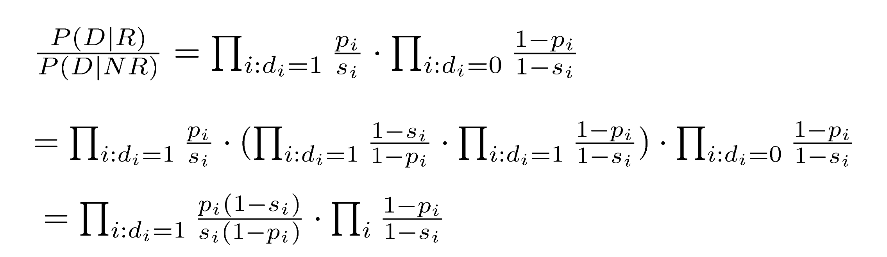
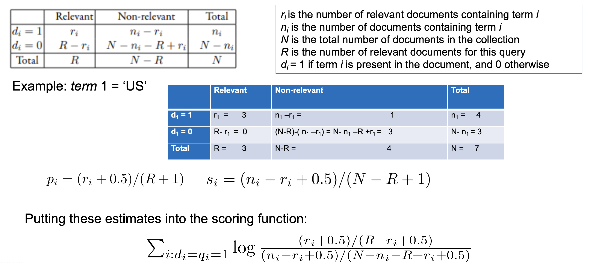
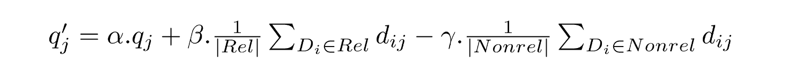

# Week 4 - Information Retrieval Models

## 4.1 Overview and Older IR Models
Information retrieval (IR) models provide a mathematical framework for defining
the search process
• includes explanation of assumptions
• basis of many ranking algorithms
• can be implicit
• For a given query Q, an IR model finds relevant documents to answer Q.
• Progress in IR models has corresponded with improvements in effectiveness.
• The key research issue is theories about relevance.

### Relevance
 - Complex concept that has been studied for some time
 - Many factors to consider
 - People often disagree when making relevance judgments
 - IR models make various assumptions about relevance to simplify problem
 - e.g., topical vs. user relevance
 - A document is topically relevant to a query if it is judged to be on the same topic, i.e., the query and the document are about the same thing. User relevance considers all the other factors that go into a user’s judgment of relevance.
- e.g., binary vs. multi-valued relevance

### Order IR Models
- Boolean Retrieval Model
  - Two possible answers: yes or no (true or false)
  - “exact-match” retrieval
  - Queries are Boolean expressions
  - Is considered the simplest IR model for ranking documents

- Query usually specified using Boolean Operators
  - AND, OR, NOT
  - e.g., “computer AND science”
  - Proximity operators (define constraints on the distance between words; e.g., requiring words to co-occur within a certain “window” (length) of text);
  - Wildcard operators (e.g., “comput*” matches “computer”, “computing”, “computation”, etc.), Wildcard characters (define the minimum string match required for a word) are also
commonly used in Boolean queries.
  - e.g., “comput?” matches “computer” and “compute” but not “computing” or “computation”.
  - e.g., “comput*” matches “computer”, “computing”, “computation”, etc.

## Searching By Numbers
- It is the process of developing queries with a focus on the size of the retrieved document set.
- It is a consequence of the limitations of the Boolean retrieval model.
- For example, sequence of queries driven by number of retrieved documents:
  - e.g. “lincoln” search of news articles
  - president AND lincoln
  - president AND lincoln AND civil war
  - president AND lincoln AND NOT (automobile OR car)
  - president AND lincoln AND NOT (automobile OR car) AND civil war
  - president AND lincoln AND (biography OR life OR birthplace OR gettysburg) AND NOT (automobile OR car)

  - This will retrieve any document containing the words “president” and “lincoln”, along with any one of the words “biography” “life”, “birthplace”, or “gettysburg” (and does not mention “automobile” or “car”)\

## Advantages of Boolean Retrieval
- Advantages
  - Results are predictable, relatively easy to understand and explain 
  - Many different features can be incorporated (e.g., document date or type)
  - Efficient processing since many documents can be eliminated from search
- Disadvantages
  - Effectiveness depends entirely on user queries (simple queries will not work well).
  - Complex queries are difficult that requires considerable experience.

## Vector Space Model
- Documents and query represented by a vector of term weights
$$
Q = (w_1, w_2, ..., w_n) \\
D_j = (w_{1j}, w_{2j}, ..., w_{nj})
$$

A Collection of Documents can be represented by a matrix of term weights

$$
\begin{bmatrix}
w_{11} & w_{12} & \cdots & w_{1n} \\
w_{21} & w_{22} & \cdots & w_{2n} \\
\vdots & \vdots & \ddots & \vdots \\
w_{m1} & w_{m2} & \cdots & w_{mn}
\end{bmatrix}
$$

## Vector Space Model - similarity measure

Documents ranked by distance between points representing query and documents
- Similarity measure more common than a distance or dissimilarity measure
- e.g., Cosine correlation
<!-- add an image -->

Consider two documents D 1, D 2 and a query Q
• D 1 = (0.5, 0.8, 0.3), D 2 = (0.9, 0.4, 0.2), Q = (1.5, 1.0, 0)

## Document Representation - Term Weights
- Tf*idf weight
  - Term frequency weight measures importance of term k in document $( D_i )$:

  - Inverse document frequency measures importance in collection:

  - Some heuristic modifications have been made.

  *add equations*

# Vector Space Model cont.
- Advantages:
  - Simple computational framework for ranking.
  - Any similarity measure or term weighting scheme could be used.

- Disadvantages:
  - Assumption of term independence.
  - No predictions about techniques for effective ranking. There is an **implicit assumption that relevance** is related to the similarity of query and document vectors.

## 2. Probabilistic Models
Proving the superiority of an IR model over other models in terms of effectiveness is challenging due to the complex nature of formalizing human activity.

- The validity of a retrieval model generally has to be validated empirically, rather than theoretically.

- Probability Ranking Principle (early theoretical statement about effectiveness, Robertson (1977)). Originally described as follows:

  - "If a reference retrieval system's response to each request is a ranking of the documents in the collection in order of decreasing probability of relevance to the user who submitted the request,
  
  - where the probabilities are estimated as accurately as possible on the basis of whatever data have been made available to the system for this purpose,
  
  - the overall effectiveness of the system to its user will be the best that is obtainable based on those data."

## IR as Classification - Bayes Classifier

## Examples of Relevant and Non-relevant documents for a query

| Document ID | Terms                       | Relevance to Q |
|-------------|-----------------------------|----------------|
| D1          | GERMAN, VW                  | 0 (no)         |
| D2          | US, US, ECONOM, SPY         | 1 (yes)        |
| D3          | US, BILL, ECONOM, ESPIONAG  | 1 (yes)        |
| D4          | US, ECONOM, ESPIONAG, BILL  | 1 (yes)        |
| D5          | GERMAN, MAN, VW, ESPIONAG   | 0 (no)         |
| D6          | GERMAN, GERMAN, MAN, VW, SPY| 0 (no)         |
| D7          | US, MAN, VW                 | 0 (no)         |

Let \( Q = \{ \text{US, ECONOM, ESPIONAG} \} \) be a query. 
\( C = \{D_1, D_2, D_3, D_4, D_5, D_6, D_7\} \) represents a collection of documents, where

\[
\begin{align*}
D_1 &= \{\text{GERMAN, VW}\} \\
D_2 &= \{\text{US, US, ECONOM, SPY}\} \\
D_3 &= \{\text{US, BILL, ECONOM, ESPIONAG}\} \\
D_4 &= \{\text{US, ECONOM, ESPIONAG, BILL}\} \\
D_5 &= \{\text{GERMAN, MAN, VW, ESPIONAG}\} \\
D_6 &= \{\text{GERMAN, GERMAN, MAN, VW, SPY}\} \\
D_7 &= \{\text{US, MAN, VW}\}
\end{align*}
\]

- The probability \( P(R|D_5) \) is unknown, as well as \( P(R|D) \), where \( D = \{\text{US, VW, ESPIONAG}\} = \{d_1, d_2, d_3\} \). To calculate \( P(D|R) \), you can use Bayes' theorem:

\[
P(D|R) = \frac{P(R|D)P(D)}{P(R)}
\]

- where \( P(D) \) is the probability of observing the terms \( D \), and \( P(R) \) is the probability of relevance.

## Estimating $P(D|R)$

- Assume independence of terms in the query, then

## Binary Independence Model

- Where i:d i = 1 means terms that have the value  (presence) in the document; and i:d i = 0 means terms that have the value 0 (absence) in the document.

## Binary Independence Model cont
- Scoring function is (if we ignore the common 2 nd product)

- Query provides information about relevant documents

- if we assume $p_i$ constant, $s_i$ approximated by entire collection, get idf-like
weight:

## Contingency Table

## BM25
Popular and effective ranking algorithm based on binary independence model
  • adds document and query term weights 

BM25 follows the following equation:
$$
        \sum_{i \in Q} \log \frac{\left(r_{i}+0.5\right) /\left(R-r_{i}+0.5\right)}{\left(n_{i}-r_{i}+0.5\right) /\left(N-n_{i}-R+r_{i}+0.5\right)} \cdot \frac{\left(k_{1}+1\right) f_{i}}{K+f_{i}} \cdot \frac{\left(k_{2}+1\right) q f_{i}}{k_{2}+q f_{i}}
$$

Where
- $f_i$ is the frequency of term i in the document
- $qf_i$ is the frequency of term i in the query
- k1, k2 are parameters whose values are set empirically
- $K = k_1((1-b) - b \times \frac{dl}{avgdl})$
- dl is doc length and avdl is the average length of a document in the collection.
- Typical TREC (Text REtrieval Conference) value for k1 is 1.2, k2 varies from 0 to 1000, b = 0.75

# BM25 Example
• Query with two terms, “president lincoln”, (qf = 1)
• No relevance information (r and R are zero)
• N = 500,000 documents
• “president” occurs in 40,000 documents (n 1 = 40, 000)
• “lincoln” occurs in 300 documents (n 2 = 300)
• “president” occurs 15 times in doc (f 1 = 15)
• “lincoln” occurs 25 times (f 2 = 25)
• document length is 90% of the average length (dl/avdl = .9)
• k1 = 1.2, b = 0.75, and k 2 = 100
• K = 1.2 · (0.25 + 0.75 · 0.9) = 1.11

**Implementation**

# Language Models
- *Unigram language model (a simple language model)*
  - probability distribution over the words in a language.
  - For example, if the documents in a collection contained just five different words (*w*1, *w*2, ..., *w*5), a possible language model for that collection might be 
    - (0.2, 0.1, 0.35, 0.25, 0.1)
    - where each number is the probability of a word occurring.
- N-gram language model
  - predicts words based on longer sequences are used. An *n*-gram model predicts a word based on the previous ***n* − 1 words.**
  - The most common n-gram models are bigram (predicting based on the previous *word*) and trigram (predicting based on the previous two words) models.

## Lms for Retrieval
Three possibilities:
• probability of generating the query text from a document language model
• probability of generating the document text from a query language model
• comparing the language models representing the query and document
topics
• Models of topical relevance
• The probability of query generation is the measure of how likely it is that a
document is about the same topic as the query.
• The probability of document generation is the measure of how likely it is that

## Lms for Retrieval cont
#### Query-Likelihood Model
- Rank documents by the probability that the query could be generated by the document model (i.e. same topic)

- Given query, start with $P(D|Q)$

- If using Bayes rule, we can write this as:
$$
P(D | Q)= P(Q | D)P(D)
$$

If assuming priori is uniform, unigram model we can use the following equation:
$$
 P(Q|D) = \prod_{i = 1}^{n}P(q_i|D)
$$

## Estimating Probabilities
- Obvious estimate for unigram probabilities is
$$
P(q_i|D) = \frac{c(q_i,D)}{|D|}
$$
In this where $c(q_i,D)$ is the number of times $q_i$ occurs in $D$ and $|D|$ is the length of $D$.
- If query words are missing from document, score will be zero

- This is the major problem.
- E.g., missing 1 out of 4 query words same as missing 3 out of 4.
- This is clearly not appropriate for longer queries.

## Smoothing
- Document texts are a sample from the language model
- Missing words should not have zero probability of occurring

- Smoothing is a technique for estimating probabilities for missing (or unseen) words

- lower (or discount) the probability estimates for words that are seen in the document text
- assign that “left-over” probability to the estimates for the words that are not seen in the text

## Estimating Probabilities

- $a_D$ is a constant $\lambda
- it gives an estimate of 
$p(q_i| D) = (1- \lambda) \frac{c(q_i,D)}{|D|} + \lambda \frac{c(q_i,C)}{|C|}$

-  Where $c_qi$ is the number of times a query word occurs in C, and |C| is the total number of word
occurrences in collection

Use logs for convenience
• accuracy problems multiplying small numbers

$$
        \log P(Q \mid D)=\sum_{i=1}^{n} \log \left((1-\lambda) \frac{f_{q_{i}, D}}{|D|}+\lambda \frac{c_{q_{i}}}{|C|}\right)
$$

## Relevance Models

- A relevance model represents the topics covered by relevant documents.
- E.g., language model can be used to represent information need
- Query and relevant documents are samples of text generated from this model 

Document likelihood model
- P(D|R) – is interpreted as the probability of generating the text in a document given a relevance model R.
- less effective than query likelihood due to difficulties comparing across documents (often documents are large) of different lengths.
- Note that a document with a model that is very similar to the relevance model is
likely to be on the same topic.
- how to compare two language models (one for documents and another for the relevant documents)?

## Pseudo-Relevance Feedback
- Relevance feedback is to acquire user feedback on the output that are initially returned from a given query Q.

- The feedback describes user information needs, and users typically label relevant outputs for Q (unlabelled outputs can be considered non-relevant information).

- In practical applications, there are three types of feedback: explicit feedback, implicit
feedback, and "pseudo" feedback.

- Pseudo relevance feedback (blind feedback) is a method of finding an initial set of most likely relevant documents. Normally, we assume that the top "k" ranked documents are relevant to Q.

- Pseudo relevance feedback can be used to estimate a relevance model from query Q and top-k ranked documents.

- Then we can rank new documents by similarity of document model to this relevance model.
• Kullback-Leibler divergence (KL-divergence) is a well-known measure of the difference between two probability distributions. It can be used to measure the similarity between a document model and a relevance mod

## KL-Divergence
• Given the true probability distribution P and another distribution Q that is an approximation to P,

- you can use negative KL-divergence to measure the difference between P and Q.
- assume relevance model R for the query is the true distribution (not symmetric), and the approximation to be the document language model (D):

$$
\sum_{w \in V} P(w | R) \log P(w | D) - \sum_{w \in V} P(w | R) \log P(w | R)
$$

note that the second term of this equation does not depend on the document and can be ignored for the purpose of ranking

- Given a simple maximum likelihood estimate for P(w | R), based on the frequency in the query text, ranking score for a document is

$$
\sum_{w \in V} \frac{f_w, }{|Q|} \log P(w | D)
$$

In this Q can be expanded by adding the top-ranked documents to the query text.
$P(W|D)$ is a rank equivalent to the query likelihood score.

- Query likelihood model is a special case of retrieval based on relevance model.

## Estimating the Relevance Model
- Probability of pulling a word w out of the “bucket” representing the relevance model depends on the n query words we have just pulled out

- We view the probability of w is the conditional probability of observing w given that we just observed the query words q 1 . . . q n

## Pseudo-Feedback Algorithm

## Rocchio Algorithm
- It is developed based on Relevance Feedback (or Pseudo-Feedback).
- It is a technique for query modification
- Rocchio algorithm
• Maximizes the difference between the average vector representing the relevant documents and
the average vector representing the non-relevant documents.
• Modifies query Q to Q’ (optimal query) according to

where:
α, β, and γ are parameters
• Typical values 8, 16, 4
• q j is the initial weight of query term j,
• d ij is the weight (if*idf) of the jth term in document i,
• Rel is the set of identified relevant documents,
• Nonrel is the set of non-relevant documents,
• | . | gives the size of a set.

