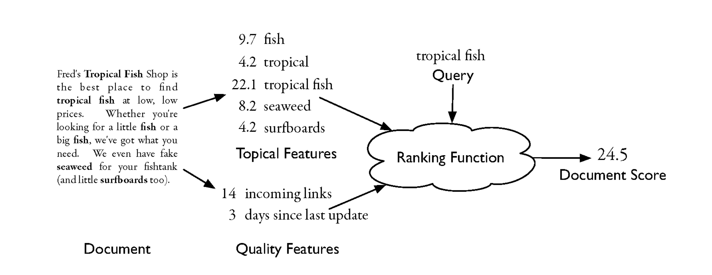
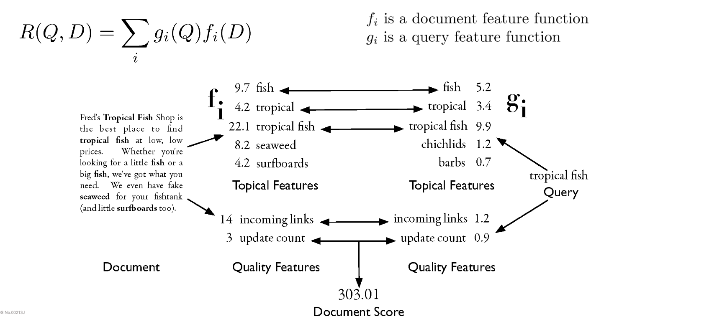
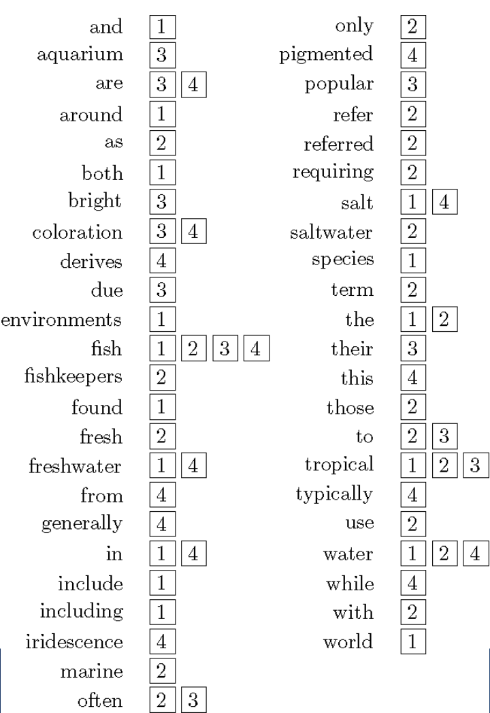
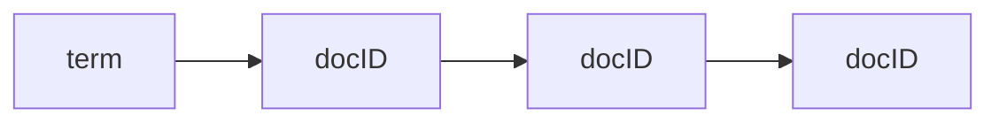
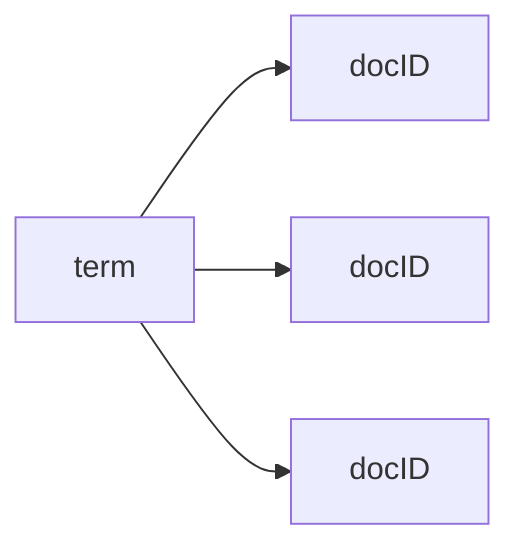
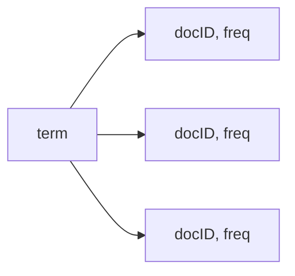
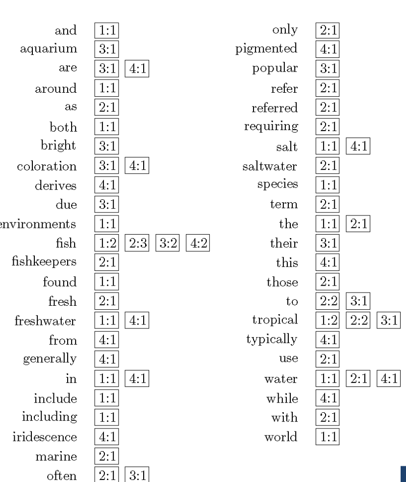
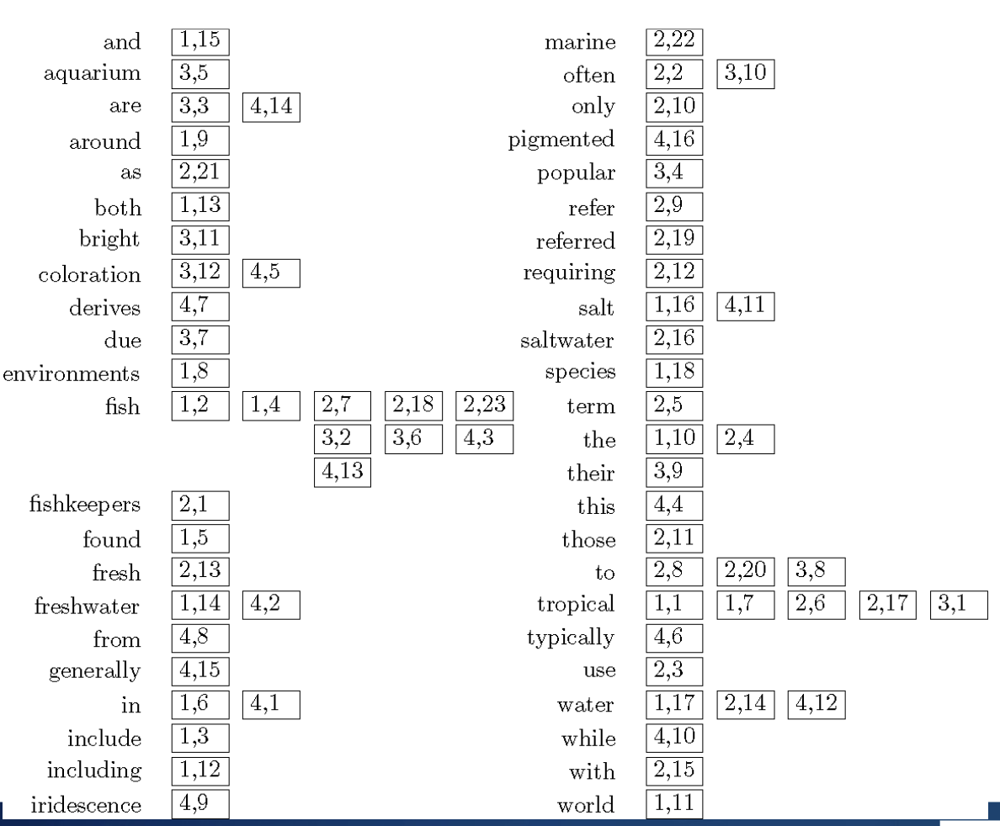
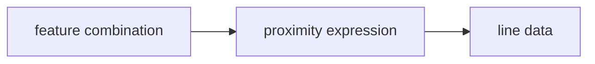

# Cab431 - Document Representation - Indexing Text and Ranking Documents

1. Abstract Model of Ranking

- Documents are writing in nature human languages. English, which are difficult for computers to analyse directly. Because it is hard to understand. For texts. The proper way is to the document is to select the site of document that features. Document features or what we call the index terms. We're talking  about the features which are some attributes of the  documents. We can express numerically. E.g. we can group document feature into two categories
    - **Content features**:
    - **Style features**:

- We select some features or index terms. This figure shows the, shows the components of the abstract model of ranking.


# More Concreate Model



## Indexes

Indexes: Indexes are data structures designed to enhance search efficiency. In the context of text search, unique data structures called inverted indexes are commonly used. Inverted indexes associate documents with words, making search faster and more effective.

Ranking: Indexes are designed to support search and text analysis, with a focus on faster response times and the ability to handle updates. Text search engines employ ranking algorithms to retrieve and present documents in a sorted order based on a score calculated using the document representation and the query. Ranking plays a crucial role in determining the relevance and order of search results.

Inverted Index: In an inverted index, each index term is linked to an inverted list. These lists contain documents or word occurrences in documents, along with additional information. Each entry in the inverted list is called a posting, and it typically includes a pointer that refers to a specific document or location. Documents within the collection are assigned unique numbers, and the inverted lists are usually organized in document order for efficient retrieval.


## See the example collection in the lecture slides - i havent added it yet


# Simple example of an inverted index
- This data structure records the documents in which each word appears.
- It does not record the number of times each word appears


# Data structures for the simple inverted index
- Linked List representation
<!--  -->

- Dictionary representation
<!--  -->

- Dictionary representation with frequency
<!--  -->



## Inverted Index with Counts
- This data structure supports better ranking algorithms.
- We can calculate both term frequency and document frequency.



## Inverted Index with positions
- This data structure supports proximity matches.
- It also has the capability of previous data structures.


## Proximity Matches
- Matching phrases or words within a window
- e.g. "tropical fish" or find "tropical" within 5 words of "fish"
- Word positions in an inverted index make these matches possible and efficient

## Fields and Extents
- Document structure is useful in search
  - field Restrictions:
    - e.g. date, author, title, etc.
  - some fields more important
    - e.g. title

- Options:
  - separate index for each field
  - add some information to postings (e.g. field number)
  - use extent lists
## Extent Lists
- An extent is a contiguous region of a document.
  - represent extents using word position
  - inverted list records all extents for a given field type
  - e.g., (1,3) means S1 has a title that contains the first two words (ending just before 3 rd word)

## Other Issues
- Pre-computed scores in inverted list
  - e.g. tf-idf
  - e.g., list for “fish” [(1:3.6), (3:2.2)], where 3.6 is total feature value for
document 1
- Compression: improves speed but reduces flexibility
- Score-ordered lists
  - query processing engine can focus only on the top part of each inverted list, where the highest-scoring documents are recorded
  - very efficient for single-word queries
  - not so efficient for phrase queries


## Auxiliary Structures

• Inverted lists usually stored together in a single file for efficiency
• Inverted file
• Vocabulary or lexicon
• Contains a lookup table from index terms to the byte offset of the inverted list in the inverted file
• Either hash table in memory or B-tree for larger vocabularies
• Term statistics stored at start of inverted lists.
• Collection statistics stored in a separate file.


## 3. Index Construction
Index Construction
```
procedure BuildIndex(D) //D is the text documents
I ← ∅ //I is the inverted index
n ← 0 //n is the number of documents
for all documents d in  D do
  n ← n + 1
  T ← Tokenize(d) //T is the set of tokens in d
  Remove all Duplicates from T
  for all tokens in t \in  T do
    if t !∈ I then
      I[t] ← ∅
    end if
    append n to I[t]
  end for
end for
return I
end procedure
```


## Merging
- It is classic way to solve the memory problem if the inverted list is very big (or in distributed index framework).

- Merging addresses limited memory problem to
- Build the inverted list structure until memory runs out
- Then write the partial index to disk, and start making a new one again.
- At the end of this process, the disk is filled with many partial indexes, which are then merged to a single result.

- Partial lists must be designed so they can be merged in a small memory
e.g., storing in alphabetical order
## Merging cont.


## Result Merging
- Index merging is a good strategy for handling updates when they come in large batches.
- For small updates this is inefficient.
- A better strategy is to keep the index in memory and update it incrementally.
- for smaller updates, make many smaller partial indexes and merge them together. These can be done in memory, and the final merge is much smaller.
- Deletions handled using delete list
- Modifications done by putting old version on delete list, adding new
version to new documents index

## 4. Query Processing
Once an index in built, we need to know how to process it to get query results. 
- Well made algorithms can boost the performance of the system.
2 types of query processing:
- Document-at-a-time
  - Calcultates the complete scores for documents by processing all term lists, one document at a time.
  - It is good for small result sets.
- Term-at-a-time
  - Accumulates scores for documents by processing all term lists, one term at a time.
- Both approaches have optimizations that can be applied to improve performance.

## 5. Optimization Techniques for Query Processing
Term-at-a-time uses more memory accumulators (one per document) but accesses the disk more efficiently.
- Two possible ways for optimization:
  - Read Less data from inverted lists
     - Skip pointers (lists)
     - better for simple feature functions
  - Calculate scores for fewer documents
    - Conjuctive processing
    - Threshold methods
    - better for complex feature functions (e.g. BM25)


## Conjunctive processing
  - It means that every document returned to the user contains all of the query terms.
  - it is a defualt mode for most search engines.
  - It is very efficient for simple feature functions.
## Threshold Methods
Threshold methods use number of top-ranked documents needed (k) to
optimize query processing
• for most applications, k is small
• For any query, there is a minimum score that each document needs to reach
before it can be shown to the user
• score of the kth-highest scoring document
• the threshold τ
• The true value is hard to calculate, but we can approximate it by using τ′
£ τ, so that we can ignore any document with a score less than τ′.


Estimating threshold
• For document-at-a-time processing, use score of lowest-ranked document in
R so far for τ′
• For term-at-a-time, have to use kth-largest score in the accumulator table A
because we don’t have full document scores until the query processing is
finished.
• MaxScore method
• It can ignore parts of the inverted lists that will not generate document
scores above τ′.
• Please note “safe optimization” in that ranking will be the same without
optimization.


## MaxScore Example
Assume we are almost certain to find a set of top k documents that contain both words.
• Suppose the indexer computes μ tree
• The maximum score for any document containing just “tree”
• Assume k =3, τ′ is lowest score after first three docs
• Highly likely that τ ′ > μ tree
• As τ ′ is the score of a document that contains both query terms
• Can safely skip over all gray postings


## Other Approaches
- Early termination of query processing 
  - ignore the high frequency word lists in term at a time processing
  - ignore documents at end of lists in document at a time processing
  - unsafe optimization
- Index pruning

- list ordering
  - order inverted lists by quality metric ( PageRank ) or by partial score
  - makes unsafe and fast optimizations more likely to be correct and produce good documents

## Structured Queries
- Query language can support specification of complex features
  - similar to SQL for database systems
  - query translator converts the users input into the structured query representation or into a query tree
  - Galago query language is used for this purpose

  e.g. #combine( #syn( #1( #text:“tree” ) ) #syn( #1( #text:“forest” ) ) )

# evaluation for structured query tree
<!--  feature combination -> proximity expression - line data -->

- a query tree is a tree representation of a query
- each node in the tree represents a feature
- each leaf node represents a term
- each internal node represents a feature combination
- the root node represents the entire query
- the query tree is evaluated recursively

This query indicates that the document score should be a combination of the scores from three subqueries. e.g.
- the first subquery is a proximity query that requires the terms “tree” and “forest” to be within 1 word of each other
- the second subquery is a proximity query that requires the terms “tree” and “forest” to be within 2 words of each other
- the third subquery is a proximity query that requires the terms “tree” and “forest” to be within 3 words of each other

