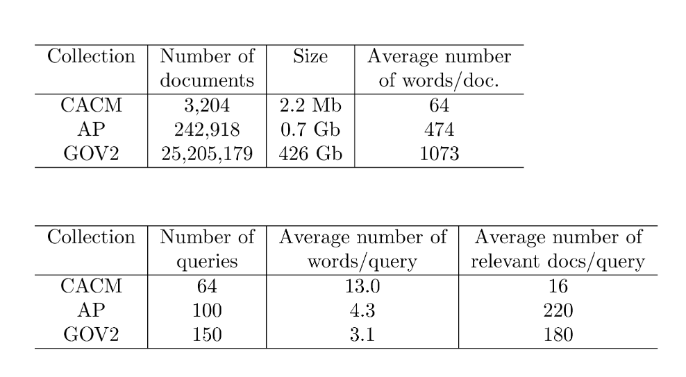
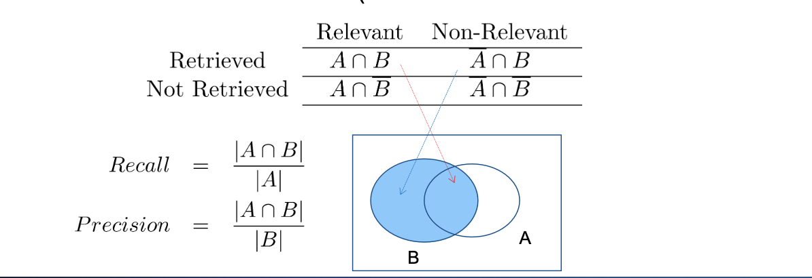
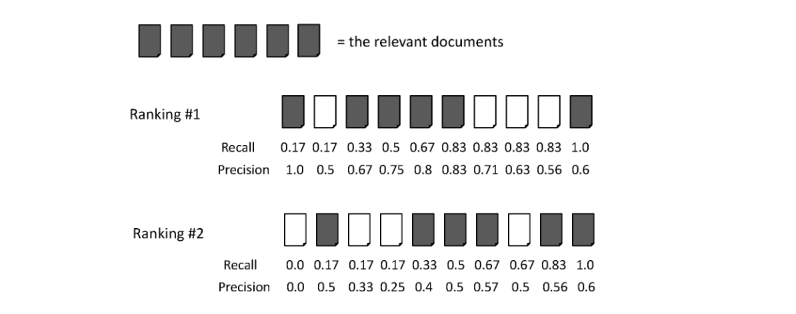
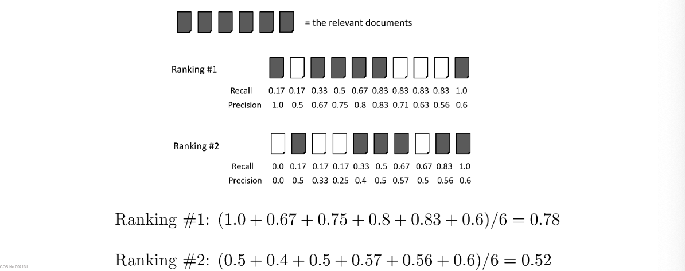
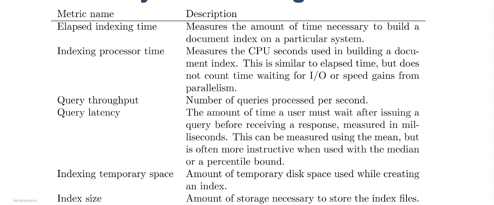
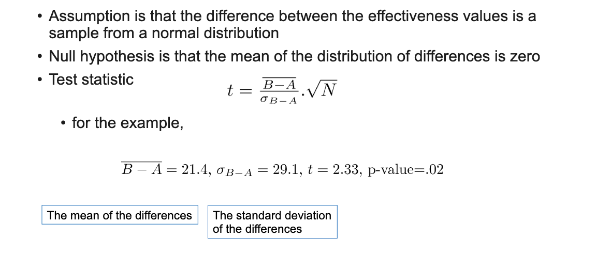

# CAB431 - Week 6 Evaluation

# 1. Evaluation Overview and Relevance Judgments

Evaluation is key to building effective and efficient search systems

- measurement usually carried out in controlled laboratory experiments
- online testing can also be done
- Effectiveness, efficiency and cost are related
- e.g., if we want a particular level of effectiveness and efficiency, this will
  determine the cost of the system configuration
- efficiency and cost targets may impact effectiveness

# Evaluation Corpus

Test collections consisting of documents, queries, and relevance judgments,

# Test Collections



# TREC Topic Example

```
<top>
<num> Number: 1
<title> PET THEREPY

<desc> Description:
What is the effectiveness of pet therapy in hospitals for the elderly?

<narr> Narrative:
We are looking for studies that measure the effectiveness of pet therapy
in hospitals for the elderly.  We are interested in studies that measure
the effect of pet therapy on the elderly patients, not on the pets.
</top>
```

# Relevance Judgments

- The relevance judgments depend on the task being evaluated.

  - e.g. TREC judgments
    - generally binary (relevant or not)
    - but some tasks use graded judgments (e.g. 0-4)

- obtaining relevance judgements is an expensive and time consuming process
  - who does it?
  - What are the instructions?
  - what is the level of agreement between judges?

# Pooling

- Exhaustive judgments for all documents in a collection is not practical
- Pooling technique is used in TREC
  - top k results from each system are pooled
  - duplicates are removed
  - documents are presented in some random order to the relevance judges
- produces a large number of relevance judgments for each query although not all documents are judged

# Logging

- Used for both tuning and evaluating search engines

  - various techniques are used to log user interactions e.g. query suggestions, clicks, etc.

- Typical contents
  - User identifier or user session identifier
  - Query terms - stored exactly as user entered
  - List of URLs of results, their ranks on the result list, and whether they were
    clicked on
  - Timestamp(s) - records the time of user events such as query submission, clicks.
  - The privacy (e.g., User identifier) is normally a concern when query logs are shared,
    distributed for research, or used to construct user profiles.
  - Various techniques can be used to anonymize the logged data,
  - removing identifying information or queries that may contain persona

# Query Logs

- clicks are not relevance judgements
  - although they are correlated
  - biased by a number of factos such as rank on a result list.
    can use click data to predict the preferences between pairs of documents.
    Skip above or skip next type of clicks are also useful for evaluating search engines.

# Filtering clicks

- Click data can also be aggregated to remove noise
- click distribution information:
  -can be used to identify clicks tha have a higher frequency than would be expected by chance.

  - High correlation with relevance
  - e.g. using click deviation to filter clicks for preference-generation policies

- Click deviation $CD(d, p) = O(d, p) - E(p)$

Where O(d, p) is the number of clicks on document d for query p, and E(p) is the expected number of clicks for query p.

# 2. Effectiveness Measures

- Assume that A is a set of relevant documents ( the relevance judgements),
  B is a set of retrived documents (the rest of the documents are not retrieved)



# Classification Errors

- False Positive (Type I error)
  - A document is retrieved that is not relevant
    $$Fallout = \frac{|\overline{A}\cap B|}{|\overline{A}|}$$
- False Negative (Type II error)

  - A relevant document is not retrieved

- Precision is used when probability that a document is relevant is important

# F measure

Harmonic mean of recall and precision

$$
F = \frac{1}{\frac{1}{2} (\frac{1}{R} + \frac{1}{P})} = \frac{2PR}{P+R}
$$

harmonic mean emphasizes the importance of small values, whereas the
arithmetic mean is affected more by outliers that are unusually large
A More general form of the F measure is the Fβ measure, which is defined as

$$
F_\beta = \frac{1}{\frac{1}{\beta^2} (\frac{1}{R} + \frac{1}{P})} = \frac{(1+\beta^2)PR}{\beta^2P}
$$

β is a parameter that determines relative importance of recall and precision. Values of β > 1 give more weight to recall, and values of β < 1 give more weight to precision.

- The common F measure is in fact $F_1$ (β = 1) where recall and precision have equal weight.

# e. Ranking Effectiveness



# Summarizing a ranking

Calculating recall and precision at a fixed rank positions or cut-off points

- calculating precision at standard recall levels, from 0.0 to 1
  - requires interpolation
- Averaging the precision values from the rank positions where a relevant document was retrieved.

# Average precision



# Averaging Across Queries


# Averaging

- mean average precision (map)
  - summarise rankings from multiple sets of queries
  - assumes user is interested in finding relevant documents for all queries
  - requires many relevant judgements
- Recall-prevision

# Interpolation

To average graphs, calculate precision at standard recall levels

P(R) = max{\{P^{'}: R^{'} \wedge (R^{'},P^{'})\in S}\}

Where S is the set of observed (R, P) pairs, and R^{'} is the largest recall value in S that is less than or equal to R.

- Defines precision at any recall level as the maximum precision observed at any recall level greater than or equal to the recall level of interest.

- produces a step function
- defines precision at recall 0.0 as the maximum precision observed at any recall level

# Average Precision at standard recall levels

- Recall-precision graph is pplotted by simply joining the average precision points at the standard recall levels

# Average Recall-Precision Graph

_see lectures_

# Focusing on Top Documents

Users tend to look at only the top part of the ranked result list to find relevant
documents

- Some search tasks have only one relevant document
- e.g., navigational search, question answering
- Recall not appropriate
- instead need to measure how well the search engine does at retrieving
  relevant documents at very high ranks

# 4. Discounted Cumulative Gain

Popular measure for evaluating web search and related tasks
• Two assumptions:
• Highly relevant documents are more useful than marginally relevant
document
• the lower the ranked position of a relevant document, the less useful it is for
the user, since it is less likely to be examined.

Uses graded relevance as a measure of the usefulness, or gain, from examining
a document.
• Gain is accumulated starting at the top of the ranking and may be reduced, or
discounted, at lower ranks.
• Typical discount is 1/log (rank)
• With base 2, the discount at rank 4 is 1/2, and at rank 8 it is 1/3

# Discounted Cumulative Gain: DCG function

DCG is the total gain accumulated at a particular rank p:

$$
DCG_p = \sum_{i=2}^p \frac{2^{rel_i} - 1}{log_2(i+1)}
$$

# Example

10 ranked documents judged on 0-3 relevance scale:
3, 2, 3, 0, 0, 1, 2, 2, 3, 0
• Discounted gain:
3, 2/1, 3/1.59, 0, 0, 1/2.59, 2/2.81, 2/3, 3/3.17, 0
= 3, 2, 1.89, 0, 0, 0.39, 0.71, 0.67, 0.95, 0
• DCG at each rank:
3, 5, 6.89, 6.89, 6.89, 7.28, 7.99, 8.66, 9.61, 9.61

# Normalized Discounted Cumulative Gain

DCG numbers are averaged across a set of queries at specific rank values
• e.g., DCG at rank 5 is 6.89 and at rank 10 is 9.61
• DCG values are often normalized by comparing the DCG at each rank with the
DCG value for the perfect ranking
• makes averaging easier for queries with different numbers of relevant
documents

# NDCG Example

Perfect ranking:
3, 3, 3, 2, 2, 2, 1, 0, 0, 0
• ideal DCG values:
3, 6, 7.89, 8.89, 9.75, 10.52, 10.88, 10.88, 10.88, 10.88
• NDCG values (divide actual by ideal):
1, 0.83, 0.87, 0.76, 0.71, 0.69, 0.73, 0.8, 0.88, 0.88
• NDCG £ 1 at any rank position.

# Using preferences

Two rankings described using preferences can be compared using the
Kendall tau coefficient (τ ) where
$$τ = (P - Q)/(P + Q)$$

• P is the number of preferences that agree, and Q is the number that
disagree
• For preferences derived from binary relevance judgments, we can use
BPREF.

# BPREF

For a query with R relevant documents, only the first R non-relevant documents are considered:

$$
BPREF = \frac{1}{R} \sum_{r=1}^R \frac{N_{dr}}{r}
$$

• d r is a relevant document, and N dr gives the number of non-relevant documents that are ranked higher than d r .
• Alternative definition
$$

BPREF = \frac{P}{P + Q}

$$

# 5. Efficiency Metrics & Significance Test


# Significance Tests
Given the results from a number of queries, how can we now conclude that ranking A is better than ranking B?

- A significance test is used to determine whether the difference between two sets of results is statistically significant

- reject the null hypothesis that the two sets of results are the same

- The null hypothesis is that the two sets of results are the same

- The alternative hypothesis is that the two sets of results are different


# One-Sided or Two-sided Tests

A Type I error is when the null hypothesis is rejected when it is in fact true.
• A Type II error is when the null hypothesis is accepted when it is in fact false.
• The power of a test is the probability that the test will reject the null hypothesis
correctly
• A test with high power will reduce the chance of a Type II error.
• Increasing the number of queries in the experiment also increases power of
test; and also reduce the chance of a Type I error as well.
• If the probability of the null hypothesis being true is very small, we reject that
hypothesis and conclude that
• ranking algorithm B is more effective than the baseline algorithm A.


# t-Test



# Setting Parameter Values

Retrieval models often contain parameters that must be tuned to get best
performance for specific types of data and queries
• For experiments:
• Use training and test data sets
• If less data available, use cross-validation by partitioning the data into K
subsets
• Using training and test data avoids overfitting – when parameter values do
not generalize well to other data

Many techniques used to find optimal parameter values given training data
• standard problem in machine learning
• In IR, often explore the space of possible parameter values by brute force
• requires large number of retrieval runs with small variations in parameter
values (parameter sweep)
• SVM optimization is an example of an efficient procedure for finding good
parameter values with large numbers of parameters

# Online Testing

• Test (or even train) using live traffic on a search engine
• Benefits:
• real users, less biased, large amounts of test data
• Drawbacks:
• noisy data, can degrade user experience
• Often done on small proportion (1-5%) of live traffic

# Summary

- No single measure is the correct one for any application
$$
