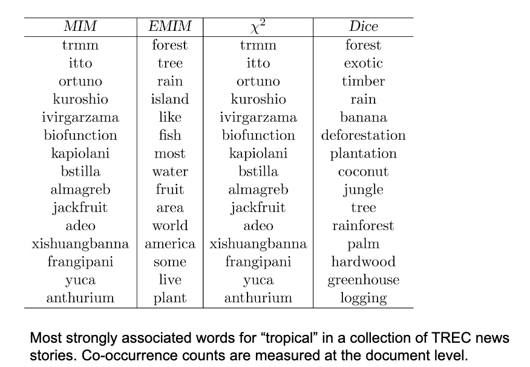

# Week 7 - Text mining and user information needs

## 1. Text Mining and Information Needs

- Text mining (or text analytics, the application of data mining in textural data), is the process of depriving high-quality information from text. Where:
- High-quality information is typically derived through the devising of patterns and trends through means such as statistical pattern learning.
- Text mining usually involves the process of structuring the input text (usually parsing, along with the addition of some derived linguistic features and the removal of others, and subsequent insertion into a database), deriving patterns within the structured data, and finally evaluation and interpretation of the output.
- 'High quality' in text mining usually refers to some combination of relevance, novelty, and interest.
- Typical text mining tasks include Information filtering, text classification (categorization), clustering, concept/entity extraction, production of granular taxonomies, sentiment analysis, document summarization, and entity relation modeling (i.e., learning relations between named entities).

## Steps for Text Mining

- Define the problem and specific goals
  - need to to acquire subject matter expertise sufficient to define the problem and the outcome in an appropriate manner ( understand user information needs)
- Identify the text that needs to be collected (data collection)
- Represent the text
- Extract features in text (high-quality information)
- Text analysis
- Reach an insight or recommendation
  - The end results of the analysis are to apply the output to the problem definition or expected goal or user information needs.

## Information Needs

- If something is relevant for a person in relation to a given topic, we might say that the person needs the information for that topic, or
  - for example, an information need is the underlying cause of the query that a person submits to a search engine.
  - We can describe it as the motivation for a person to search for information on the web.
- Sometimes called information problem to emphasize that an information need is generally related to a task.
- Sometimes it is difficult for people to define exactly what their information need is since that information is a gap in their knowledge.
- Categorized using variety of dimensions for understanding information needs, e.g.,
  - number of relevant documents being sought
  - type of information that is needed
  - type of task that led to the requirement for information

## 2. Query-Based Approaches for Acquiring Information Needs

- A query can represent very different information needs
  - May require different search techniques and ranking algorithms to produce the best rankings
- A query can be a poor representation of the information need:
  - Users may find it difficult to express their information needs as
    - users are encouraged to enter short queries both by the search engine interface, and by the fact that long queries don’t work

## User Interaction

- It is used to discuss relevance in IR models
- To produce a query that is a better representation of the information need.
- Interaction with the system occurs.
  - during query formulation and reformulation
  - while browsing the results
- Key aspect of effective retrieval
  - users cant change ranking algorithm but can change results through interaction
    helps refine description of information need
    - e.g., same initial query, different information needs
    - how does user describe what they don’t know?

## ASK Hypothesis

- Belkin et al (1982) proposed a model called Anomalous State of Knowledge (ASK).

- the ask hypothesis:

  - difficult for people to define exactly what their information need actually is, because that information is a gap in their knowledge.
  - Search algorithms should look for information that fills those gaps

  - interesting ideas but little has been done in practice to use them to improve search engines or other information retrieval systems.

## Keyword Queries

- Query languages in the past were designed for professional searchers (intermediaries)

Read the textbook in pages 188-189 for the following example that use query
language (e.g., wildcard operators and various forms of proximity operators) to specify the information need.

```
User Query
Are there any cases which discuss negligent maintenance or failure to maintain aids to navigation such as lights, buoys, or channel markers?
```

```
Intermediary query
NEGLECT! FAILURE! MAINTAIN! AID! NAVIGAT!
```

## Keyword Queries cont.

- simple natural language queries were designed to enable everyone to search.
- current search engine do not perform well (in general) with natural language queries
- people trained (in effect ) to use keyword queries.

  - compare average of about 2.3 words/web query to average of 30 words/CQA (community question answering) query.

- Keyword selection is snot always easy
  - Query refinement techniques can help

## Query-Based Stemming

Make decision about stemming at query time ratheer than during the indexing process (here
the words in documents are stemmed during indexing, the words in the queries
must also be stemmed)

- improved performance for some queries

- Query is expanded using word variants

  - e.g. : "rock clombing" expaning with "climb" ( as a new long query "rock climbing climb"), not stemmed to "climb" (as a new long query "rock climbing climb climb")

  - documents do not get stemmed(when we remove the suffix of a word to get the root word, e.g., "climbing" to "climb") if you use query expansion.

## Stem Classes

- A stem class is the group of words that will be transformed into the same stem by the stemming algorithm.
  - generated by running stemmer on a large corpus of text (corpus is a collection of documents)
  - e.g. Porter stemmer on TREC news.

## Stem Classes cont.

AS we know that stem classes are often too big and inaccurate.
- They contain a number of errors; e.g.,
- The words relating to “police” and “policy” should not be in the same class.
- Other words are not errors, but may be used in different contexts; e.g., “banked” is
more often used in discussions of flying and pool, but this stem class will add words
that are more common in financial discussions.
- The length of the lists is an issue if the stem classes are used to expand the query; e.g.,
- Adding 22 words to a simple query will certainly negatively impact response time
and, if not done properly using a synonym operator, could cause the search to fail.
- Modify using Analysis of Word Co-occurrence
- Assumption:
- Word variants that could substitute for each other should co-occur often in
documents

## Modifying Stem Classes

- For all pairs of words in the stem classes, count how often they co-occur in the text windows of W words , W is typically in the range of 50 to 100 words.

- COmpute a co-occurrence or association metric for each pair, this measures how strong the association is between the two words.

- construct a graph where the vertices represent words and the edges are between words that have a strong association.

- Find the connected components of this graph. these are the new stem classes.

## Modifying Stem Classes cont.
Dices` coefficient is an example of a term association measure

- $2.n_{ab}/(n_a+n_b)$
- where $n_x$ is the number of windows containing $x$

- Two verticies are in the same connected component of of the graph, if there is a path between them.
  - forms or word clusters
- Example output of modified stem classes
  - 1. policies (policy),
  - 2. police policed policing,
  - 3. bank banking banks,
  - 4. pool,

## Spell Checking

important part of query processing
- 10-15% of all web queries have spelling errors
- Errors include typical word processing errors but also many other simple types

- Basic approach: suggest corrections for words not found in spelling dictionary

- suggestions found by comparing words to words in dictionary using similarity measures.

- most common similarity measure is edit distance
  - number of operations required to transform one word into another

## Edit Distance

- Damerau-Levenshtein distance

  - is used to count the minimum number of insertions, deletions, substitutions, and if single characters required.

- e.g. at distance 1

  - extenssions -> extensions (insertion error)
  - poiner -> pointer (deletion error)
  - marshmellow -> marshmallow (substitution error)
  - brimingham -> birmingham (transposition error)

- e.g. at distance 2
  - doceration -> decoration (insertion error)
  - deceration -> decoration
- there are a number of techniques used to speed up calculation of edit distances
  - restrict words starting with the same letter
  - restrict words of the same length
  - restrict words that sound alike

## Edit Distance: Soundex Code

Last option uses a phonetic code to group words
- e.g., Soundex, a type of phonetic encoding that was originally used for the problem of matching names in medical record

1. Keep the first letter (in upper case) of the word.
2. replace these letters with hyphens: a,e,i,o,u,y,h,w

3. replace the other letters by numbers as follows

   - b,f,p,v -> 1
   - c,g,j,k,q,s,x,z -> 2
   - d,t -> 3
   - l -> 4
   - m,n -> 5
   - r -> 6

4. Delete adjacent repeats of a number

5. Delete the hyphens

6. Keep the first three number or pad out with zeros

e..g
extenssions -> E235; extensions -> E235; poiner -> P560; pointer -> P536; marshmellow -> M624; marshmallow -> M624; brimingham -> B655; birmingham -> B655; doceration -> D263; decoration -> D263; deceration -> D263; decoration -> D263

## Spelling Correction Issues

- Ranking suggested corrections
- “Did you mean...” feature requires accurate ranking of possible corrections,
e.g., present them in decreasing order of their frequency in the language.
- Context
- Choosing right suggestion depends on context (other words)
- e.g., lawers → lowers, lawyers, layers, lasers, lagers
but trial lawers → trial lawyers
- Run-on errors (where word boundaries are skipped or mistyped)
- e.g., “mainscourcebank”
- Missing spaces can be considered as another single character errors

## Noisy Channel for Spelling Correction

It is a general framework that can address the issues of ranking, context, and
run-on errors.
- The user chooses word w based on a probability distribution P(w)
- called the language model
- can capture context information, e.g., P(w 1|w 2)
- The user tries to write word w, but the noisy channel causes the person to write
word e instead, with a probability P(e|w)
- called error model
- represents information about the frequency of spelling errors; e.g., the
probabilities for words (e) that are edit distance 1 away from the word w will
be quite high

## Noisy Channel Model

Now the problem is that
- The corrector (algorithm) observes an error e (golf curse) and tries to suggest a
correct work w (course), i.e.,
- the probability that the correct word is w given that we can see the person wrote e.
- We need to estimate probability of correction
- P(w|e) = P(e|w)P(w)
- It is the product of the error model probability and the language model probability.
- Estimate language model probability using context in query log or a collection
- e.g., P(w) = λP(w) + (1 − λ)P(w|wp)
- wp is the previous word; e.g.,
- “fish tink”
- “tank” and “think” both likely corrections, but P(tank|fish) > P(think|fish)

## Noisy Channel Model cont.

Estimating error model probability P(e|w)
- The simple approach: assume all words with same edit distance have same
probability, only edit distance 1 and 2 considered.
- More complex approach: incorporate estimates based on common typing
errors.
- These estimates are derived from large collections of text by finding
many pairs of correctly and incorrectly spelled words.

## Spellcheck Process and Query Suggestion

1. Tokenize the query
2. for each token, a set of alternative words and pairs of words is found using an edit distance modified by weighting certain types of errors as described above, the data structure that is searched for the alternatives contain words and pairs from both the query log and the trusted dictionary.

3. the noisy channel model is used to select the best correction for each token, and the best pair of corrections for each pair of tokens.

4. the process of looking for alternatives and find the best coreection is repeated until no better correction is found

## Query Logs

Query logs are the best source of information about queries and related terms
- short pieces of text and click data
- e.g., most frequent words in queries containing “tropical fish” from MSN log:
stores, pictures, live, sale, types, clipart, blue, freshwater, aquarium,
supplies
- query suggestion based on finding similar queries
- group based on click data

## 3. Query Expansion

A variety of automatic or semi-automatic query expansion techniques have
been developed
- goal is to improve effectiveness by matching related terms
- semi-automatic techniques require user interaction to select best expansion
terms
- The key to effective expansion is to choose words that are appropriate for
the context, or topic, of the query.
- For example, “aquarium” may be a good expansion term for “tank” in the
query “tropical fish tanks”, but not appropriate for the query “armor for
tanks”.
- Query suggestion is a related technique
- alternative queries, not necessarily more terms

## Query Expansion cont.

Approaches usually based on an analysis of term co-occurrence
- either in the entire document collection, a large collection of queries, or the
top-ranked documents in a result list
- query-based stemming also an expansion technique
- Automatic expansion based on general thesaurus (e.g., WordNet
https://wordnet.princeton.edu/ ) not effective
- does not take context into account ( see the previous example for
“aquarium”)
- To address this problem, people use all the words in a query to find related
words rather than expanding each word separately.

## Term Association Measures

- Dice’s Coefficient For two words (or terms) a and b

$$ \frac {2.n*{ab}}{n_a + n_b} =^{rank} \frac{n*{ab}}{n_a + n_b} $$

- Mutual Information

$$
\log \frac{P(a,b)}{P(a)P(b)} = \log N.\frac{n_{ab}}{n_a.n_b} =^{rank} \frac{n_{ab}}{n_a.n_b}
$$

P(a, b) is the probability that a and b occur in the same text window. P(a) is the probability that word a occurs in a text window, and n a is the number of occurrences, P(a) = n a /N, where a can be a query of a word.

## Term Association Measures cont.

Mutual Information measure favors low frequency terms
- Expected Mutual Information Measure (EMIM) addresses this problem by
weighting the mutual information value using the probability P(a, b).
- It interested in the case where both terms occur, giving the formula

$$
P(a,b).\log \frac{P(a,b)}{P(a)P(b)} = \frac{n_{ab}}{N}.\log \frac{N_{ab}}{n_a.n_b} =^{rank} n_{ab}.\log(N.\frac{n_{ab}}{n_a.n_b})
$$

## Term Association (χ2 ) Measure

Pearson’s χ2 test is a statistical test for determining whether two categorical

- compares the number of co-occurrences of two words with the expected number of co-occurrences if th two words were independent
- normalizes this comparison by the expected number.
- also limited for focused on word co-occurrences


## Association Measure Summary


## association Measure Example



## Context vectors

Represent words by the words that co-occur with them (a virtual document)
- e.g., top 35 most strongly associated words for “aquarium” (using
Dice’s coefficient or word embedding techniques
https://en.wikipedia.org/wiki/Word_embedding ):
- Rank words (e.g., “aquarium”) for a query (e.g., “tropical fish”) by ranking
context vectors (virtual documents) to decide expansion terms.

## Summary of Association Measures

- In summary, both automatic and semi-automatic query expansion methods have been
discussed.
- Some term association measures are better than others, but term association based on
single words does not produce good expansion terms, because it does not capture the
context of the query.
- The best way to capture query context is to use a query log, both to analyse word
associations and to find similar queries based on clickthrough data.
- E.g., associated words are of little use for expanding the query “tropical fish”
- Expansion based on whole query words takes context into account, e.g., using
Dice with term “tropical fish” gives the following highly associated words:
goldfish, reptile, aquarium, coral, frog, exotic, stripe, regent, pet, wet
- If there is no query log available, the best alternative would be to context vectors,
Relevance Feedback (or Pseudo-Relevance Feedback), as described below

## 4. Relevance Feedback

- The user identifies relevant (and maybe non-relevant) documents to form a training set.
- The system modifies query or finding terms from those documents.
- E.g., words that occur more frequently in the relevant documents than in the non-
relevant documents, or in the collection as a whole, are added to the query or
increased in weight.
- Modifying the query is in fact equivalent to learning a classifier that distinguishes
between relevant and nonrelevant documents.
- but, the problem is very little training data!
- The alternative technique is pseudo-relevance feedback, in which we assume top-
ranked documents are relevant to the initial query:
- where instead of asking the user to identify relevant documents, the system
assumes that the top-ranked documents are relevant.

## Relevance Feedback Example

- If we assume top 10 are relevant, most frequent terms are (with frequency):
a (926), td (535), href (495), http (357), width (345), com (343), nbsp
(316), www (260), tr (239), htm (233), class (225), jpg (221)
- too many stopwords and HTML expressions
- Use only snippets and remove stopwords
tropical (26), fish (28), aquarium (8), freshwater (5), breeding (4),
information (3), species (3), tank (2), Badman’s (2), page (2), hobby (2),
forums (2)

## Relevance Feedback Example cont.

- If document 7 (“Breeding tropical fish”) is explicitly indicated to be relevant, the
  most frequent terms are:
  breeding (4), fish (4), tropical (4), marine (2), pond (2), coldwater (2),
  keeping (1), interested (1)
  - Specific weights and scoring methods used for relevance feedback depend on
  retrieval model.

## Relevance Feedback

Both relevance feedback and pseudo-relevance feedback are effective, but not
used in many applications
- pseudo-relevance feedback has reliability issues, especially with queries that
don’t retrieve many relevant documents
- Some applications use relevance feedback
- filtering, “more like this”
- Query suggestion more popular
- may be less accurate, but can work if initial query fails

## 5. Query Context and Personalization

- If a query has the same words as another query, results will be the same
  regardless of
  - who submitted the query
  - why the query was submitted
  - where the query was submitted
  - what other queries were submitted in the same session
  - All that matters is what words were used to describe the query.
  - The other factors (known as query context, e.g., user profiles, privacy issues,
  location) could have a significant impact on relevance
  - But it is difficult to incorporate into ranking

## User Models

- Much research has been done, in particular, on learning user models or profiles
to represent a person’s interests so that a search can be personalized.
- User models are used to generate user profiles based on documents that the
person looks at
- such as web pages visited (or clicked), email messages, or word processing
documents on the desktop.
- Modify queries using words from user profiles.
- Generally, not effective
- imprecise profiles, information needs can change significantly

# Query Logs

- Query logs provide important contextual information that can be used effectively
- Context in this case is
- previous queries that are the same
- previous queries that are similar
- query sessions including the same query
- Query history for individuals could be used for caching or web cookie.

## Local Search

- Location is context
- Local search uses geographic information to
modify the ranking of search results
- location derived from the query text
- location of the device where the query
originated
- e.g.,
- Location “cape cod” in query
“fishing supplies Cape Cod

## Extracting Location Information

- Identify the geographic region associated with web pages
- use location metadata that has been manually added to the document,
- or identify locations such as place names, city names, or country names in
text (information extraction)
- Identify the geographic region associated with the query
- 10-15% of queries contain some location reference
- Rank web pages using location information in addition to text and link-based
features

Type of information extraction
- ambiguity and significance of locations are issues
- Location names are mapped to specific regions and coordinates

## Applications

- Snippet generation - information summary

## Sentence Selection

Significance factor for a sentence is calculated based on the occurrence of
significant words

## Snippet Generation

Significance factor for bracketed text spans is computed by dividing the
square of the number of significant words in the span by the total number of
words

Involves more features than just significance factor
- e.g. for a news story, could use
- whether the sentence is a heading
- whether it is the first or second line of the document
- the total number of query terms occurring in the sentence
- the number of unique query terms in the sentence
- the longest contiguous run of query words in the sentence
- a density measure of query words (significance factor)
- Weighted combination of features used to rank sentences

- Web pages are less structured than news stories
- can be difficult to find good summary sentences
- Snippet sentences are often selected from other sources
- metadata associated with the web page
- e.g., <meta name="description" content= ...>
- external sources such as web directories
- e.g., Open Directory Project, http://www.dmoz.org
- Snippets can be generated from text of pages like Wikipedia

## Snippet Guidelines

- All query terms should appear in the summary, showing their relationship to
the retrieved page
- When query terms are present in the title, they need not be repeated
- allows snippets that do not contain query terms
- Highlight query terms in URLs
- Snippets should be readable text, not lists of keywords

## Advertising

It is a key component of web search since that is how companies generate
revenue.
- Sponsored search – advertising presented with search results
- Contextual advertising – advertising presented when browsing web pages
- Both involve finding the most relevant advertisements in a database
- An advertisement usually consists of a short text description and a link
to a web page describing the product or service in more detail

## Searching Advertisements

- Factors involved in ranking advertisements
- similarity of text content to query
- bids for keywords in query
- popularity of advertisement
- Small amount of text in advertisement
- dealing with vocabulary mismatch is important
- expansion techniques are effective
