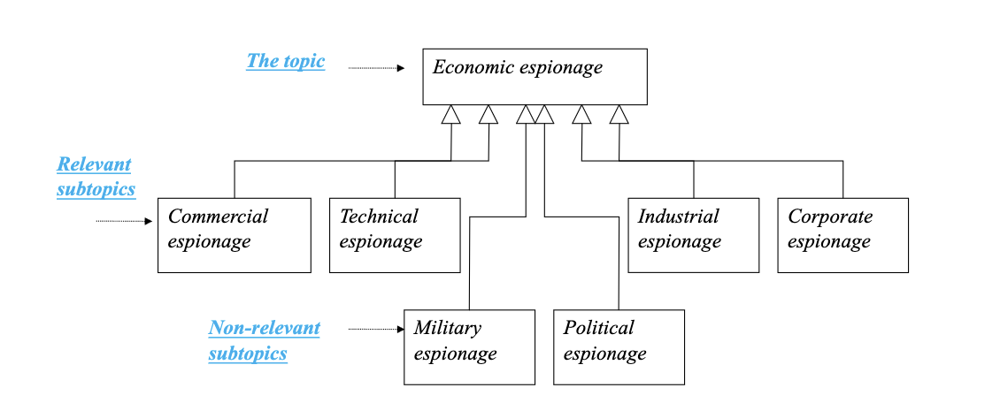
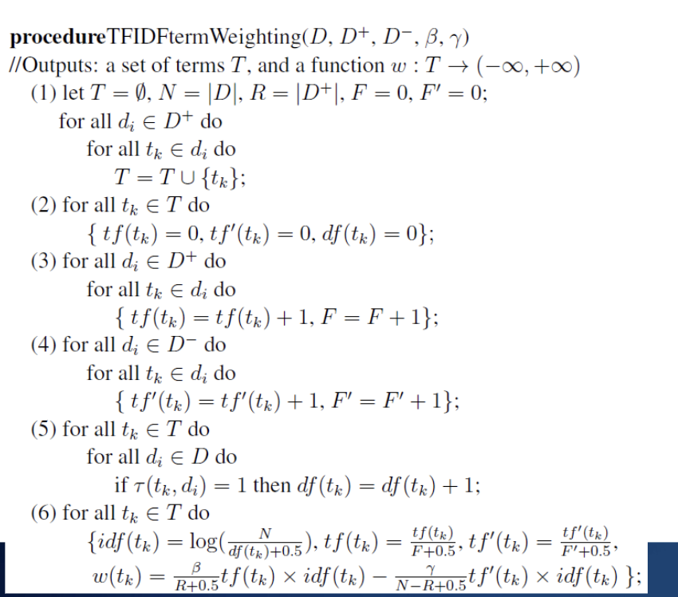
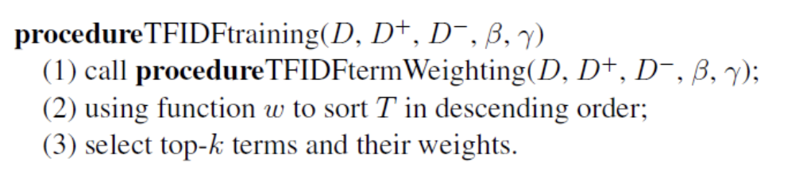
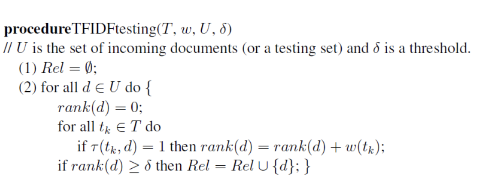
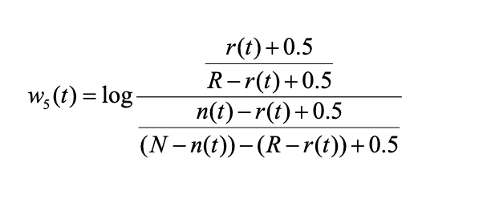
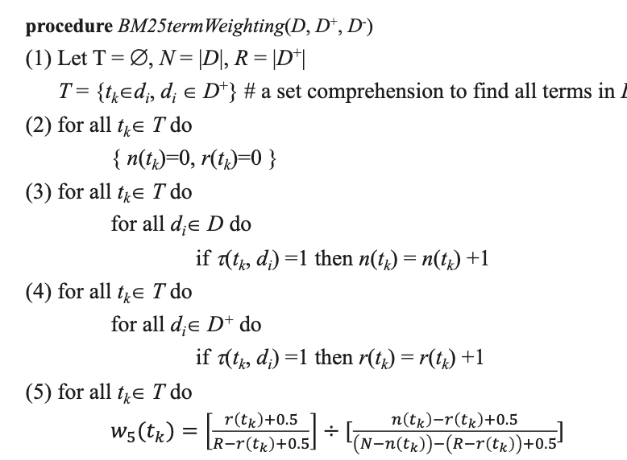
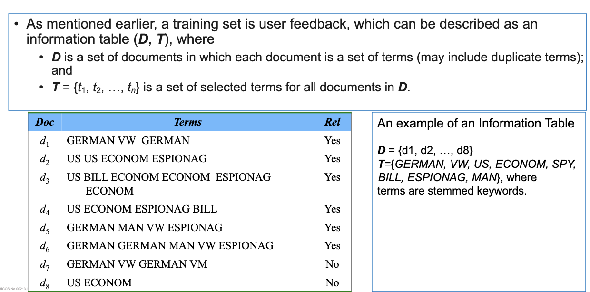
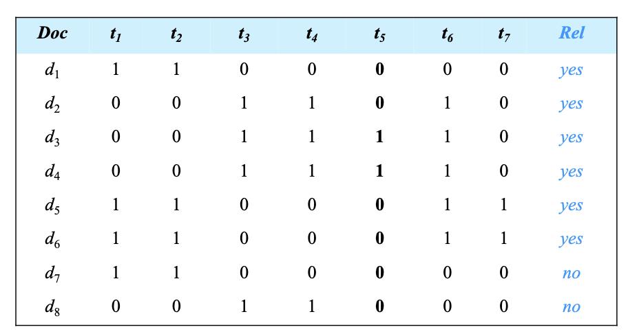
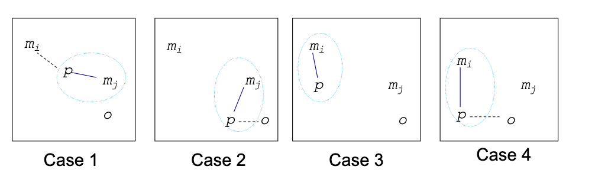

# cab431 - Week 8 Information Filtering/Term based methods

# 1. Information filtering introduction

- Information Filtering (IF) is a name used to describe a variety of processes involving the delivery of information to people.

- IF systems have a similar function to Information Retrieval (IR) systems, but they differ in the way they are used.

- Most IR systems support the short term needs of a diverse set of users. IF systems,
  however, are commonly personalized to support long-term, relatively stable, or periodic
  goals or desires of a particular user or a group of users.

- For example, document filtering, where the user’s information need stays the same, but
  the document collection itself is dynamic, with new documents arriving periodically.

- The main distinction between IR and IF is that IR systems use “query”, and IF systems use “user profiles”:
  - Typically, user profiles represent long-term information interests or needs (e.g., keeping up-to-date on a topic) that may change slowly over time as conditions, goals, and knowledge change.

# Information Filtering vs. Information Retrieval

- it is very diffucult to capture long term information needs and represent them in a machine readable form.

- easy way is to ise a query, but a query doesnt clearly describe what the user wants (see week 7)

- For example, for a given query {Java, C++, Oracle, Unix, program}, an IR model or a search engine often uses the query as a pattern to match relevant documents.

However, the user profile may be some knowledge about a topic (representing as a set of
terms and/or a term-weight distribution).
- For example, we may treat "program" as topics (subjects) “programming language” or
“programmer”.
- With this in mind, we can't just think of "program" as a pattern, but want to describe what we
know about the topics of “programming language” or “programmer” to determine the relevant
documents.

# Manually Acquiring of Knowledge for Topics of Interest

- Step 1:

  - Domain experts provide descriptions and narratives for the topics of interest;

- Step 2:
  - Build a concept model according to the descriptions and narratives;

```xml
<topic>
  <title>Economic espionage</title>
  <description>
    What is being done to counter economic espionage internationally?
  </description>
  <narrative>
    Documents which identify economic espionage cases and provide action(s)
    taken to reprimand offenders or terminate their behaviour are relevant.
    Economic espionage would encompass commercial, technical, industrial or
    corporate types of espionage. Documents about military or political
    espionage would be irrelevant.
  </narrative> </topic
>`
```

# Example of long-term user information needs cont.



# Manually Acquiring of Knowledge for Topics of Interest cont

- It is difficult to write adequate descriptions and narratives.
- Although linguists can provide appropriate descriptions and narratives, the corresponding
conceptual model is still incomplete.
- First, the linguists may ignore some important terms, for example, “spy” in this example.
- Dictionaries usually are not very useful for expanding the set of terms since we do not know
authors’ writing styles.
- It is also quite often that the linguists and the dictionaries may ignore some relations
between subtopics. For instance, we are not sure if there is any overlap between technical
espionage and industrial espionage

# Automatically Acquiring of Knowledge from Relevance Feedback

- Filtering task can be considered as a supervised learning.
- This method does not ask to provide descriptions and narratives (no query).
- It assumes that users can provide feedback (or documents are labelled by domain experts), a
training set D (or labelled dataset), which consists of a set of relevant documents D + and a
set of irrelevant documents D - ; or
- At least, they can provide a small set of relevant documents for their topics of interest in the
beginning.
- The objective here is to discover a set of features (e.g., term-weight pairs) to represent the
knowledge about “Topics of Interest” (or user information needs)

# Example of a Training Set $D$

# 2. Rocchio-based information filtering model

- Review Rocchio Algorithm as an IR model

- optimal query

  - maximizes the difference between the average vector representing the relevant dociments and the average vector representing the non-relevant documents

- add equation

# tf\*idf Term Weighting

- It uses tf\*idf term weighting to represent the knowledge about “Topics of Interest” (or user information needs)

- Term frequency measures the importance of term $t_k \in T$ in relevant documents ($D^+$), where $f_{ij} is term j’s frequency in document i$:

$$
tf(t_k) = \frac{\sum_{d_i \in D^+} f_{ik}}{\sum_{d_i \in D^+} \sum_{t_j \in d_i} f_{ij}}
$$

Inverse document frequency measures importance in collection

- add other equation/s



# Training algorithm



# The Ranking Function

- To obtain a ranking function, we should select a weighting function, e.g. w as a set of terms T.

- The ranking function is defined as follows:

$$
relevance(d) = \sum_{t \in T} w(T) \times (t,d)
$$

# Testing algorithm



# 3. Probabilistic information filtering models

- They use probable relevance to describe the importance of term tk for “Topics of Interest”.
- The individual term weight can be estimated based on two mutually exclusive independence
assumptions:
- I1: The distribution of terms in relevant documents is independent and their distribution in
all documents is independent.
- I2: The distribution of terms in relevant documents is independent and their distribution in
non-relevant documents is independent.
- There are also two methods that refer to as ordering principles for presenting the result set:
- O1: Probable relevance is based only on the presence of search terms in the documents.
- O2: Probable relevance is based on both the presence of search terms in documents and
their absence from documents.

# Interpretations of Variables

- Let N=|D| be the total number of documents in the training set D;
- R be the number of relevant documents for a topic;
- n(t) be the number of documents that contain term t; and
- r(t) be the number of relevant documents that contain term t.
- For training set D in Example 8.2, we have
N=8, R=6, n(US)= 4, and r(US)= 3

# Weighting Formulas

- choosing I1 and O1 yields the following weight:

  $$
  w_1(t) = \log{\frac{\frac{r(t)}{R}}{\frac{n(t)}{N}}
  $$

- choosing I2 and O1 yields the following weight:

$$
w_2(t) = \log{\frac{\frac{r(t)}{R-r(t)}}{\frac{n(t)}{N-n(t)}}
$$

# Weighting Formulas cont.

choosing I1 and O2 yields the following weight:

$$
w_3(t) = \log{\frac{\frac{r(t)}{R}}{\frac{n(t)-r(t)}{N-R}}
$$

choosing I2 and O2 yields the following weight:

$$
w_4(t) = \log{\frac{\frac{r(t)}{R-r(t)}}{\frac{n(t)-r(t)}{N-n(t)-R+r(t)}}
$$

# The Best Probabilistic Formula

Most people believe that w 4 is most likely to yield the best results (BM25).

- The denominators in these fractions may be zero. Also considering the incomplete information in the training set, 0.5 is added to the weights to account for these problems.

- the modified weighting function appears as:



# BM25 Training Algorithm



# 4. Cluster Analysis

- Clustering is the process of grouping documents (or objects) into clusters so that objects in a
cluster are highly similar to each other, but very different from documents in other clusters.
- Cluster analysis is a popular unsupervised learning method (i.e., it does not require any
training data).
- We usually use a distance function to measure the dissimilarities between objects.
- Note a similarity measure, which typically has a value s from 0 to 1, can be converted
into a distance measure by using 1 – s.
- Evaluating the output of a clustering algorithm can be challenging since clustering is an
unsupervised learning, there is often little or no labeled data to use for the purpose of
evaluation.
- For information retrieval, we can rank clusters instead of individual documents in response
to query or “topics of interest” if we assume documents in the same cluster tend to be
relevant to the same queries.

# Information Table



# Binary Variables

- has only 2 states: 0 or 1, where:

  - 0 denotes the variable is absent,
  - 1 denotes presence

- We may view each term as a binary variable in the information table.
  We may view each term as a binary variable in the information table, e.g.,
  - GERMAN : t1
  - VW : t2
  - US : t3
  - ECONOM : t4
  - BILL : t5
  - ESPIONAG : t6
  - MAN : t

# Example of Binary Information Table


- for example the given term "bill", which is the binary variable $t_5$ in the binary information table:
- 1 indicates that $d_3$ and $d_4$ include it while 0 indicates that $d_1$, $d_2$, $d_5$, $d_6$, $d_7$, and $d_8$ do not include it.

# Binary Contingency Table

- A contingency table is a type of table in a matrix format that displays the frequency distribution of the
variables.
- We can use it to comparing the difference between two documents di and dj based on their binary
information table representation.
- Assume
- q is the number of variables that equal 1 in both documents dj and di;
- t is the number of variables that equal 0 in both documents dj and di;
- s is the number of variables that equal 0 in di but equal 1 in dj; and
- r is the number of variables that equal 1 in di but equal 0 in dj.
- u=q+r+s+t, the total number of variables

- add table soon

# Distance Measures

- Simple matching coefficient, used for symmetric binary variables, that is, no preference on 1 and 0.

$$
dis_s(d_i,d_j) = \frac{r+s}{r+s+q+t}
$$

- Jaccard coefficient, used for asymmetric binary variables, that is, preference on 1 and 0.

$$
dis_Jac(d_i,d_j) = \frac{r+s}{r+s+q}
$$

# Partitioning Approach

- Given a set of documents (objects), a partitioning approach attempts to construct k partitions
(clusters or groups) of objects such that
- Each partition must contain at lease one object; and
- Each object must belong to exactly one partition.
- The partitioning approach usually creates an initial partitioning. It then uses an iterative
relocation technique to reshuffle objects in order to improve the initial partitioning.
- The general criterion of a good partitioning is that objects in the same partition are close or
related to each other, whereas objects in the different partitions are dissimilar

# The k-medoids Technique

- Each partition (cluster) is represented by one of the objects that locate near the centre of the
cluster.
- The basic idea of the k-medoisd technique is to find k clusters in n objects by
- first arbitrarily selecting a representative object (the medoid) for each cluster;
- for each remaining object
- classify it to the cluster that it is the most similar;
- iteratively replaces one of the medoids by one of the non-medoids if the quality of the
resulting partitioning is improved. Please note medoids are always restricted to be
members of the data set

# The Square-Error Criterion

- The quality is estimated using a cost function which measures the
average dissimilarity between objects and their medoids.
- Typically, a square-error criterion is used to describe the cost
function, which satisfy

$$
E = \sum_{i=1}^{k}\sum_{p\in C_i}dis(d_p,m_i)^2
$$

where $m_i$ is the medoid of cluster $C_i$ and $dis(d_p,m_i)$ is the distance between object $d_p$ and its medoid $m_i$.

# Determine New Medoids

- To determine whether a non-medoid object o is a good replacement for a current medoid m j , we
need to discuss all possible cases for all other non-medoid objects p:
- Case 1: p is reassigned to another medoid m i
- p currently belongs to m j . If m j is replaced by o as a medoid and p is closest to m i (i¹j).
- Case 2: p is reassigned to o
- p currently belongs to m j . If m j is replaced by o as a medoid and p is closest to o.
- Case 3: the assigned does not change
- p currently belongs to m i (i¹j). If m j is replaced by o as a medoid and p is still closest to
m i .
- Case 4: p is reassigned to o
- p currently belongs to m i (i¹j). If m j is replaced by o as a medoid and p is closest to o.

# Four Cases for Evaluation of a Cost Function


- each time a reassignment occurs, adifference in square-error E is contributed to the cost function.
- the cost function calculates the difference in square-error E for all possible cases and then selects the case that results in the largest reduction in E.

- the total cost of swapping S is the sum of cost incurred by all non- medoid objects. if the total cost is negative, the swap is accepted and the new medoid is selected.

# K-medoids Algorithm

Input – the number of clusters k and a database containing n objects.
Output - A set of k clusters that minimizes the sum of the dissimilarities of all the objects to their nearest
medoid.
procedure:
(1) Arbitrarily choose k objects (m1 ,…,mk ), as the initial medoids;
(2) Repeat
Assign each remaining object to the cluster with the nearest medoid;
Randomly select a non-medoid object, o;
Evaluate the total cost, S, of swapping mj with o;
If (S<0)
swap mj with o and form the new groups of the k medoids;
(3) Until no change;

- This algorithm attempts to decide k partitions for n documents (objects).
- In step (1), the initial k medoids are determined randomly;
- The algorithm repeatedly tries to get the best medoids for all partitions in step
(2). All of the possible pairs of objects are examined

# Hierarchical Methods

- A hierarchical method builds a hierarchical classification of objects.
- Hierarchical methods:
- Agglomerative (also called bottom-up method)
- It starts with each object that represents a single group. It then merges the smaller
groups into larger ones until a terminal condition holds (or all objects in the same
group).
- Divisive method (also called top-down method)
- It starts with all objects in the same group. It then splits the larger groups into smaller
ones until a terminal condition holds (or each object is in a separate group

# Examples of Bottom-up and Top-down methods

- For the bottom-up method, in the start point, it puts each object into a singleton
cluster.
- In the step 1, it merge the two clusters {a} and {b} since they have the smallest
minimum Euclidean distance.
- For the top-down method, in the start point, it forms an initial cluster using all
objects.
- The cluster is split in step 1 into two clusters {ab} and {cde} since they have the
largest maximum Euclidean distance

# Euclidean Distances

et Ci and Cj be clusters. p and p’ denotes objects.
- Minimum distance
dismin (Ci ,Cj )= minpÎCi,p’ÎCj (dis(p,p’))
- Maximum distance
dismax (Ci ,Cj )= maxpÎCi,p’ÎCj (dis(p,p’))

# Evaluation Clustering Algorithms

# Clustering and Search

A possible hypothesis is that documents in the same cluster tend to be relevant to the same
queries.

Cluster-based retrieval:

$$
P(Q|C_i) = \prod_{i = 1}^{n}P(q_i|C_i)
$$

- The intuition behind this ranking method is that a relevant document with no terms in
  common with the query could potentially be retrieved if it were a member of a highly ranked
  cluster with other relevant documents.

- The second term, which comes from the cluster language model, increases the
probability estimates for words that occur frequently in the cluster and are likely to be
related to the topic of the document.