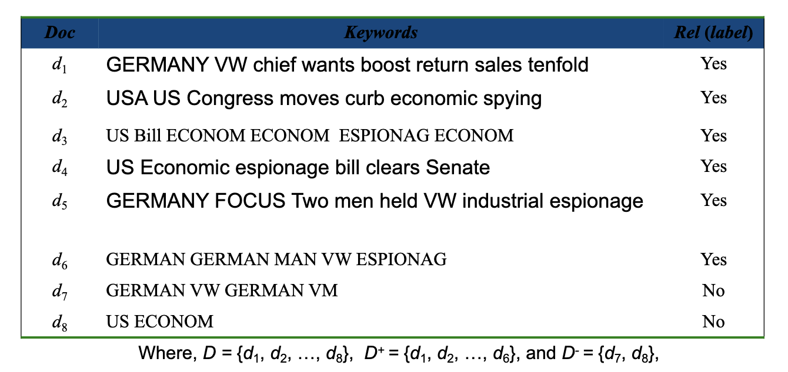
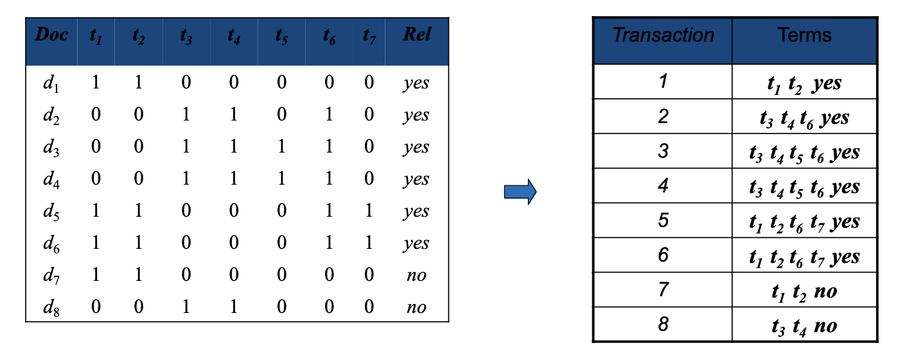
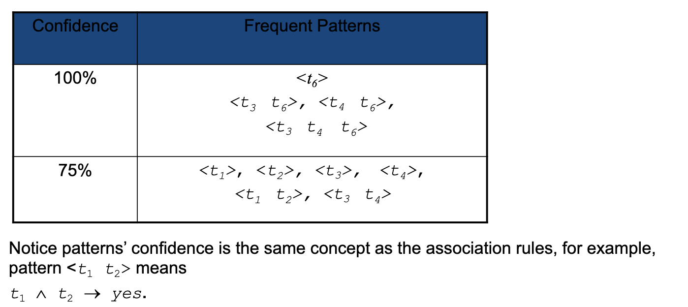
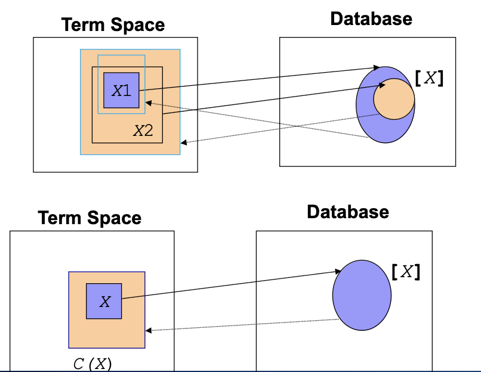
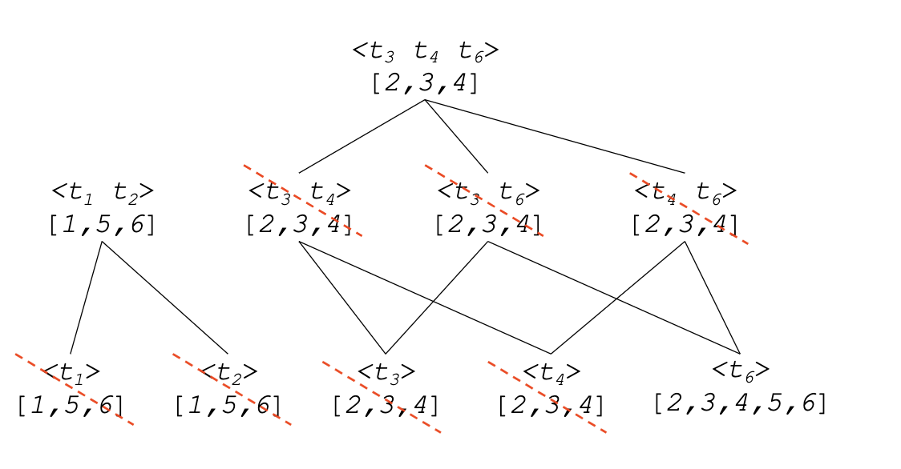
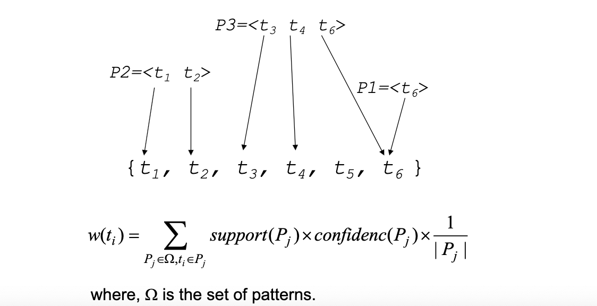
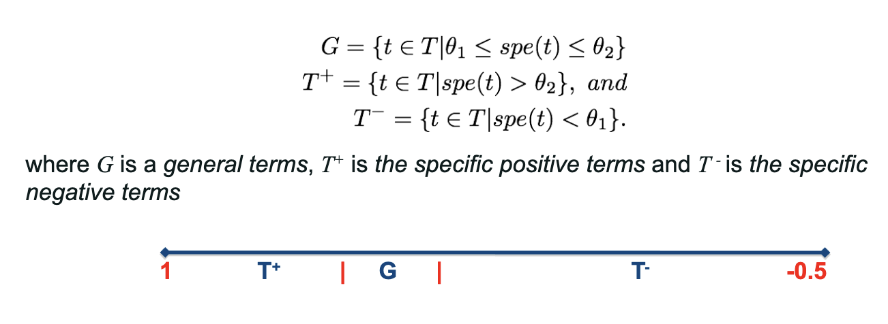
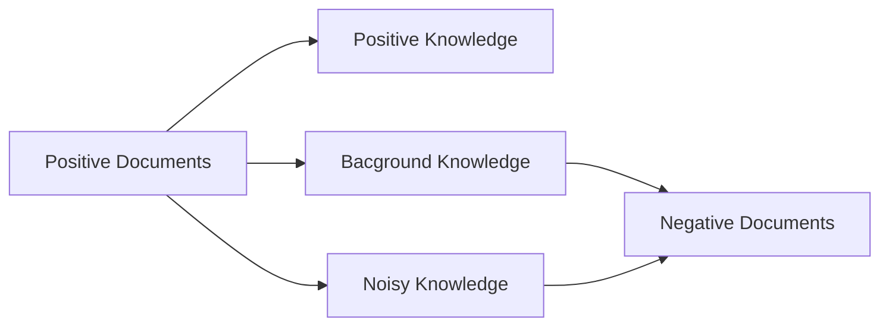
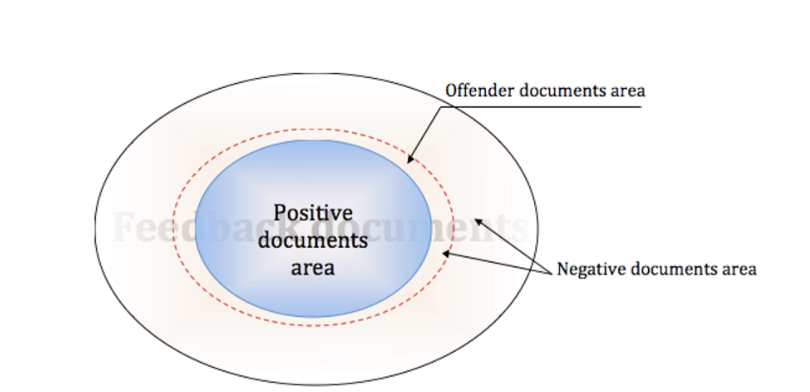
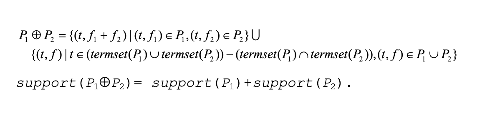

# cab431 - week 9 - Information Filtering Generative models

# 1. Knowledge Representation

It is the study of how the beliefs, intentions, and goals of an intelligent agent can be expressed in terms of symbols and concepts. It is also the study of how such knowledge can be acquired, represented, and used by computational processes.

- involves representing tye key concepts and relations between the decision variables in some formal manner, typically within a framework suggested by an expert systems shell

- Rule based representation
- Frame based representation- It represents knowledge in the from of IF ... then rules
  e.g. IF the patient has a fever and a headache, THEN the patient has the flu

# Knowledge base

- the heart of an AI-based system is its knowledge base KB, which contains its beliefs about the problem-solving knowledge of a particular application.
- The knowledge base consists of a set of
  - Rules
    - If "Premise (antecedent)" then "conclusion (consequent)"
    - Premise -> conclusion

# Example 1. Diagnosing automotive problem

# Run knowledge base: production system

• Production system is a way to model human problem solving for running knowledge base. There are two directions for running knowledge base.
• Data driven, i.e., forward search
• Facts are placed in working memory and the system searches for an interpretation in a forward fashion.
• Goal driven, i.e., backward search
• The gaol expression is initially placed in working memory. The system matches rule
conclusions with the goal, selecting one rule and placing its premises in the working memory

# A simple production system example

```
Rules:
P1: $$ -> *
P2: *$ -> *
P3: *x -> x*
P4: * -> null & halt
P5: $xy -> y$x
P6: null -> $
```

- Reversing a string from an alphabet does not contain the symbol $. and the \* symbol is used as a wildcard ( or marker symbols)
- The ordering of the production rules is important.
- Input: $abc
- Output: cba$

# 2. Data Mining Concept

Data mining also called knowledge discovery in databases (KDD), is the process of discovering interesting patterns from large amounts of data stored in databases, data warehouses, or other information repositories.

- why is it important:
  - Manfully knowledge acquiring is expensive
  - there exists alo of useful information and knowledge in the huger amout of electronic data.
- Association Rule Mining (learning)
  - Discovers interesting relations between variables in large databases to identify strong rules in datasets.
  - there are many algorithms for generating association rules that have been proposed:
    e.g. Apriori algorithm, We do not discuss the algorithms in this course.

# Patterns vs. Terms

An association rule is composed by two different itemsets (sets of items), X and Y, in a form of X => Y, where X is called antecedent (LHS) and Y is called consequent (RHS), X ∩ Y = ∅, and X∪Y is a frequent itemset

- Itemsets are also called patterns in some applications.

- For text analysis, a pattern is a set of terms (words) or term frequency pairs, which describes the extent to which the pattern is discussed in a set of training documents.

- Different from the term-based patterns, which are based on term or ord, the patterns-based approaches utilize patterns for text analysis.

- People usually believe that patterns (like phrases) carry more semantic meaning than terms.

# Generative Models vs Discriminative Models

**A generative model includes the distribution of the data itself and tells you how likely a given example is.**

- For example, models that predict the next word in a sequence typically use a generative model, because they need to know the probability of each word in the vocabulary as the next word. (Markov decision process)
- Generative models are desirable as they capture the underlying generation process of a data population of interest.

- **A discriminative model ignores the question of whether a given instance is likely, and just tells you how likely a
  label is to apply to the instance.**
- For example, a discriminative model tries to tell the difference between relevance and non-relevance.
- Discriminative models, often referred to as classification approaches

• In statistical analysis,
• A generative model is a statistical model of the joint probability distribution P(X,Y) on given observable variable X and target variable Y;
• A discriminative model is a model of the conditional probability P(Y | X=x) of the target Y, given an observation x; and
• Classifiers computed without using a probability model are also referred to loosely as "discriminative".
• Generative models try to understand the basic formation of the individual classes (e.g., relevance or non- relevance), and thus, carry richer information than discriminative models.
• However, it is usually very hard to learn a generative model for data of high dimension since the structure of the data space is largely unknown.

# 3. Pattern Mining for text analysis

- $T = {\{t1,t2, ...., tk\}}$ be a set of keywords (terms)
- $D$ be a training set of documents, which consist of a set of positive documents $D+$ and a set of negative documents $D-$
- A set of terms $X$ is referred to as a termset if $X \subseteq T$.
- IN Example 2 we have:
  T = {t1,t2,…,t7}= {GERMAN, VW, US, ECONOM, BILL, ESPIONAG, MAN} , where we consider
  spying is the synonym of ESPIONAGE.
  • D = {d1 ,d2 ,…,d8 }, where
  • D+ = {d1 ,d2 ,…,d6 }
  • D- = {d7 ,d8 }

# Example 2. A training Set D



# Example 3. A Training Set: Binary Information Table vs. Transaction Database


# Frequent Patterns in Relevant Documents

Let $X$ be a termset, we use [X] to denote the covering set of X, which includes all relevant d such that X ⊆ d. (X is a subset of d)

- Given a termset X, its occurence frequency is the number of positive documents that contain the termset, that is |[X]|. and its support is the ratio of its occurence frequency to the total number of positive documents, that is, |[X]|/|D+|.
- A termset X is called a frequent termset if its support is greater than or equal to a given threshold min_sup, that is, |[X]|/|D+| ≥ min_sup.

# All Frequent Patterns in Example 3 Transaction Database min_sup = 50%


# Example 4. Patterns and Their Covering Sets (indexing)


# Interesting Patterns

- The confidence of a frequent pattern is the fraction of the documents including the pattern that are relevant.
- Let $$N_x = | {d| d \in D, X \subseteq d}|$$ be the number of documents in D that contain X, and $$N_{xy} = | {d| d \in D, X \subseteq d, Y \subseteq d}|$$ be the number of documents in D that contain both X and Y.


- the confidence shows the percentage of the pattern's occurrence in the relevant documents.
- A frequent pattern is called an interesting pattern if its confidence is greater than or equal to min_conf, a minimum confidence threshold.

# Example 5. Complete Transaction Database



# Interesting Patterns in Example 5 min_conf = 75%



# Relationship between Terms and Documents

- Not all interesting patterns are meaningful. For example, pattern <t 3 t 4 > always occurs together with pattern <t 3 t 4 t 6 >
- Therefore, we expect to keep only the larger patterns and prune the meaningless one, the shorter one.
- Noew we attempt to describe the condition for pruning the meaningless patterns.
- Give a termset X its covering set [X] which is a subset of rlevant documents.
- similarly, given a set of relevant documents Y, we can define its termset: termset(Y)= {t | t ∈ T, ∀d ∈ Y => t ∈ d}.

# Relationship between Terms and Documents cont.


# Examples of Documents’ termsets for Example 5

| Set of positive documents | Termset      |
| ------------------------- | ------------ |
| [2,3,4]                   | {t3, t4, t6} |
| [1,5,6]                   | {t1, t2}     |
| [2,3,4,5,6]               | {t6}         |
| [1,2]                     | {}           |

# Closed Patterns

- given an interesting pattern $X$, its closure
  $C(X) = termset([X])

- properties of the closure operation
  $$ X1 \subseteq X2 => C(X1) \subseteq C(X2)$$
$$ C(X) = X$$ for all patterns X.

- An interesting pattern X is closed iff C(x) = x.

# Closure Operation and Closed Patterns cont.



# Example 6. Pruning Non-closed Patterns to obtain Discovered Patterns



# 4. Application of Patterns for Information Filtering.

• There are two ways to use the discovered patterns:
• Weighting patterns
• This approach evaluates a weight for each pattern and views patterns as atoms. For
example, w(P)=confidence(P); or w(P)=support(P)\*confidence(P);
• For each incoming document, the filtering algorithm first determines which patterns
appear in the document; it then sum the weights of the appeared patterns.
• Mapping patterns onto the term space
• This approach views term as atoms. It deploys the discovered patterns onto the term
space.

# Pattern Deploying


# Mapping Patterns onto the Term Space cont.
• w(t1) = w(t2) = (support(P2)*confidence(P2))÷2
• w(t3) = w(t4) = (support(P3)*confidence(P3))÷3
• w(t6) = (support(P3)*confidence(P3))÷3 +
(support(P1)*confidence(P1))÷1
• w(t5) = 0


# Term Specificity
- The concept of relevance is subjective
- it is easy for human beings to judge whether a term is relevant to a document or not.
-  However, it is difficult to judge the degree of relevance.
- We define the specificity of a given term t in the training set D = D+ ∪ D- as follows:

$$
spe(t) = \frac{|coverage^+(t)| - |coverage^-(t)|}{|D^+|}

coverage^+(t) = {d \in D^+ | t \in d}
coverage^-(t) = {d \in D^- | t \in d}
$$

# Categories of Terms
- Based on the specificity score the terms can be categorized into three group used the following classification rules



# Is Negative Feedback useful?
- In general, negative and positive documents are share some general knowledge. Those general knowledge is related to some of the extend topic that both share.


There are two main issues of using negative relevance feedback:
• The selection of constructive negative examples to reduce the space of negative examples;
• How to use selected negative examples to improve the judgment?

offenders: : are negative documents that most likely to be classify as positive.



# Select Constructive Negative Examples
Re-rank the negative examples used the extracted low-level features (terms)
from positive feedback.
• Select the top K documents as an offenders.
• Extract higher level patterns and low-level terms from selected negative
example used PTM.


# How to select constructive negative examples?


# Term Weight Revision
• Generally, the specific terms are more important, However, general term are also
necessary for describing what users want.
• For that reasons, we increased the weights of positive terms and reduce the
weights of the specific negative terms as in this paper:

# Example of Comparison Results of Models on RCV1

# Comparison of Pattern (Phrase) Based Methods on RCV1

# Comparison for using different combinations of Categories of Terms for RFD2.

# Patterns with Term Frequencies
• One important factor is missed in the closed patterns
• Term frequency.
• This factor is very import in terms of information retrieval and search
engines.
• tf(d,t) the number of occurrences of term t in document d.
• P={(t,f)|tÎT, f=tf(t,d)>0}, is referred to as a pattern.
• support(P) describes the extent to which the pattern is discussed in the
training set: the greater the support is, the more important the pattern is.
• termset(P)={t|(t,f) ∈ P} is the set of terms in the pattern.

# Composition Operation
- We assume that pattern P 1 equals to pattern P 2 if and only if
termset$(P 1 )=termset(P 2 )$.
• Therefore, we should compose patterns with the same termset at least.

- Let P 1 and P 2 be two patterns. We call P 1 Å P 2 the composition of P 1 and P 2 which satisfies:



# Example 7. Weights in Patterns

# Examples: Termsets of Patterns

# Examples: Relationship between Patterns

# Normal Forms of Patterns
Let $P = \{(t_1, f_1, (t_2, f_2), ..., (t_n, f_n)\}$ be a pattern.

Its normal form is defined as follows:
$\{(t_1, w_1, ...)\}$ where
$w_1 = \frac{f_1}{\sum_{i=1}^n f_i}$

for all $i <= r$ and $i>1$

We call (w 1 ,w 2 ,…,w r ) the weight distribution of P, and we have $\sum_{i=1}^r w = 1$.

# Normalize support
- support can be normalized, which satisfies:

- $support :: \Omega -> [0,1]$, such that

- $support(P) = \frac{support(P)}{\sum_{P_j \in \Omega} support(P_j)}$


# Example 8. Normalization

# Deduced Probability
- To obtain a relevance function, we firstly calculate a deduced probability function pr by using
the normalized support function and the normal forms of patterns
# 5. Neural Probabilistic Language Model


# Window-Based Neural Language Model
• It is the first large-scale deep learning for natural
language processing model.
• It learns a distributed representation of words,
along with the probability function for word
sequences expressed in terms of these
representations.
• The right figure shows the deep neural network
architecture. It can be interpreted as the following
equation
Where the weight matrix W (1) is applied to the word
vectors (solid green arrows in the Figure), W (2) is
applied to the hidden layer (also solid green arrow)
and W (3) is applied to the word vectors (dashed green
arrows).

# Example of dimensions
We assume that the neural network includes 100 hidden states and 200 size vectors for each word with 12681 vocabulary size, then above equation can be explained using their shapes as shown below.

• embedding matrix = (12681 x 200)
• e(x_1) = (1 x 200)
• e(x_2) = (1 x 200)
• x' = (1 x 200) concat (1 x 200) = (1 x 400)
• W1 = (100 x 400)
• b = (1 x 100)
• h = tanh(W1 x' + b) = (1 x 100)
• W2 = (12681 x 100)
• y = softmax(W2h) = (1 x 12681


# In Summary
• Neural Probabilistic Language Model (NPLM) aims at creating a language
model using functionalities and features of artificial neural network.
• It is the foundation of generative AI.
• However, It use a finite window of previous words.
• Recurrent Neural Networks (RNN) are capable of conditioning the model on all
previous words in the corpus.
